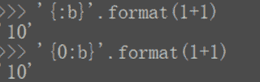

<!--yml
category: codewars
date: 2022-08-13 11:50:50
-->

# Codewars 刷题笔记（Python）2.Binary Addition_apollo315的博客-CSDN博客

> 来源：[https://blog.csdn.net/apollo315/article/details/104623611?ops_request_misc=&request_id=&biz_id=102&utm_term=codewars&utm_medium=distribute.pc_search_result.none-task-blog-2~all~sobaiduweb~default-7-104623611.nonecase](https://blog.csdn.net/apollo315/article/details/104623611?ops_request_misc=&request_id=&biz_id=102&utm_term=codewars&utm_medium=distribute.pc_search_result.none-task-blog-2~all~sobaiduweb~default-7-104623611.nonecase)

## 题目

Implement a function that adds two numbers together and returns their sum in binary. The conversion can be done before, or after the addition.
The binary number returned should be a string.

> 难度：7 kyu

## 我的解法

```
def add_binary(a,b):
    return bin(a + b)[2:] 
```

思路很简单：

1.  将a和b的和用`bin()`函数转为以字符串表示的二进制字面量（示例：`bin(2)`结果为`'0b10'`）
2.  因为输出结果要求去掉字符串开头的`'0b'`，所以我们对上一步的结果字符串做一下切片，获取字符串子串。

## 其他解法

```
def add_binary(a,b):
    return '{0:b}'.format(a + b) 
```

或者

```
def add_binary(a,b):
    return '{:b}'.format(a + b) 
```

这个解法我是真没想到过，看了别人的解答才稍微有点理解，因为这个涉及到Python的内建函数`format`，详细可以参考[PyFormat](https://pyformat.info/)，`'{:b}'`可以简单认为是十进制转二进制的转换器（b意思是binary），我只做个简单的了解。


## 学习总结

1.  `bin()`函数我是现学现搜的，非常简单。
2.  调试时错了一次，根据输出对比发现题目要求去掉字符串开头的`'0b'`，所以做了下切片处理。
3.  虽然简单，但是我的解法和最佳答案是一样的，还是很高兴的。
4.  看到其他解法时也感觉自己要学的东西还有很多，不懂的太多了。