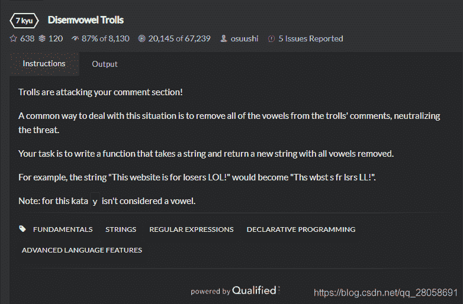
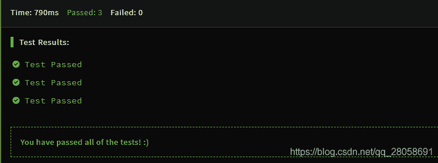

<!--yml
category: codewars
date: 2022-08-13 11:42:58
-->

# Codewars_Disemvowel Trolls_再别秀了的博客-CSDN博客

> 来源：[https://blog.csdn.net/qq_28058691/article/details/103334827?ops_request_misc=%257B%2522request%255Fid%2522%253A%2522166036059216781685328322%2522%252C%2522scm%2522%253A%252220140713.130102334.pc%255Fall.%2522%257D&request_id=166036059216781685328322&biz_id=0&utm_medium=distribute.pc_search_result.none-task-blog-2~all~first_rank_ecpm_v1~rank_v31_ecpm-30-103334827-null-null.142^v40^control,185^v2^control&utm_term=codewars](https://blog.csdn.net/qq_28058691/article/details/103334827?ops_request_misc=%257B%2522request%255Fid%2522%253A%2522166036059216781685328322%2522%252C%2522scm%2522%253A%252220140713.130102334.pc%255Fall.%2522%257D&request_id=166036059216781685328322&biz_id=0&utm_medium=distribute.pc_search_result.none-task-blog-2~all~first_rank_ecpm_v1~rank_v31_ecpm-30-103334827-null-null.142^v40^control,185^v2^control&utm_term=codewars)

# Codewars学习记录


这个题叫Disemvowel Trolls，就是说现在网上有一群喷子，常用的方法是移除所有的元音字母，然后返回这个字符串就可以了。
我的写法是：

## Python3.4.3

```
 def disemvowel(string):
    for i in 'aeiouAEIOU':
        string = string.replace(i,'')
    return string 
```

```
 test.assert_equals(disemvowel("This website is for losers LOL!"),
                              "Ths wbst s fr lsrs LL!") 
```

结果当然是：

其思路就是简单的遍历字符串，寻找元音字母然后将元音字符用replace来替换成空字符，返回输入string就好了。看了一下其他的方法，也学到了很多。

```
def disemvowel(s):
    return s.translate(None, "aeiouAEIOU") 
```

这段直接可以返回一个屏蔽好的字符串，然后返回屏蔽后的字符串。