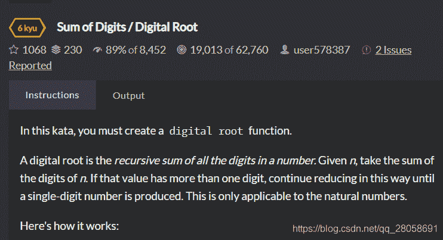
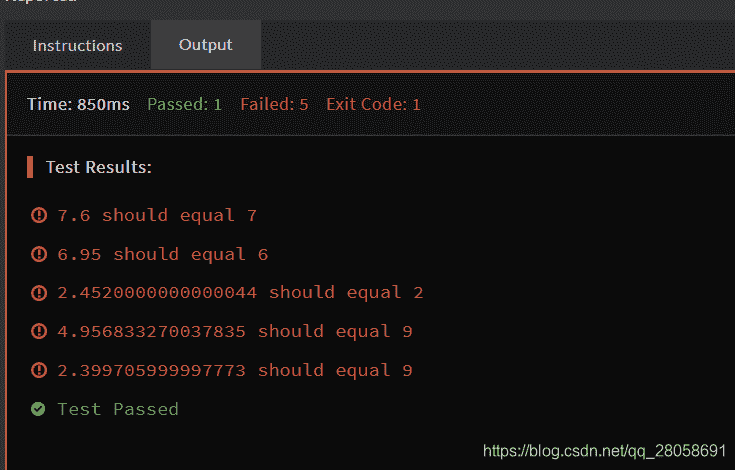
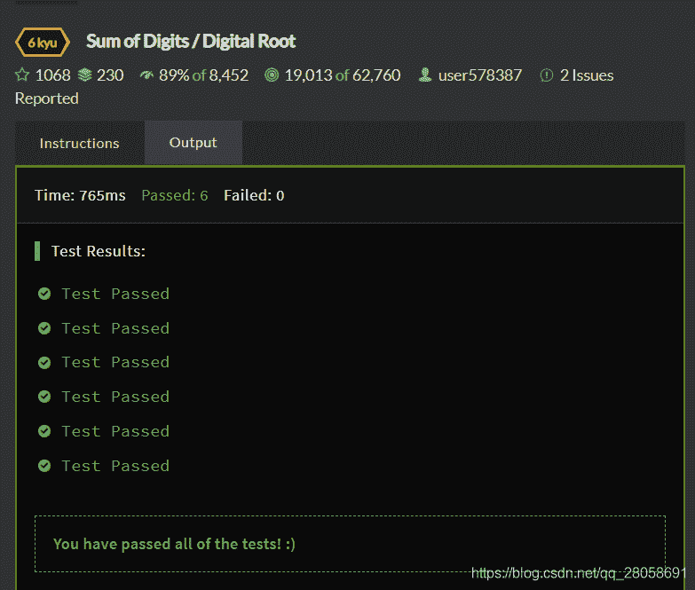
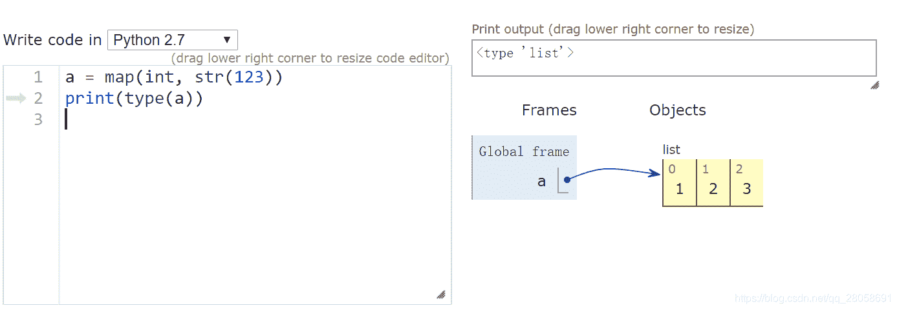

<!--yml
category: codewars
date: 2022-08-13 11:50:04
-->

# Codewars_Sum of Digits / Digital Root_再别秀了的博客-CSDN博客

> 来源：[https://blog.csdn.net/qq_28058691/article/details/103335767?ops_request_misc=&request_id=&biz_id=102&utm_term=codewars&utm_medium=distribute.pc_search_result.none-task-blog-2~all~sobaiduweb~default-6-103335767.nonecase](https://blog.csdn.net/qq_28058691/article/details/103335767?ops_request_misc=&request_id=&biz_id=102&utm_term=codewars&utm_medium=distribute.pc_search_result.none-task-blog-2~all~sobaiduweb~default-6-103335767.nonecase)

​​

```
digital_root(16)
=> 1 + 6
=> 7

digital_root(942)
=> 9 + 4 + 2
=> 15 ...
=> 1 + 5
=> 6

digital_root(132189)
=> 1 + 3 + 2 + 1 + 8 + 9
=> 24 ...
=> 2 + 4
=> 6

digital_root(493193)
=> 4 + 9 + 3 + 1 + 9 + 3
=> 29 ...
=> 2 + 9
=> 11 ...
=> 1 + 1
=> 2 
```

就是给定一个自然数，然后又返回每个位置值的和，刚开始我写的是：

```
def digital_root(n):
    while(n > 9):
        n = n/10 + n%10
    return n 
```

结果：

没有小数的情况，只考虑了整数下的情况，之后修改了代码为：

```
def digital_root(n):
    if n < 10:
        return n
    else:
        return digital_root(sum(map(int, str(n)))) 
```

完美解决

给大家看一下map()函数的用法。先贴图。

先用str()函数将输入值转换为string，使用map()函数返回列表，一一映射为int类型，然后再用个sum就好啦。
简单如斯。