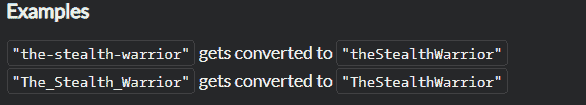

<!--yml
category: codewars
date: 2022-08-13 11:39:39
-->

# Codewars刷题-python：8级_雨霁夜白的博客-CSDN博客

> 来源：[https://blog.csdn.net/weixin_44114632/article/details/122589624?ops_request_misc=%257B%2522request%255Fid%2522%253A%2522166036059016780357231535%2522%252C%2522scm%2522%253A%252220140713.130102334.pc%255Fall.%2522%257D&request_id=166036059016780357231535&biz_id=0&utm_medium=distribute.pc_search_result.none-task-blog-2~all~first_rank_ecpm_v1~rank_v31_ecpm-2-122589624-null-null.142^v40^control,185^v2^control&utm_term=codewars](https://blog.csdn.net/weixin_44114632/article/details/122589624?ops_request_misc=%257B%2522request%255Fid%2522%253A%2522166036059016780357231535%2522%252C%2522scm%2522%253A%252220140713.130102334.pc%255Fall.%2522%257D&request_id=166036059016780357231535&biz_id=0&utm_medium=distribute.pc_search_result.none-task-blog-2~all~first_rank_ecpm_v1~rank_v31_ecpm-2-122589624-null-null.142^v40^control,185^v2^control&utm_term=codewars)

# Python练习

```
之前一直零散使用python，缺乏总结，coding效率太低。在codewars网站上刷题，写个博客来总结一下！冲！ 
```

## No.1 Convert string to camel case


my solution：

```
import re
def to_camel_case(text):
    arr = re.split(r'[-_]',text)
    for i in range(1,len(arr)):
        arr[i] = arr[i].title()
    return ''.join(arr) 
```

高赞solution

```
def to_camel_case(s):
    return s[0] + s.title().translate(None, "-_")[1:] if s else s 
```

```
def to_camel_case(text):
    return text[:1] + text.title()[1:].replace('_', '').replace('-', '') 
```