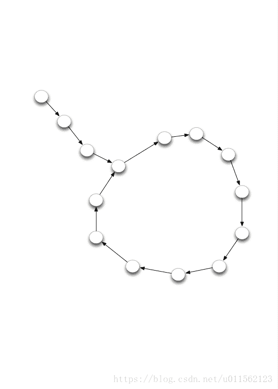

<!--yml
category: codewars
date: 2022-08-13 11:48:20
-->

# Codewars第九天–Can you get the loop ?_soufal的博客-CSDN博客

> 来源：[https://blog.csdn.net/u011562123/article/details/81946003?ops_request_misc=&request_id=&biz_id=102&utm_term=codewars&utm_medium=distribute.pc_search_result.none-task-blog-2~all~sobaiduweb~default-9-81946003.nonecase](https://blog.csdn.net/u011562123/article/details/81946003?ops_request_misc=&request_id=&biz_id=102&utm_term=codewars&utm_medium=distribute.pc_search_result.none-task-blog-2~all~sobaiduweb~default-9-81946003.nonecase)

## Codewars第九天–Can you get the loop ?

题目描述：
您将获得一个节点，该节点是链接列表的开头。 此列表始终包含尾部和循环。
您的目标是确定循环的长度。
例如，在下图中，尾部的大小为3，循环大小为11。

在这里，可以使用`node.next` 来获得下一个节点。
思想：在这里只需要找到某一个节点有着两个前驱即可。这个节点就可以当做循环列表的开头和结尾。他的大小为原列表中的长度减去他在列表中的位置，并加1。
这里的输入node为一个节点对象，指向一个列表的开头。为了判断循环的大小，在这里设置一个循环判断值：`temp` 。以及一个顺序存储当前节点的列表`result`。循环的条件为：当前节点的下一个节点不在`result` 中时，将其添加到列表中，直到发现某一个节点的后继已经存在于`result` 中了。停止循环。这意味着我们找到了有着两个前驱的节点。

**这里开始出现了一个问题，当循环列表中有两个节点时，测试用例判断其长度为1，因此在最后的结果返回时条件了判断条件。**
通过了全部测试用例。
代码如下：

```
def loop_size(node):
    temp = True
    new_node = node
    result = []
    while temp:
        result.append(new_node)
        new_node = new_node.next
        if new_node in result:
            temp = False
            loop_size = len(result) - result.index(new_node.next) + 1
    if loop_size == 2:
        return loop_size - 1
    else:
        return loop_size
```