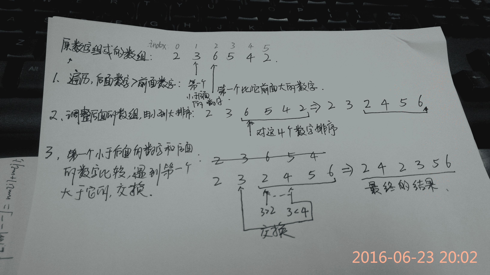

<!--yml
category: codewars
date: 2022-08-13 11:50:59
-->

# Codewars简单使用和 其中一道题，用JavaScript实现一个函数，求一个正数的次大数字，拿自己的解法和大神相比，简直对不起JavaScript给我提供的 那么多便利_Cinderella_hou的博客-CSDN博客

> 来源：[https://blog.csdn.net/Cinderella_hou/article/details/51746061?ops_request_misc=&request_id=&biz_id=102&utm_term=codewars&utm_medium=distribute.pc_search_result.none-task-blog-2~all~sobaiduweb~default-9-51746061.nonecase](https://blog.csdn.net/Cinderella_hou/article/details/51746061?ops_request_misc=&request_id=&biz_id=102&utm_term=codewars&utm_medium=distribute.pc_search_result.none-task-blog-2~all~sobaiduweb~default-9-51746061.nonecase)

下午刚接触Codewars ，[点击这里打开codewar](https://www.codewars.com/dashboard) ，进去之后先做对两道题才能继续，注册之后可以选择自己擅长的语言和自己的等级，做题的范围等，接下来就可以做题了，会根据题目的难度和你做的情况升级。而且界面很酷炫，可以更改设置，编程之后可以runtest ，测试程序的简单功能性，通过之后submit 系统会给出更多的测试范例和结果，还有运行时间，非常好用。

 下午做了两道题，其中一题挑战逻辑，经过一个多小时艰苦备战，终于测试通过，但看看自己代码，用了70多行，写了好几个函数，再去看排名较高的，20行左右搞定，除了第一名的思路新颖，和后面的思路基本一样，但是枉费了很多JavaScript的函数，自己傻乎乎的去实现。一言不合，上题目和代码：

You have to create a function that takes a positive integer number and returns the next bigger number formed by the same digits(返回一个用相同数字组成的比这个正数第一大的数字，如果不存在则返回 -1):  比如nextBigger(12)==21

nextBigger(513)==531

nextBigger(2017)==2071 

nextBigger(2072) == 2207

nextBigger(9)==-1

nextBigger(111)==-1

nextBigger(531)==-1

分析了几个例子，我的思路就是，先把数字转为数组，然后从后往前遍历，每次后一个数字和前一个数字比较，当遇到

第一后面数字比前面数字大的时候，对该数字及以后的数字进行从小到大排序，然后用该数字前面一个数字和排序后

的数组进行比较，直到遇到第一个比这个小数字大的数字，然后交换两者，再将交换之后的数组转换成数字。

过程和例子见下图：



根据这个思路的完整代码：

```
<!DOCTYPE html>
    <head>
    	<meta charset="utf-8">
    	<title>codewars</title>
    </head>
    <body>
<script type="text/javascript">
 function nextBigger(n){
  //your code here
  var str = n.toString();
  var length = str.length;
  var index = str.length -1;
  var arr = str.split("");
  //alert(typeof arr);
  var nextBigger = 0;
  while(index > 0 )
  {
      if(str[index] > str[index -1])          
         {
             arr = adjust(arr,index -1,length -1);
             //数组转换为数字
             nextBigger = adjustToNum(arr);
             break;
         }
       else{
          index --;
       }
  }
    if(index == 0)
    {
        nextBigger  = -1;
    }
    return nextBigger ;
}

function adjust(arr,start,end)
{
	console.log("adjust befor" + arr) ;
   var len = end - (start + 1 ) +1;
   if (len>1) {
    	for(var i = start +1 ;i < end;++i)
    {
         for(var j = end; j> start+1 ;j--)
           {
               if(arr[j] < arr[j-1])
               {
                arr  = swap(arr,j,j-1);
               }
           }
    }
     for (var i = 0; i < len; i++) {
     	 if (arr[start] < arr[start + 1 + i]) {
             arr =  swap(arr,start, start + 1 + i );
               break;
     	 }
     }
   }
    else{
      arr =  swap(arr,start,end);
      console.log("adjust:" + arr);
   }

    return arr;
}
function swap(arr,index1,index2)
{
    var temp = arr[index2];
    arr[index2] = arr[index1];
    arr[index1]  = temp;
    return arr;
}
function adjustToNum(arr)
{
    var num = 0;
    for(var i = 1;i <= arr.length; ++ i)
      {
           num += arr[i-1] * Math.pow(10,arr.length - i);
       }
       return num;
}
var num = nextBigger(236542);
console.log(num);
</script>
    </body>
</html> 
```

再来看思路一致的简洁代码：

```
function nextBigger(n){
  console.log(n);
  var chars = n.toString().split('');
  var i = chars.length-1;
  while(i > 0) {
    if (chars[i]>chars[i-1]) break;
    i--;
  }
  if (i == 0) return -1;
  var suf = chars.splice(i).sort();
  var t = chars[chars.length-1];
  for (i = 0; i < suf.length; ++i) {
    if (suf[i] > t) break;
  }
  chars[chars.length-1] = suf[i]
  suf[i] = t;
  var res = chars.concat(suf);
  var num = parseInt(res.join(''));
  console.log("->" +num);
  return num;
}
```

从上到下对比简洁之处，

1 ，数字转为数组，我用了两行，

2 ，用了sort，parseInt，splice ，conact函数省了n行代码 

```
 var str = n.toString();
  var arr = str.split("");
```

其实一行就搞定了：

```
var chars = n.toString().split('');
```

然后也是查找第一个大于它前面的数字，找到之后我是用了一个函数和函数参数来控制排序的范围

```
arr = adjust(arr,index -1,length -1);
```

并在arrjust（arr,start,end）调用swap(arr,index1,index2)用冒泡法完成排序


。排序之后让前一个小数字一次比较

遇到第一个比这个小数字大的数字则交换。看看这臃肿的代码和精确(费神)形参控制对之后函数排序的代码吧。

```
function adjust(arr,start,end)
{
	console.log("adjust befor" + arr) ;
   var len = end - (start + 1 ) +1;
   if (len>1) {
    	for(var i = start +1 ;i < end;++i)
    {
         for(var j = end; j> start+1 ;j--)
           {
               if(arr[j] < arr[j-1])
               {
                arr  = swap(arr,j,j-1);
               }
           }
    }
     for (var i = 0; i < len; i++) {
     	 if (arr[start] < arr[start + 1 + i]) {
             arr =  swap(arr,start, start + 1 + i );
               break;
     	 }
     }
   }
    else{
      arr =  swap(arr,start,end);
      console.log("adjust:" + arr);
   }

    return arr;
}
```

看人家的代码：

```
<span style="color:#ff0000;">var suf = chars.splice(i).sort();   //对之后的数组排序</span>
 <span style="color:#ff0000;"> var t = chars[chars.length-1];     //t就是例子236542的3</span>
  for (i = 0; i < suf.length; ++i) {
    if (suf[i] > t) break;            <span style="color:#ff0000;">// 找到后面6542排序后第一个比t大的数字 </span>
  }
  chars[chars.length-1] = suf[i]    <span style="color:#ff0000;">//交换</span>
  suf[i] = t;<span style="white-space:pre">		</span>
```

```
此时数组里的数字就是调整之后的顺序啦，。下一步就是把数组装换为数字了，来看看我的：
```

```
<pre name="code" class="html" style="line-height: 21px; text-indent: 12px;">function adjustToNum(arr)
{
    var num = 0;
    for(var i = 1;i <= arr.length; ++ i)
      {
           num += arr[i-1] * Math.pow(10,arr.length - i);
       }
       return num;
}
```

```
在来看看人家的：
```

```
<pre name="code" class="html" style="line-height: 21px; text-indent: 12px;">  var res = chars.concat(suf);
  var num = parseInt(res.join(''));
```

用了一个join函数和 parseInt函数就搞定了，额。。。

```

```
来看看更烧脑的：
```

```
<pre name="code" class="html">const sortedDigits = n => { let arr = n.toString().split(''); arr.sort((a, b) => b - a); return arr; };

function nextBigger(n){

  let arr = sortedDigits(n);
  let max = parseInt(arr.join(''), 10);

  for(var i = n + 1; i <= max; i++){
    if(sortedDigits(i).every((x, j) => x === arr[j])){
      return i;
    }
  }

  return -1;
}
```

累到没力气分析，首先找到这几个数字能组成的最大数，然后从当前数到最大数循环，用every函数匹配，直到遇到一个数其组成数字能组成的最大数和输入的 

```

```
一样，就是查找到了。 
```

```

```