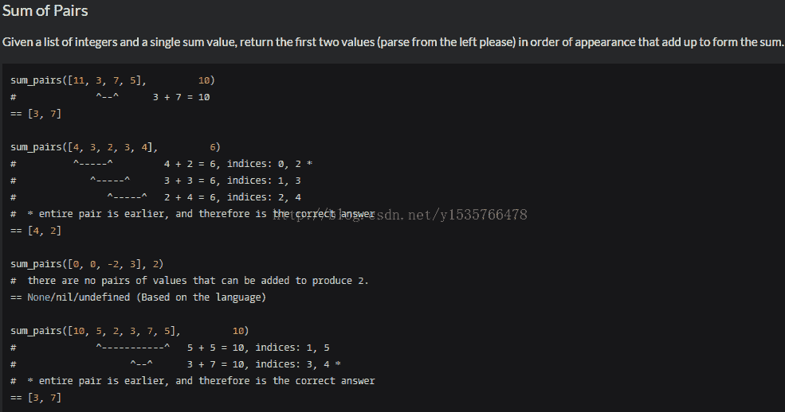

<!--yml
category: codewars
date: 2022-08-13 11:49:37
-->

# Codewars算法题（8）_哆啦AA梦的博客-CSDN博客

> 来源：[https://blog.csdn.net/y1535766478/article/details/76223685?ops_request_misc=&request_id=&biz_id=102&utm_term=codewars&utm_medium=distribute.pc_search_result.none-task-blog-2~all~sobaiduweb~default-5-76223685.nonecase](https://blog.csdn.net/y1535766478/article/details/76223685?ops_request_misc=&request_id=&biz_id=102&utm_term=codewars&utm_medium=distribute.pc_search_result.none-task-blog-2~all~sobaiduweb~default-5-76223685.nonecase)

第26题：

问题：

 

问题描述：

给定一个列表，和一个整数s，找出列表中两数之和为s,的两个数，并返回，若有若干对这样的数，那么选择相距较短的，在相距较短的中再找出index小的。

评分较高答案：

```
**def** sum_pairs(lst, s):
  cache = set()
    **for** i **in** lst:
  **if** s - i **in** cache:
  **return** [s - i, i]
        cache.add(i)
```

该方法用减法推倒~~~~，大神就是大神啊

第27题：

问题：

Divisors of 42 are : 1, 2, 3, 6, 7, 14, 21, 42\. These divisors squared are: 1, 4, 9, 36, 49, 196, 441, 1764\. The sum of the squared divisors is 2500 which is 50 * 50, a square!

Given two integers m, n (1 <= m <= n) we want to find all integers between m and n whose sum of squared divisors is itself a square. 42 is such a number.

The result will be an array of arrays(in C an array of Pair), each subarray having two elements, first the number whose squared divisors is a square and then the sum of the squared divisors.

#Examples:

```
list_squared(1, 250) --> [[1, 1], [42, 2500], [246, 84100]]
list_squared(42, 250) --> [[42, 2500], [246, 84100]]
```

问题描述：

 给定一个区间[m, n] 求这个区间内符合条件的 数对， [i, f[i]] 即 f[i] 为 i的所有因子的平方和且f[i]为平方数

评分较高代码：

```
CACHE={}
**def** **squared_cache**(number):
  **if** number **not in** CACHE:
  divisors = [x **for** x **in** range(1, number + 1) **if** number % x == 0]
        CACHE[number] = sum([x * x **for** x **in** divisors])
    **return** CACHE[number]

**def** **list_squared**(m, n):
  ret = []
    **for** number **in** range(m, n + 1):
  divisors_sum = squared_cache(number)
        **if** (divisors_sum ** 0.5).is_integer():
  ret.append([number, divisors_sum])
    **return** ret
```

其中：squared_cache函数是求整数的因子的平方和

自己代码：（有误）

```
**def** **factors**(p):
  divisors = []
    **for** k **in** range(1, p + 1):
  **if** p % k == 0:
  divisors.append(k)
    **return** divisors
**def** **list_squared**(m, n+1):
  output = []
    sum = 0
  **for** num **in** (m, n):
  **for** i **in** factors(num):
  sum += i*i
            **if** (sum ** 0.5).is_integer()
```

```
  **return** output.append([num, sum])
```

现在我的代码是错误的，但是我仍找不出原因。函数factors（）是求一个数的所有因子，并以列表形式返回。希望看到帖子的大神帮帮忙~~~，菜鸟儿在此感谢了！

201707281111持续更新~~~~