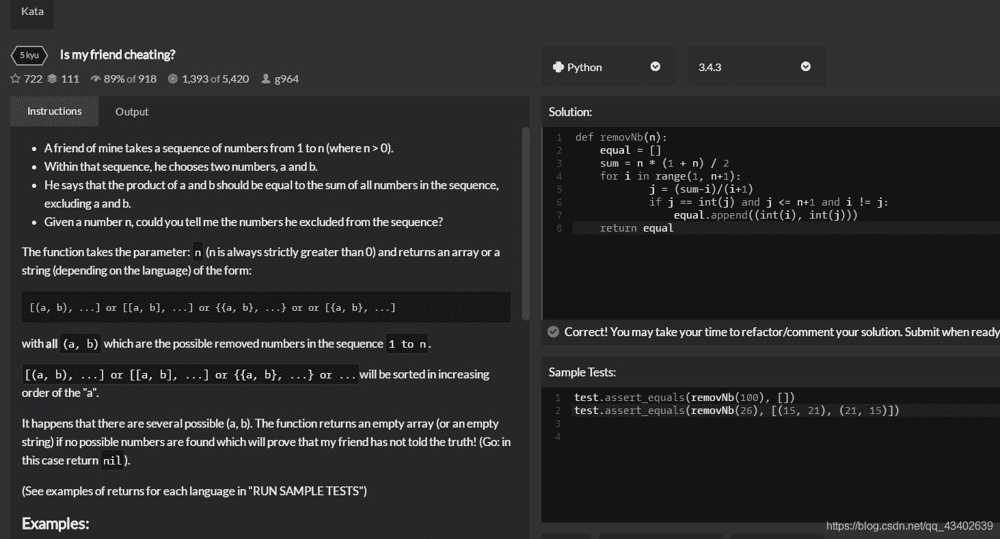

<!--yml
category: codewars
date: 2022-08-13 11:45:35
-->

# Codewars:Is my friend cheating? by python._东流-beyond the label的博客-CSDN博客

> 来源：[https://blog.csdn.net/qq_43402639/article/details/90704784?ops_request_misc=&request_id=&biz_id=102&utm_term=codewars&utm_medium=distribute.pc_search_result.none-task-blog-2~all~sobaiduweb~default-3-90704784.nonecase](https://blog.csdn.net/qq_43402639/article/details/90704784?ops_request_misc=&request_id=&biz_id=102&utm_term=codewars&utm_medium=distribute.pc_search_result.none-task-blog-2~all~sobaiduweb~default-3-90704784.nonecase)

开始用两个循环跑，超时了。。。

`程序代码：

def removNb(n):

```
equal = []
sum = n * (1 + n) / 2
for i in range(1, n+1):
        j = (sum-i)/(i+1)
        if j == int(j) and j <= n+1 and i != j:
            equal.append((int(i), int(j)))
return equal 
```

`
（插入代码块不太会操作、、、）
