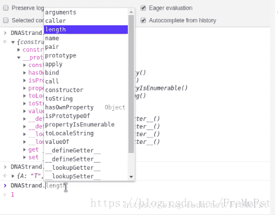

<!--yml
category: codewars
date: 2022-08-13 11:51:59
-->

# JS codewars题目_ShanCW的博客-CSDN博客

> 来源：[https://blog.csdn.net/FreMePst/article/details/83181983?ops_request_misc=&request_id=&biz_id=102&utm_term=codewars&utm_medium=distribute.pc_search_result.none-task-blog-2~all~sobaiduweb~default-3-83181983.nonecase](https://blog.csdn.net/FreMePst/article/details/83181983?ops_request_misc=&request_id=&biz_id=102&utm_term=codewars&utm_medium=distribute.pc_search_result.none-task-blog-2~all~sobaiduweb~default-3-83181983.nonecase)

# LEVEL 8

## 1.在这个kata中，您将创建一个函数，该函数获取非负整数和字符串的列表，并返回一个新的列表，其中过滤掉了字符串

**mycode**

```
 function filter_list(l) {
    		var arr2 =[];
    		for(var i=0;i<l.length;i++){
    			if(typeof(l[i])=="number"){
    				arr2.push(l[i]);
    			}	
    		}
    		return arr2;

} 
```

**bestcode**

```
function filter_list(l) {
  return l.filter(function(v) {return typeof v == 'number'})
} 
```

**filter方法**
filter() 方法创建一个新的数组，新数组中的元素是通过检查指定数组中符合条件的所有元素。
**array.filter(function(currentValue,index,arr), thisValue)**

和map()类似，Array的filter()也接收一个函数

```
var arr = [1, 2, 4, 5, 6, 9, 10, 15];
var r = arr.filter(function (x) {
    return x % 2 !== 0;
}); 
```

* * *

## 2.给定两个整数a和b，可以是正数或负数，找到包含它们之间的所有数字的总和并返回它。如果两个数字相等则返回a或b。

mycode（其实就是等差数列求和。。。）

```
function GetSum( a,b )
{
   let min = Math.min(a,b);
   let max = Math.max(a,b);

 	return (max+min)*(max-min+1)/2;
} 
```

bestcode

```
const GetSum = (a, b) => {
  let min = Math.min(a, b),
      max = Math.max(a, b);
  return (max - min + 1) * (min + max) / 2;
} 
```

let 和 const参考：[http://es6.ruanyifeng.com/#docs/let](http://es6.ruanyifeng.com/#docs/let)

* * *

## 3.脱氧核糖核酸（DNA）是一种在细胞核中发现的化学物质，带有生物体发育和功能的“指令”。符号“A”和“T”是彼此的互补，如“C”和“G”。 你有DNA的一面功能（字符串，Haskell除外）; 你需要获得另一个互补的一面。

**SymbolTest**

```
Test.assertEquals(DNAStrand("AAAA"),"TTTT","String AAAA is");
Test.assertEquals(DNAStrand("ATTGC"),"TAACG","String ATTGC is");
Test.assertEquals(DNAStrand("GTAT"),"CATA","String GTAT is");

DNAStrand ("ATTGC") # return "TAACG"
DNAStrand ("GTAT") # return "CATA" 
```

myCode:Time: 633ms

```
function DNAStrand(dna){
  trans="";
  for(let i=0;i<dna.length;i++){
  	  	switch (dna[i]){
  		case 'A': trans+='T';break;
  		case 'C': trans+='G';break;
  		case 'T': trans+='A';break;
  		case 'G': trans+='C';break;
  	}
  }
return trans;
} 
```

bestCode:Time: 673ms 牛批的解题方式

```
function DNAStrand(dna) {
  return dna.replace(/./g, function(c) {
    return DNAStrand.pairs[c]
  })
}

DNAStrand.pairs = {
  A: 'T',
  T: 'A',
  C: 'G',
  G: 'C',
} 
```

笔记：
1.
DNAStrand.pair ={}
给DNAStrand添加一个pairs属性


* * *

## 4.编写一个方法，将一系列连续（递增）字母作为输入，并返回数组中缺少的字母。您将始终获得有效的数组。它总会丢失一个字母。数组的长度始终至少为2。该数组将始终只包含一个字母。

```
describe("KataTests", function(){
  it("exampleTests", function(){
    Test.assertEquals(findMissingLetter(['a','b','c','d','f']), 'e');
    Test.assertEquals(findMissingLetter(['O','Q','R','S']), 'P');
  });
}); 
```

mycode

```
function findMissingLetter(array)
{
  for(let i=0;i<array.length;i++)
  	if((array[i].charCodeAt()+1)!=array[i+1].charCodeAt())
  		return String.fromCharCode(array[i].charCodeAt()+1)
} 
```

bestcode(感觉一般般）

```
function findMissingLetter(array) {
  let first = array[0].charCodeAt(0)
  for (let i = 1; i < array.length; i++) {
    if (first + i !== array[i].charCodeAt(0)) {
      return String.fromCharCode(first + i)
    }
  }
  throw new Error("Invalid input")
} 
```

笔记：
String.fromCharCode()//返回ascii码对应的字符
str.charCodeAt(position)//返回str字符对应的ASCII
array[i].charCodeAt()={var str="";str.charCodeAt(i);}

## 您的任务是对给定的字符串进行排序。字符串中的每个单词都包含一个数字。这个数字是单词在结果中应该具有的位置。注意：数字可以是1到9.因此1将是第一个单词（不是0）。如果输入String为空，则返回空String。

mycode

```
function order(words){

  console.log("code start")
  let arr_words=words.split(" ");
  let temp=[];
  for(let i=0;i<arr_words.length-1;i++)
  	  	for(let j=0;j<arr_words.length-1-i;j++)
  	  		if(arr_words[j].replace(/[^0-9]/ig,"")>arr_words[j+1].replace(/[^0-9]/ig,""))
  			{
  			temp=arr_words[j];
  			arr_words[j]=arr_words[j+1];
  			arr_words[j+1]=temp;
  			}
  			return arr_words.join(" ");
} 
```

bestcode（挫败感，一定要多使用js的方式，return可以返回多个，正则表达式还没学）

```
function order(words){

  return words.split(' ').sort(function(a, b){
      return a.match(/\d/) - b.match(/\d/);
   }).join(' ');
} 
```

# LEVEL 7

mycode

```
function SeriesSum(n)
{
  let sum=0;
  for(let i=1;i<=n;i++)
  	sum += 1/(3*i-2);
  	return(sum.toFixed(2))
} 
```

bestcode

```
function SeriesSum(n) {
  for (var s = 0, i = 0; i < n; i++) {
    s += 1 / (1 + i * 3)
  }

  return s.toFixed(2)
} 
```

笔记：xxx.toFixed(2)属性将xxx**强制转换**为两位小数1->1.00 1.1111->1.11

您将获得一个整数数组。
你的工作是获取该数组并找到一个索引N，其中N左边的整数之和等于N右边的整数之和。如果没有索引可以实现这一点，则返回 -1。

```
Test.describe("FindEvenIndex", function() {
  Test.it("Tests", function() {
    Test.assertEquals(findEvenIndex([1,2,3,4,3,2,1]),3, "The array was: [1,2,3,4,3,2,1] \n");
    Test.assertEquals(findEvenIndex([1,100,50,-51,1,1]),1, "The array was: [1,100,50,-51,1,1] \n");
    Test.assertEquals(findEvenIndex([1,2,3,4,5,6]),-1, "The array was: [1,2,3,4,5,6] \n");
    Test.assertEquals(findEvenIndex([20,10,30,10,10,15,35]),3, "The array was: [20,10,30,10,10,15,35] \n");
  }); 
```

mycode

```
function findEvenIndex(arr)
{
	arr.unshift(0);
	console.log(arr)
	let sum1=0
	for( let index=1;index<arr.length;index++)
	{
		let sum2=0;
		sum1 += arr[index-1];
		for(let j=index;j<arr.length-1;j++)
			sum2 += arr[j+1];
		if(sum1==sum2)
			return index-1
		if(index>arr.length-2)
		return -1
	}
} 
```

bestcode

```
function findEvenIndex(arr)
{
  for(var i=1; i<arr.length-1; i++) {
    if(arr.slice(0, i).reduce((a, b) =>  a+b) === arr.slice(i+1).reduce((a, b) =>  a+b)) {
      return i;
    }
  }
  return -1;
} 
```