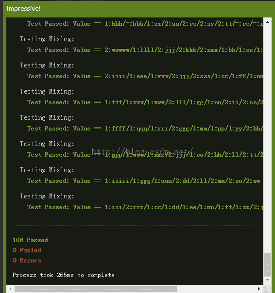

<!--yml
category: codewars
date: 2022-08-13 11:51:02
-->

# JavaScript进阶学习 CodeWars 日记 求两个字符串的混合_Cinderella_hou的博客-CSDN博客

> 来源：[https://blog.csdn.net/cinderella_hou/article/details/51834199?ops_request_misc=&request_id=&biz_id=102&utm_term=codewars&utm_medium=distribute.pc_search_result.none-task-blog-2~all~sobaiduweb~default-0-51834199.nonecase](https://blog.csdn.net/cinderella_hou/article/details/51834199?ops_request_misc=&request_id=&biz_id=102&utm_term=codewars&utm_medium=distribute.pc_search_result.none-task-blog-2~all~sobaiduweb~default-0-51834199.nonecase)

    CodeWars 是一个在线编程网站，其奖励机制像打怪升级。你不能查看高于你级别的问题的答案。除非自己通过提交测试。通过提交之后可以看到各种解法排行榜 。通过对比自己解法和排行榜对比，可以找到差距，提高能力。

 题目描述：编写一个mix函数，实现这样的功能， 求两个字符串的混合字符串，只统计字符串中小写字母（a ~ z)。当s1和s2都有字符a时，当含有字符的数量大于1时，统计两者含有最大的数目，如果相等取等号。比如，s1 = "my&friend&Paul has heavy hats! &"  ，s2 = "my friend John has many many friends &"   ，则mix(s1,s2)后返回字符串   "2:nnnnn/1:aaaa/1:hhh/2:mmm/2:yyy/2:dd/2:ff/2:ii/2:rr/=:ee/=:ss"

返回的字符串需要排序，首先长度长的在前面，如果长度一样，则前缀1优先于2优先于= 。不同的组用/隔开。

  解题思路： 首先过滤字符串，将a~z之外的字符过滤掉，然后统计每个字符出现的次数，这里是参考剑指offer的思路，设计一个数组，类似哈希表，数组下标代表字符的ascii编码，该下标对应的值代表该字符出现的次数。然后连接字符串，因为两个哈希数组同样的下标代表同一个字符，因此只需要在遍历哈希数组的时候，判断对应下标值的元素大小，如果s1》s2 ,则字符串为 “1：”+n个 元素，如果s1 == s2 ，字符串为 “=：” +n个 元素 ，否则 字符串为“2：”+ n个元素，因为元素和下标具有对应关系，即利用下标找到ascii码，再找到该ascii码对应的元素就可以了，n即是该下标对应的值。 连接好字符串之后，还要对字符串进行排序，首选用string.split（/）.然后对数组进行排序，排序规则是，首先判断元素长度，长度不等时降序排列，如果长度相等，按照元素前缀“1”，“2”，“=” 排序，如果前缀也相等，再按ascii码排序。

  说了这么多，上代码：

```
function mix(s1, s2) {
  var arr1 = [];       //arr1 和arr2 下面要用的哈希表
  var arr2 = [];
  var i = 0;
  var j =0 ;
  var str = "";
  var aIndex = 'a'.charCodeAt();
  for(;i<= 'z'.charCodeAt() - aIndex  ;++i  ){           //对两个数组哈希表初始化
    arr1[i] = 0;
    arr2[i] = 0;
  }
  for(i = 0; i < s1.length ;++i){
    if (s1[i] >= 'a' && s1[i] <= 'z') {
           arr1[s1[i].charCodeAt() - aIndex] ++ ;           //统计赋值，并排除非 a-z字符
    }
  }
 /s2 的哈希表
   for(i = 0; i < s2.length ;++i){
    if (s2[i] >= 'a' && s2[i] <= 'z') {
           arr2[s2[i].charCodeAt() - aIndex] ++ ;
    }
  }
  ///连接字符串
  var item1 =  0 ; var item2 = 0;
for(i =0 ;i < arr1.length ;++i){
  item1 = arr1[i];
  item2 = arr2[i] ;
   if (item1 > 1 ||  item2 > 1) {
    if (item1 != item2 ) {
       str += ( item1 > item2 ) ?  "1:" : "2:";           //连接前缀
    }  else {
      str += "=:"
    }
    //连接后面字符
      var len = (item1 > item2) ? item1 : item2;
      while(len){
         str += String.fromCharCode(i+97) ;
         len -- ;
      }
      str += "/";
   }

}
/去除最后一个'\'
   substr=str.substring(0,str.length-1);
   var sortFor = function(arr){                  //字符串排序规则
    var i =0 ;
    var j = 0;
    for(i =0;i<arr.length ; ++i){
      for( j = arr.length -1 ; j>i;--j){
        if (arr[j].length > arr[j-1].length) {
          var temp = arr[j];
          arr[j] = arr[j-1] ;
          arr[j-1] = temp ;
        } 
        if (arr[j].length == arr[j-1].length) {
          if (arr[j][0] != "=" && arr[j-1][0] == "="  || 
               arr[j][0] == arr[j-1][0]  &&  arr[j][2].charCodeAt() < arr[j-1][2].charCodeAt() ||
                arr[j][0] != "="  && arr[j-1][0] != "=" && arr[j][0] < arr[j-1][0] ) {
                 var temp = arr[j];
               arr[j] = arr[j-1] ;
               arr[j-1] = temp ;
          }
        }
      }
    }
    return arr;
   }
   var subarr = substr.split("/");
  substr = sortFor(subarr).join("/");
   return substr ;
}
```

过程就是这样，通过了codewars上所有的用例测试。结果图为：嘿嘿，成就感很大哦，虽然花费了一下午。

 

提交通过之后就可以查看排行榜了，大概这题比较复杂，排行榜得分高的不多，除了第一个代码稍微简单，用了es6的很多内容，第一之后代码都比较复杂。但是有一个奇怪的现象，虽然我的代码到处都是for循环，运行时间是265ms，排行第一的运行时间反而是350ms。还是贴一下老大的代码：

```
function mix(s1, s2) {
  var counter = s => s.replace(/[^a-z]/g,'').split('').sort().reduce((x,y)=> (x[y] = 1 + (x[y]||0), x),{});
  s1 = counter(s1); s2 = counter(s2);
  var res = [], keys = new Set(Object.keys(s1).concat(Object.keys(s2)));
  keys.forEach(key => {
    var c1 = s1[key]||0, c2 = s2[key]||0, count = Math.max(c1, c2);
    if (count>1) {
      var from = [1, '=', 2][Math.sign(c2-c1)+1];
      var str = [...Array(count)].map(_=>key).join('');
      res.push(from+':'+str);
    }
  });
  return res.sort((x, y) => y.length - x.length || (x < y ? -1 : 1)).join('/');
}
```

这个代码表示还有部分没看懂，待我研究研究再来分析。