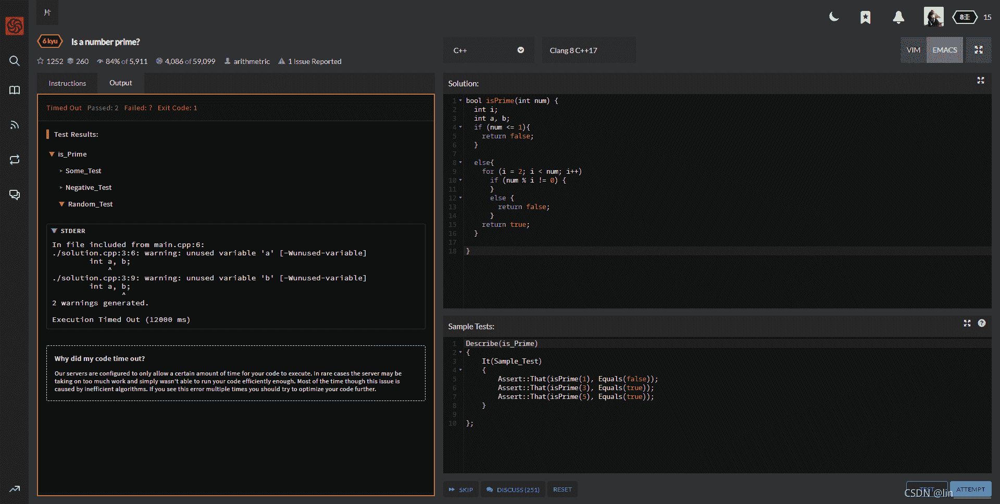
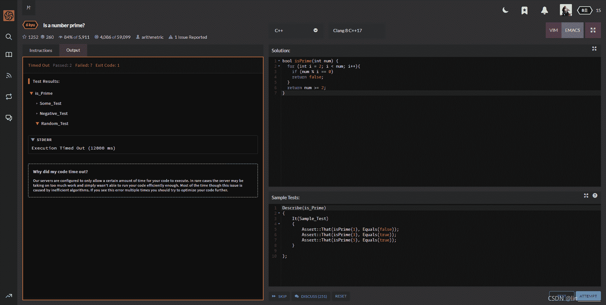

<!--yml
category: codewars
date: 2022-08-13 11:49:47
-->

# Kata | Codewars 之 Is a number prime?_lin_________的博客-CSDN博客

> 来源：[https://blog.csdn.net/lin_________/article/details/119936610?ops_request_misc=&request_id=&biz_id=102&utm_term=codewars&utm_medium=distribute.pc_search_result.none-task-blog-2~all~sobaiduweb~default-4-119936610.nonecase](https://blog.csdn.net/lin_________/article/details/119936610?ops_request_misc=&request_id=&biz_id=102&utm_term=codewars&utm_medium=distribute.pc_search_result.none-task-blog-2~all~sobaiduweb~default-4-119936610.nonecase)

> Title：
> 
> Define a function that takes one integer argument and returns logical value `true` or `false` depending on if the integer is a prime.
> 
> Per Wikipedia, a prime number (or a prime) is a natural number greater than 1 that has no positive divisors other than 1 and itself.
> 
> ## Requirements
> 
> *   You can assume you will be given an integer input.
> *   You can not assume that the integer will be only positive. You may be given negative numbers as well (or `0`).
> *   **NOTE on performance**: There are no fancy optimizations required, but still *the* most trivial solutions might time out. Numbers go up to 2^31 (or similar, depends on language version). Looping all the way up to `n`, or `n/2`, will be too slow.

我的：

```
bool isPrime(int num) {
	int i;
	int a, b;
	if (num <= 1){
		return false;
	}

	else{
		for (i = 2; i < num; i++)
			if (num % i != 0) {
			}
			else {
				return false;
			}
		return true;
	}

}
```



 说我执行超时了（Execution Timed Out (12000 ms)）

精简之后还是不行



 （有没有可以过得参考指点一下）