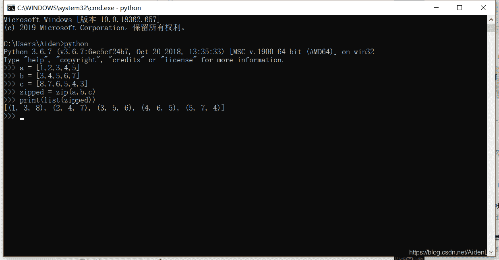
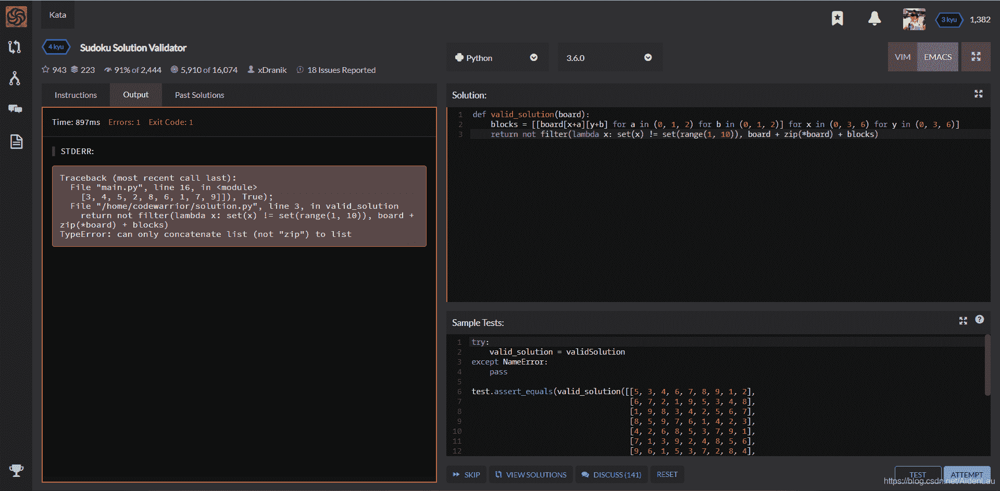
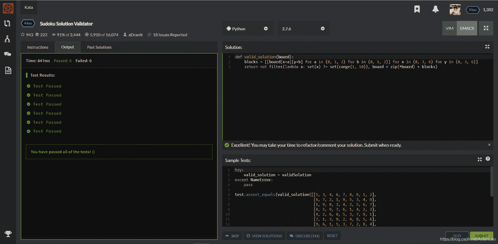

<!--yml
category: codewars
date: 2022-08-13 11:30:07
-->

# Sudoku Solution Validator (Codewars 4kyu Python)_AidenLau的博客-CSDN博客

> 来源：[https://blog.csdn.net/AidenLau/article/details/104687289?ops_request_misc=&request_id=&biz_id=102&utm_term=codewars&utm_medium=distribute.pc_search_result.none-task-blog-2~all~sobaiduweb~default-1-104687289.142^v40^control,185^v2^control](https://blog.csdn.net/AidenLau/article/details/104687289?ops_request_misc=&request_id=&biz_id=102&utm_term=codewars&utm_medium=distribute.pc_search_result.none-task-blog-2~all~sobaiduweb~default-1-104687289.142^v40^control,185^v2^control)

**题目：**

**Sudoku Background**

Sudoku is a game played on a 9x9 grid. The goal of the game is to fill all cells of the grid with digits from 1 to 9, so that each column, each row, and each of the nine 3x3 sub-grids (also known as blocks) contain all of the digits from 1 to 9.
(More info at: http://en.wikipedia.org/wiki/Sudoku)

**Sudoku Solution Validator**

Write a function validSolution/ValidateSolution/valid_solution() that accepts a 2D array representing a Sudoku board, and returns true if it is a valid solution, or false otherwise. The cells of the sudoku board may also contain 0’s, which will represent empty cells. Boards containing one or more zeroes are considered to be invalid solutions.
The board is always 9 cells by 9 cells, and every cell only contains integers from 0 to 9.

**Examples**

validSolution([
[5, 3, 4, 6, 7, 8, 9, 1, 2],
[6, 7, 2, 1, 9, 5, 3, 4, 8],
[1, 9, 8, 3, 4, 2, 5, 6, 7],
[8, 5, 9, 7, 6, 1, 4, 2, 3],
[4, 2, 6, 8, 5, 3, 7, 9, 1],
[7, 1, 3, 9, 2, 4, 8, 5, 6],
[9, 6, 1, 5, 3, 7, 2, 8, 4],
[2, 8, 7, 4, 1, 9, 6, 3, 5],
[3, 4, 5, 2, 8, 6, 1, 7, 9]
]); // => true

validSolution([
[5, 3, 4, 6, 7, 8, 9, 1, 2],
[6, 7, 2, 1, 9, 0, 3, 4, 8],
[1, 0, 0, 3, 4, 2, 5, 6, 0],
[8, 5, 9, 7, 6, 1, 0, 2, 0],
[4, 2, 6, 8, 5, 3, 7, 9, 1],
[7, 1, 3, 9, 2, 4, 8, 5, 6],
[9, 0, 1, 5, 3, 7, 2, 1, 4],
[2, 8, 7, 4, 1, 9, 6, 3, 5],
[3, 0, 0, 4, 8, 1, 1, 7, 9]
]); // => false

**我的思路：**

这题是让我们检查一个9*9的二维数组是否符合数独的格式，即：每行、每列、每个区块都是1-9。

于是我可以构造三个function，*check_lines()* ，*check_arrays()* 和 *check_squares()* 分别检查行、列和区块。如果三个函数检验结果都是True，则数组符合数独格式。

**我的解答：**

```
def valid_solution(board):
    if check_lines(board) and check_arrays(board) and check_squares(board):
        return True
    return False

def check_square(board,a,b):
    s = (board[a][b:b+3] + board[a+1][b:b+3] + board[a+2][b:b+3])
    s.sort()
    if s == [1,2,3,4,5,6,7,8,9]:
        return True
    return False

def check_lines(board):
    for i in range(len(board)):
        l = board[i][:]
        l.sort()
        if l != [1,2,3,4,5,6,7,8,9]:
            return False
    return True

def check_arrays(board):
    board = [[r[col] for r in board] for col in range(len(board[0]))]
    return check_lines(board)

def check_squares(board):
    if check_square(board,0,0) and check_square(board,0,3) and check_square(board,0,6) and check_square(board,3,0) and check_square(board,3,3) and check_square(board,3,6) and check_square(board,6,0) and check_square(board,6,3) and check_square(board,6,6):
        return True
    return False 
```

**Most Clever：**

做完题目看一下题后投票clever最多的答案：

```
def validSolution(board):
    blocks = [[board[x+a][y+b] for a in (0, 1, 2) for b in (0, 1, 2)] for x in (0, 3, 6) for y in (0, 3, 6)]
    return not filter(lambda x: set(x) != set(range(1, 10)), board + zip(*board) + blocks) 
```

第一句定义了9个block，第二句检验每个部分是否符合格式。其中很灵活地运用了 *zip()* 和 *filter()* 两个function。

*zip()* 函数用于将可迭代的对象作为参数，将对象中对应的元素打包成一个个元组，然后返回由这些元组组成的列表。如果各个迭代器的元素个数不一致，则返回列表长度与最短的对象相同，利用 * 号操作符，可以将元组解压为列表。

自己试一下：

本题中由于是规整的二维数组，*zip()* 相当于把数组横竖对调一下。

*filter()* 函数用于过滤序列，过滤掉不符合条件的元素，返回由符合条件元素组成的新列表。该接收两个参数，第一个为函数，第二个为序列，序列的每个元素作为参数传递给函数进行判断，然后返回 True 或 False，最后将返回 True 的元素放到新列表中。

本题中*filter()* 会返回符合条件（ *lambda x: set(x) != set(range(1, 10)* ）的元素，如果为None，not None强行转换会变成True。


由于这是4年前的答案，所以我一开始并没能运行成功，后来发现要用python2才可以运行成功。我猜测是由于 *zip()* 和 *filter()* 的用法在两个版本的python中不一样。查阅资料发现：

“*filter()* 在Pyhton2.7 返回列表，Python3.x 返回迭代器对象”

“*zip()* 方法在 Python 2 和 Python 3 中的不同：在 Python 3.x 中为了减少内存，*zip()* 返回的是一个对象。如需展示列表，需手动 *list()* 转换”



**总结：**

检验流程的大体思路一致，Most Clever答案非常巧妙，很灵活地运用了 *zip()*，*filter()* 和 not None强制转换，使得繁琐的步骤能一句话解决。