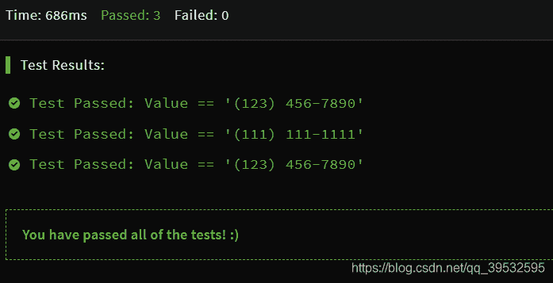

<!--yml
category: codewars
date: 2022-08-13 11:48:18
-->

# codeWars --Create Phone Number_YeSyinnng的博客-CSDN博客

> 来源：[https://blog.csdn.net/qq_39532595/article/details/85647354?ops_request_misc=&request_id=&biz_id=102&utm_term=codewars&utm_medium=distribute.pc_search_result.none-task-blog-2~all~sobaiduweb~default-8-85647354.nonecase](https://blog.csdn.net/qq_39532595/article/details/85647354?ops_request_misc=&request_id=&biz_id=102&utm_term=codewars&utm_medium=distribute.pc_search_result.none-task-blog-2~all~sobaiduweb~default-8-85647354.nonecase)

Go on：）

题目：

> Write a function that accepts an array of 10 integers (between 0 and 9), that returns a string of those numbers in the form of a phone number.
> 
> Example: createPhoneNumber([1, 2, 3, 4, 5, 6, 7, 8, 9, 0]) // =>
> returns "(123) 456-7890

大意是根据一个数字，创建一个电话号码，根据电话号码的格式进行输出。
今天这题 比较简单呀：
代码：

```
function createPhoneNumber(numbers){
        numbers.unshift('(');
        for(var i=0;i<numbers.length;i++){
            if(i===3){
                numbers[i]+=') ';
            }else if(i===6){
                numbers[i]+='-';
            }
        }
        return numbers.join('');
    } 
```



好的，方法二：

```
 function createPhoneNumber1(numbers){
        numbers = numbers.join('');     //转为字符串 再用substring进行截取
        return '('+numbers.substring(0,3)+') '+numbers.substring(3,6)+'-'+numbers.substring(6);
    } 
```

然后是大佬的点睛：（替换是真的没有想到呀，记下来记下来）

```
 function createPhoneNumber2(numbers){
       var format ="(xxx) xxx-xxxx";
       for(var i=0;i<numbers.length;i++){
           format = format.replace('x',numbers[i]);
       }
       return format;
    } 
```

最后是正则表达式，嗯，接下去我要狂补正则了，告辞！！！

```
function createPhoneNumber(numbers){
  return numbers.join('').replace(/(...)(...)(.*)/, '($1) $2-$3');
} 
```

继续继续加油呀~