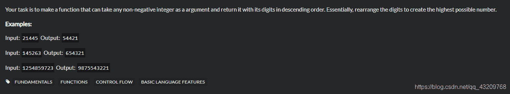
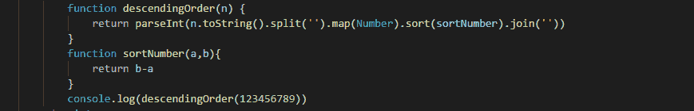
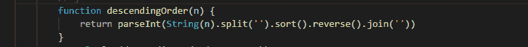

<!--yml
category: codewars
date: 2022-08-13 11:40:12
-->

# codewars----Descending Order_bug的生产者的博客-CSDN博客

> 来源：[https://blog.csdn.net/qq_43209768/article/details/96429269?ops_request_misc=&request_id=&biz_id=102&utm_term=codewars&utm_medium=distribute.pc_search_result.none-task-blog-2~all~sobaiduweb~default-9-96429269.142^v40^control,185^v2^control](https://blog.csdn.net/qq_43209768/article/details/96429269?ops_request_misc=&request_id=&biz_id=102&utm_term=codewars&utm_medium=distribute.pc_search_result.none-task-blog-2~all~sobaiduweb~default-9-96429269.142^v40^control,185^v2^control)

题目描述：

我的解答：

将一个数里面的每个数字按照倒序排列，在这里我多写了一个sortNumber函数来进行排序，但实际上不用，因为这里不会存在两位数以上的数字，因此单纯地按照ASCII码来排序也是可以的。

别人更简洁的写法可以参考一下
