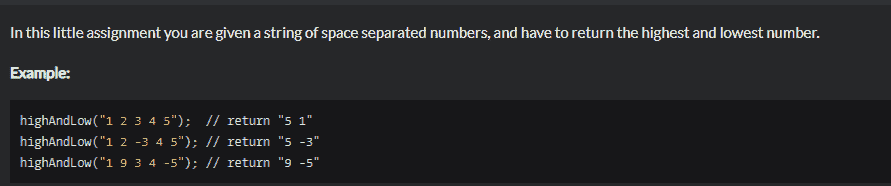
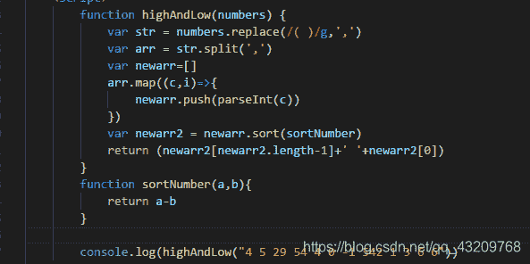
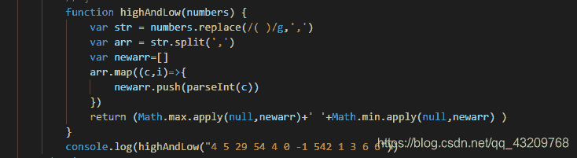
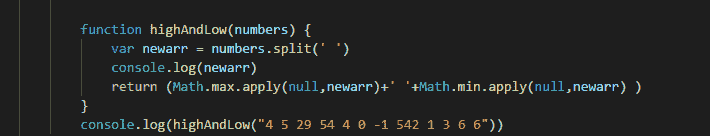
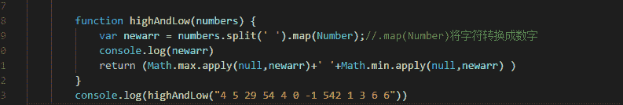
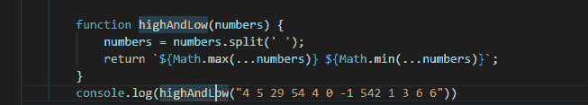

<!--yml
category: codewars
date: 2022-08-13 11:50:29
-->

# codewars----Highest and Lowest_bug的生产者的博客-CSDN博客

> 来源：[https://blog.csdn.net/qq_43209768/article/details/96425753?ops_request_misc=&request_id=&biz_id=102&utm_term=codewars&utm_medium=distribute.pc_search_result.none-task-blog-2~all~sobaiduweb~default-2-96425753.nonecase](https://blog.csdn.net/qq_43209768/article/details/96425753?ops_request_misc=&request_id=&biz_id=102&utm_term=codewars&utm_medium=distribute.pc_search_result.none-task-blog-2~all~sobaiduweb~default-2-96425753.nonecase)

题目描述

我的解答1

我的解答2

在参照别人的写法后，发现了解法二更简洁的写法

这里的newarr是一个字符串数组：

```
["4", "5", "29", "54", "4", "0", "-1", "542", "1", "3", "6", "6"] 
```

若使它成为一个真正的数组，可以将上面的答案改写成

网友的优质解答，看的我虎躯一震呀（这里用到了es6的模板字符串和延展操作符）
