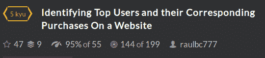

<!--yml
category: codewars
date: 2022-08-13 11:51:39
-->

# codewars--Identifying Top Users and their Corresponding Purchases On a Website_honeybabyqinqin的博客-CSDN博客

> 来源：[https://blog.csdn.net/weixin_41871914/article/details/85799036?ops_request_misc=&request_id=&biz_id=102&utm_term=codewars&utm_medium=distribute.pc_search_result.none-task-blog-2~all~sobaiduweb~default-9-85799036.nonecase](https://blog.csdn.net/weixin_41871914/article/details/85799036?ops_request_misc=&request_id=&biz_id=102&utm_term=codewars&utm_medium=distribute.pc_search_result.none-task-blog-2~all~sobaiduweb~default-9-85799036.nonecase)

# Identifying Top Users and their Corresponding Purchases On a Website

* * *

## Problem Description:

[Click here to get the problem description.](https://www.codewars.com/kata/5838b5eb1adeb6b7220000f5/train/python)



* * *

## Version of Python:


* * *

## Solutions:

### Method1:

```
sum=[]
dict={}
def id_best_users(*args):
    # your code here
    for arg in args:
        sum.extend(arg)
    #print(sum)

    for item in sum:
        dict[item]=dict.get(item,0)+1
    #print("dict: ",dict)
    #print("###################################################################################################################")
    m2={}
    for k,v in dict.items():
        if v in m2.keys():
            m2[v].append(k)
        else:
            m2[v] = [k]
    #print(m2)
    #print("###################################################################################################################")

    list2=[]
    for k,v in m2.items():
        list1=[]
        list1.append(k)
        list1.append(v)
        #print(list1)
        list2.append(list1)
    #print(list2)
    #print("###################################################################################################################")

    list2.sort(reverse=True)
    #print(list2)

    return list2 
```

* * *

## Grammars(Method1):

* * *

### Method2:

```
from collections import Counter
from itertools import chain

def id_best_users(*args):
    best_users = set.intersection(*(set(a) for a in args))
    cnt = Counter(chain(*args))
    users = {}
    for k, v in cnt.iteritems():
        if k in best_users:
            users.setdefault(v, []).append(k)
    return [[k, sorted(v)] for k, v in sorted(users.iteritems(), reverse=True)] 
```

### Method3:

```
def id_best_users(*args):
    dct_m = set.intersection( *[ set( x for x in arg ) for arg in args ])
    dct = { u:sum( arg.count(u) for arg in args) for u in dct_m }
    dct_r = [ [x,sorted(u)] for x in set(dct.values()) for u in [[ y for y in dct.keys() if dct[y] == x ]] ]

    return sorted(dct_r, reverse=True) 
```

### Method4:

```
from collections import Counter

def id_best_users(*months):

    n = Counter([user for month in months for user in month])
    c = {}
    for user in set.intersection(*[set(month) for month in months]):
        c[n[user]] = c.get(n[user], []) + [user]

    return [[k, sorted(c[k])] for k in sorted([k for k in c], reverse=True)] 
```

### Method5:

```
def id_best_users(*args):
    from collections import Counter
    sum_counts = Counter(sum(args, []))

    common_set = set.intersection(*(set(arg) for arg in args))

    def is_common(user):
        return user in common_set

    common_users = [user for user, _ in sum_counts.most_common()
                    if is_common(user)]

    from itertools import groupby
    return [[count, sorted(users)] for count, users in
            groupby(common_users, lambda user: sum_counts[user])] 
```

* * *

##### Method1 is written by me, and the others is made by some BIG PEOPLE.