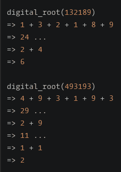
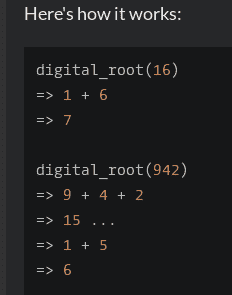

<!--yml
category: codewars
date: 2022-08-13 11:47:59
-->

# codewars--Sum of Digits_honeybabyqinqin的博客-CSDN博客

> 来源：[https://blog.csdn.net/weixin_41871914/article/details/84977950?ops_request_misc=&request_id=&biz_id=102&utm_term=codewars&utm_medium=distribute.pc_search_result.none-task-blog-2~all~sobaiduweb~default-8-84977950.nonecase](https://blog.csdn.net/weixin_41871914/article/details/84977950?ops_request_misc=&request_id=&biz_id=102&utm_term=codewars&utm_medium=distribute.pc_search_result.none-task-blog-2~all~sobaiduweb~default-8-84977950.nonecase)

# Sum of Digits / Digital Root

#### problem describtion:

In this kata, you must create a digital root function.
A digital root is the recursive sum of all the digits in a number. Given n, take the sum of the digits of n. If that value has two digits, continue reducing in this way until a single-digit number is produced. This is only applicable to the natural numbers.



## Method:

```
def digital_root(n):
    while n >= 10:
        n=sum(map(int,str(n)))
        digital_root(n)
    return n 
```

If you replace *while* with *if*,you can’t get true.Also.I don’t know the reason.

## Explanation:

the function of map() :

```
map(function, iterable, ...) 
```

Using the map() function maps the specified sequence based on the supplied function. The first parameter function, uses the function with each element in the parameter sequence, returning a new list ,containing the values returned by each function with each element.
Here you need to convert the int to string, and then sum() is used directly to sum the string. Using a recursion , calculating a new value determines whether it is a two-digit number.