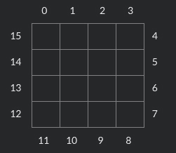

<!--yml
category: codewars
date: 2022-08-13 11:28:59
-->

# codewars 7×7 Skyscrapers 问题解决_Li_ux的博客-CSDN博客

> 来源：[https://blog.csdn.net/u011755670/article/details/104891730/?ops_request_misc=&request_id=&biz_id=102&utm_term=codewars&utm_medium=distribute.pc_search_result.none-task-blog-2~all~sobaiduweb~default-3-104891730.142^v40^control,185^v2^control](https://blog.csdn.net/u011755670/article/details/104891730/?ops_request_misc=&request_id=&biz_id=102&utm_term=codewars&utm_medium=distribute.pc_search_result.none-task-blog-2~all~sobaiduweb~default-3-104891730.142^v40^control,185^v2^control)

### codewars 7×7 Skyscrapers 问题解决

# 1、背景说明

最近工作上的任务完成得比较超前，闲暇之余就会在刷题网站上刷题玩。前两天偶然刷到一道*1kyu*([codewars](https://www.codewars.com/)上题目难度按等级排名，数字越小等级越高，题目也越难，*1kyu*代表1级即最难)，仔细看了题目描述后发现和之前做过的一道*4kyu*的题类似，于是我就开始了解题之旅，最终在经历了2天的奋战后终于解决了这个问题。为了更好的巩固从问题中学习到的知识和思路，也为了做一次知识分享的尝试，我把从解题开始到结束的经历和感悟写成了这篇文章，初次尝试会比较生疏，希望大家能多多理解。

# 2、题目分析

[题目链接](https://www.codewars.com/kata/5917a2205ffc30ec3a0000a8/go)

## 2.1 题目描述

In a grid of 7 by 7 squares you want to place a skyscraper in each square with only some clues:

*   The height of the skyscrapers is between 1 and 7
*   No two skyscrapers in a row or column may have the same number of floors
*   A clue is the number of skyscrapers that you can see in a row or column from the outside
*   Higher skyscrapers block the view of lower skyscrapers located behind them

Can you write a program that can solve this puzzle in time?

看到这或许你还不明白这道题想要你解决的问题到底是什么，那么请注意下面这句话:
**This kata is based on [4 By 4 Skyscrapers](https://www.codewars.com/kata/4-by-4-skyscrapers/) and [6 By 6 Skyscrapers](https://www.codewars.com/kata/6-by-6-skyscrapers/) by FrankK. By now, examples should be superfluous; you should really solve Frank’s kata first, and then probably optimise some more. A naive solution that solved a 4×4 puzzle within 12 seconds might need time somewhere beyond the Heat Death of the Universe for this size. It’s quite bad.**

里面对为什么题目描述中没有例子的原因做了解释:***这道题是基于4x4和6x6的问题之上的***，所以为了解决这个问题，我们需要先看一下4x4和6x6的题目。

## 2.2 4x4的问题

Example:

To understand how the puzzle works, this is an example of a row with 2 clues. Seen from the left side there are 4 buildings visible while seen from the right side only 1:

There is only one way in which the skyscrapers can be placed. From left-to-right all four buildings must be visible and no building may hide behind another building:

Example of a 4 by 4 puzzle with the solution:

看到这里应该大概了解题目想说明什么了吧，想象在每个格子里放置一个高度为格子中数字的’楼房’，然后从对应的方向看过去，能看到几个’楼房’的数量即为格子外的限制条件。
像 `1234` 这样一排数字，从左往右看，4个格子的’楼房’都能被看到，所以左边是`4`，而从右往左看的话因为最右边的格子里的4层高的’楼房’把后边的全部挡住了，所以只能看到1个’楼房’，右边就是`1`。

下面我们再来题目需求

Task:

```
func SolvePuzzle(clues []int) [][]int 
```

*   Pass the clues in an array of 16 items. This array contains the clues around the clock, index:
    
*   If no clue is available, add value `0`
*   Each puzzle has only one possible solution
*   `SolvePuzzle()` returns matrix `int[][]`. The first indexer is for the row, the second indexer for the column. (Python: returns 4-tuple of 4-tuples, Ruby: 4-Array of 4-Arrays)

看到这题目需求就完全明确了，一开始会给定一个数组作为限制条件（即从各行各列各方向看过去的楼层高度），我们需要完成一个`SolvePuzzle`函数，函数的功能如下:

*   计算一个行列满足给定限定条件的二维数组
*   每行每列的数字不能重复
*   需要在12秒内计算出结果

## 2.3 思路分析

*   首先想到是8皇后的问题（如果不了解8皇后问题的自行百度喔），但又多了限制条件，于是重新思考思路。重新思考的思路还是基于8皇后之上，这种问题一般都需要使用回溯来解决，主要是找到回溯的条件。苦苦思考之后，发现这个问题的限制条件是一行或一列的，那么可以每次填写一整行和一整列，这样会减少回溯的次数，至于每次回溯的限制，则直接根据行或列两头的限制条件来决定。
*   然后又出现了另外的问题，比如4x4两边的限制条件是1和4，那么就只有一种填法:4321，而且4x4的排列组合很少，完全可以手动把每种限制条件的排序全部列出来再选择。但7x7的问题如果要自己手动写的话就太多，还容易出错，于是就想到了先生成一个全排列的列表，然后遍历列表，把每一个排列从头到尾能数出的高度和从尾到头能数出的高度全部计算出来，同时按照高度分在不同的map中，这样方便后面的使用。
*   各个排列对应的数字都计算好了，现在需要的是划分限制条件数组了，从4x4的问题中我们能够看出，给定了16个数字，但是其中`0-3`和`11-8`、`4-7`和`12-15`是一一对应限制了一列或一行的，那么可以将限制条件筛选出来。首先筛选从小到大筛选两头都有数字的限制条件为一组，因为两头都有限制的行或列对应可以填的数字组合越少，然后再把只有一边有数字的限制条件筛选出来，如果两边都为0的直接忽略。选好之后再按照限制条件的大小进行排序，组装成一个列表，确保限制条件越大的在前面。
*   前提工作已经完成了，这个时候就需要开始填写格子了，首先明确的是，我们需要先填写有限制条件的格子，即每行每列两头有数字的格子，根据限制条件从前面计算的全排列组合高度map中取出组合填入格子中，填入的时候需要判断是否和已有的数字冲突，如果冲突则不符合，需要重新取组合，填好一个限制条件对应的行或列后再填下一个规则，若所有的组合都不能填入表格中，则应该回溯到上一步重新填写，知道所有的规则都填写完为止。
*   不要以为这个时候就完成了，刚刚我们填写的只是有规则的行或列，还有些格子是没有被规则覆盖到的，这个时候我们就需要一个格子一个格子的填写，每个格子填写的时候需要判断行和列中的数字是否重复，如果不重复则填好后继续填下一个格子，如果所有数字都重复则需要回溯到上一个格子重新填写，如果无法完成空白格子的填写，则需要回溯到上一步规则填写中，从最后一个规则重新填写，直到所有的空白格子都完成填写，这个时候才最终完成了解题。

# 3、代码编写

完整的代码地址 : https://github.com/wshhz/codewars/blob/master/1kyu/solvePuzzle.go

## 3.1 全排列组合及统计

```
 func PermutationConcurrency(s []int) [][]int {
	req, out := make(chan []int), make(chan []int)

	permutaionConImpl(req, out, s)

	over := make(chan [][]int)

	go func() {
		result := make([][]int, 0)

		for res := range out {
			result = append(result, res)
		}

		over <- result
	}()

	for _, c := range s {
		sl := []int{c}
		req <- sl
	}
	close(req)

	return <-over
}

func prefixIncrement(in []int, s []int, next chan []int) {
	for _, c := range s {
		exist := false
		for _, e := range in {
			if e == c {
				exist = true
				break
			}
		}
		if exist {
			continue
		}

		temp := make([]int, 0)
		temp = append(temp, in...)
		temp = append(temp, c)
		next <- temp
	}
}

func permutaionConImpl(req chan []int, out chan []int, s []int) {
	go func() {

		v, ok := <-req
		if !ok {
			return
		}

		next := out
		if len(v) != len(s)-1 {
			next = make(chan []int)
			permutaionConImpl(next, out, s)
		}

		prefixIncrement(v, s, next)
		for in := range req {
			prefixIncrement(in, s, next)
		}
		close(next)
	}()
} 
```

```
...
result := PermutationConcurrency(data)

for _, items := range result {

	count := calcCount(items)
	reCount := calcCount(reverse(items))

	clueListMap[count][reCount] = append(clueListMap[count][reCount], items)
	clueListMap[count][0] = append(clueListMap[count][0], items)
}
...

func calcCount(data []int) int {
	max, count := data[0], 1
	for _, cur := range data[1:] {
		if cur > max {
			count++
			max = cur
		}
	}

	return count
} 
```

## 3.2 限制规则统计

根据规则条件分组

```
...
selfClueNodeList := make([]*SelfClueNode, 0)
	existMap := make(map[int]interface{})
	for i := 0; i < len(clues); i++ {
		if clues[i] == 0 {
			continue
		}

		if i < N {
			selfClueNodeList = append(selfClueNodeList, &SelfClueNode{i, clues[i], clues[3*N-1-i]})

			if clues[3*N-1-i] != 0 {
				existMap[3*N-1-i] = struct{}{}
			}
		} else if i < 2*N {
			selfClueNodeList = append(selfClueNodeList, &SelfClueNode{i, clues[i], clues[5*N-1-i]})

			if clues[5*N-1-i] != 0 {
				existMap[5*N-1-i] = struct{}{}
			}
		} else {

			if _, exists := existMap[i]; exists {
				continue
			}

			selfClueNodeList = append(selfClueNodeList, &SelfClueNode{i, clues[i], 0})
		}
	}

	sort.Slice(selfClueNodeList, func(i, j int) bool {

	maxNum := 0
	if selfClueNodeList[j].Forward > maxNum {
		maxNum = selfClueNodeList[j].Forward
	}

	if selfClueNodeList[j].Rev > maxNum {
		maxNum = selfClueNodeList[j].Rev
	}

	if selfClueNodeList[i].Rev == 0 && selfClueNodeList[j].Rev != 0 {
		return false
	}

	if selfClueNodeList[j].Rev == 0 && selfClueNodeList[i].Rev != 0 {
		return true
	}

	return selfClueNodeList[i].Forward > maxNum || selfClueNodeList[i].Rev > maxNum
})
... 
```

## 3.3 根据规则列表开始填写

每个规则的填写

```
...
	if clues.Index < N {

		ifReverse = false
		isRow = false
		curIndex = clues.Index
		for i := 0; i < N; i++ {
			nowData[i] = result[i][curIndex]
		}
	} else if clues.Index < 2*N {

		ifReverse = true
		isRow = true
		curIndex = clues.Index - N
		for j := 0; j < N; j++ {
			nowData[j] = result[curIndex][j]
		}
	} else if clues.Index < 3*N {

		ifReverse = true
		isRow = false
		curIndex = 3*N - 1 - clues.Index
		for i := 0; i < N; i++ {
			nowData[i] = result[i][curIndex]
		}
	} else {

		ifReverse = false
		isRow = true
		curIndex = 4*N - 1 - clues.Index
		for j := 0; j < N; j++ {
			nowData[j] = result[curIndex][j]
		}
	}

	for cluesListIndex := clueIndexList[level]; cluesListIndex < len(cluesNodeList); cluesListIndex++ {
		data := cluesNodeList[cluesListIndex]
		if ifReverse {
			data = reverse(data)
		}
		if isMatch(data, nowData, result, isRow, curIndex) {
			clueIndexList[level] = cluesListIndex + 1
			fillData(result, data, curIndex, isRow)
			if dfs(level+1, result, cluesList, clueIndexList) {
				return true
			}
			clueIndexList[level] = 0
			fillData(result, nowData, curIndex, isRow)
		}
	}
... 
```

## 3.4 空白格子的填写

在填写完规则行列后还需要填写剩下的空白格子

```
...
	i, j := zeroNodeList[level][0], zeroNodeList[level][1]
	for num := 1; num <= N; num++ {
		if isValid(result, i, j, num) {
			result[i][j] = num
			if dfs1(level+1, result, zeroNodeList) {
				return true
			}
			result[i][j] = 0
		}
	}
... 
```

## 3.5 使用到的辅助方法

```
 func isValid(result [][]int, i, j, num int) bool {
	for k := 0; k < N; k++ {
		if k != j && result[i][k] != 0 && result[i][k] == num {
			return false
		}
	}
	for k := 0; k < N; k++ {
		if k != i && result[k][j] != 0 && result[k][j] == num {
			return false
		}
	}

	return true
}

func fillData(result [][]int, data []int, index int, isRow bool) {
	if isRow {
		for j := 0; j < N; j++ {
			result[index][j] = data[j]
		}
	} else {
		for i := 0; i < N; i++ {
			result[i][index] = data[i]
		}
	}
}

func reverse(data []int) []int {
	result := make([]int, len(data))
	copy(result, data)

	for i, j := 0, len(result)-1; i < j; i, j = i+1, j-1 {
		result[i], result[j] = result[j], result[i]
	}

	return result
}

func calcCount(data []int) int {
	max, count := data[0], 1
	for _, cur := range data[1:] {
		if cur > max {
			count++
			max = cur
		}
	}

	return count
}

func isMatch(data []int, existsNum []int, result [][]int, isRow bool, index int) bool {
	for i := 0; i < N; i++ {
		if existsNum[i] == 0 {
			continue
		}

		if existsNum[i] != data[i] {
			return false
		}
	}

	if isRow {

		for j := 0; j < N; j++ {
			if existsNum[j] != 0 {
				continue
			}

			for i := 0; i < N; i++ {
				if i == index {
					continue
				}

				if result[i][j] != 0 && result[i][j] == data[j] {
					return false
				}
			}
		}
	} else {

		for i := 0; i < N; i++ {
			if existsNum[i] != 0 {
				continue
			}

			for j := 0; j < N; j++ {
				if j == index {
					continue
				}

				if result[i][j] != 0 && result[i][j] == data[i] {
					return false
				}
			}
		}
	}

	return true
} 
```

# 4、总结

我以前接触过数独这种类似题目，所以在看到这个题目时会在第一时间就想到使用回溯法来进行解题，但因为有时间限制，从而不能像数独一样用爆破法一个格子一个格子的填写，加上限制条件的特殊性，最终想到一整行或一整列的解题方法，成功的在限制时间内解出了这道题。但我感觉这个解法并不是最优的解法，其中还有很多可以优化的地方，我自己一时半会是想不出来了，希望大家能多多的提提建议，尽量的优化解答。

这是我第一次在csdn上写文章，磕磕碰碰了几天最终写完了，算是完成了长时间来的一次尝试，文笔不好所以导致文章的内容质量不是很高，今后会持续的做知识输出，也会提高自己的写作能力，如果有写得不好的地方希望大家能理解！

**原创不易！转载请注明作者！谢谢！**