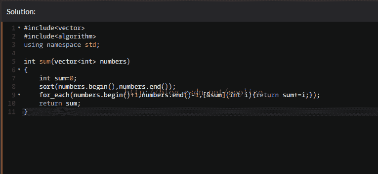

<!--yml
category: codewars
date: 2022-08-13 11:42:39
-->

# codewars c++8分题(1)_ooolize的博客-CSDN博客

> 来源：[https://blog.csdn.net/ooolize/article/details/57416224?ops_request_misc=%257B%2522request%255Fid%2522%253A%2522166036059216781685328322%2522%252C%2522scm%2522%253A%252220140713.130102334.pc%255Fall.%2522%257D&request_id=166036059216781685328322&biz_id=0&utm_medium=distribute.pc_search_result.none-task-blog-2~all~first_rank_ecpm_v1~rank_v31_ecpm-20-57416224-null-null.142^v40^control,185^v2^control&utm_term=codewars](https://blog.csdn.net/ooolize/article/details/57416224?ops_request_misc=%257B%2522request%255Fid%2522%253A%2522166036059216781685328322%2522%252C%2522scm%2522%253A%252220140713.130102334.pc%255Fall.%2522%257D&request_id=166036059216781685328322&biz_id=0&utm_medium=distribute.pc_search_result.none-task-blog-2~all~first_rank_ecpm_v1~rank_v31_ecpm-20-57416224-null-null.142^v40^control,185^v2^control&utm_term=codewars)

**综述: 使用标准库容器与与之配套的泛型算法.关键是找出最大值与最小值,策略是先排序,再从第二个开始加到倒数第二个. 具体实现为 使用标准库容器vector储存元素 泛型算法sort排序，for_each与lambda表达式配合相加，这里注意lambda是引用捕获[&sum](int i){return sum+=i;} ，（亦可用函数指针，函数对象类代替）.** 

**kata**: sum without highest and lowest

**instruction:**

solution:

 

**output:**

**** 

**疑问：是否能使用标准库定义的函数对象类plus<int>，如何返回？**