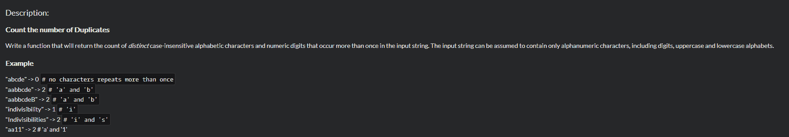
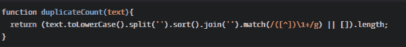

<!--yml
category: codewars
date: 2022-08-13 11:49:34
-->

# codewars-random(5)_weixin_30532759的博客-CSDN博客

> 来源：[https://blog.csdn.net/weixin_30532759/article/details/99244907?ops_request_misc=&request_id=&biz_id=102&utm_term=codewars&utm_medium=distribute.pc_search_result.none-task-blog-2~all~sobaiduweb~default-4-99244907.nonecase](https://blog.csdn.net/weixin_30532759/article/details/99244907?ops_request_misc=&request_id=&biz_id=102&utm_term=codewars&utm_medium=distribute.pc_search_result.none-task-blog-2~all~sobaiduweb~default-4-99244907.nonecase)

正则表达式可以解决很多问题，而我现在是正则表达渣渣

问题：

我的解法：function duplicateCount(text){
  //...
  var alphabet = "abcdefghijklmnopqrstuvwxyz";
  text = text.toLowerCase();
  var count = 0;

  for(var index = 0; index < alphabet.length; index++){
  var flag1 = text.indexOf(alphabet[index]);
  var flag2 = text.lastIndexOf(alphabet[index]);
    if(flag1 != -1 && flag2 != -1 && flag1 != flag2) count++;
  }
  return count;

}

思路：用字母表挨个检查目标字符串，出现两个count就加一(这里想用正则的，然而我是个正则渣渣，唉)，为什么不用目标字符串做字母表？会重复

最优解：