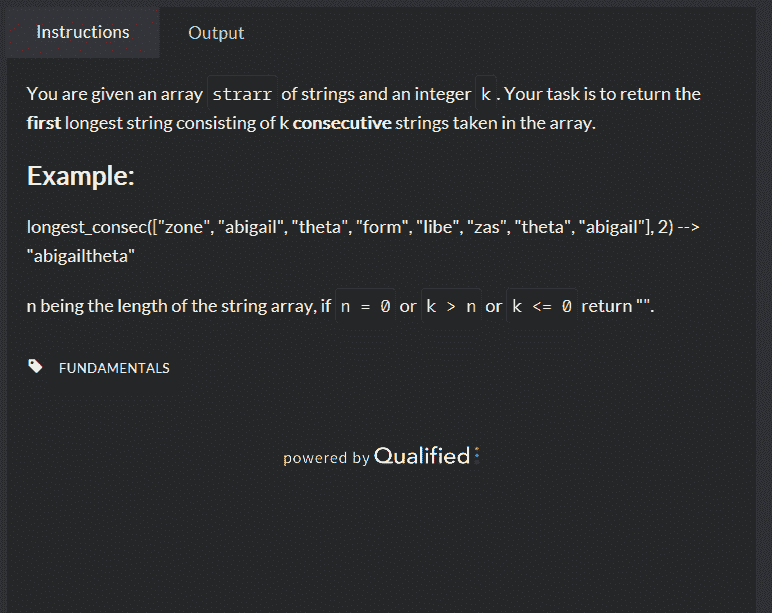

<!--yml
category: codewars
date: 2022-08-13 11:34:54
-->

# codewars-random（3）_weixin_30951743的博客-CSDN博客

> 来源：[https://blog.csdn.net/weixin_30951743/article/details/99244901?ops_request_misc=&request_id=&biz_id=102&utm_term=codewars&utm_medium=distribute.pc_search_result.none-task-blog-2~all~sobaiduweb~default-8-99244901.142^v40^control,185^v2^control](https://blog.csdn.net/weixin_30951743/article/details/99244901?ops_request_misc=&request_id=&biz_id=102&utm_term=codewars&utm_medium=distribute.pc_search_result.none-task-blog-2~all~sobaiduweb~default-8-99244901.142^v40^control,185^v2^control)

思路：两个嵌套的for循环（不推荐，应该有更好的。）

具体代码：function longestConsec(strarr, k) {
    // your code
    var n = strarr.length;
    if(n == 0 || k > n || k <= 0)
    return "";
    var maxStr = "";
    for(var l = 0; l < k; l++)
    {
     maxStr += strarr[l];
    }

    var tempStr = "";
    for(var i = 0; i <= strarr.length - k; i++){
      for(var j = 0; j < k; j++)
       {

        tempStr += strarr[i+j];

       }
       if(tempStr.length > maxStr.length)
         maxStr = tempStr;
    tempStr = "";
    }
    return maxStr;
}