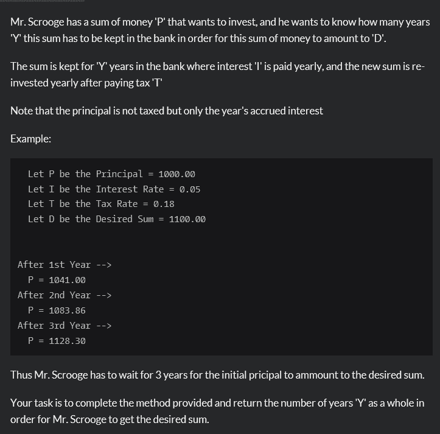

<!--yml
category: codewars
date: 2022-08-13 11:46:34
-->

# codewars-random（4）_weixin_30781631的博客-CSDN博客

> 来源：[https://blog.csdn.net/weixin_30781631/article/details/99244900?ops_request_misc=&request_id=&biz_id=102&utm_term=codewars&utm_medium=distribute.pc_search_result.none-task-blog-2~all~sobaiduweb~default-3-99244900.nonecase](https://blog.csdn.net/weixin_30781631/article/details/99244900?ops_request_misc=&request_id=&biz_id=102&utm_term=codewars&utm_medium=distribute.pc_search_result.none-task-blog-2~all~sobaiduweb~default-3-99244900.nonecase)

问题简介：算多长时间用本金能得到想要的利息，基础题。

代码：function calculateYears(principal, interest, tax, desired) {
    // your code
    if(principal >= desired)
    return 0;

    var years = 0;
    while(principal < desired){
    var temp = principal * interest;
    var interests = temp - temp*tax;
    principal += interests;
    years++;
    }
    return years;
}

代码冗余，只想着做出来，并未想优化，需改正。