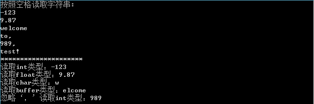

<!--yml
category: codewars
date: 2022-08-13 11:51:49
-->

# codewars 一道题 Highest and Lowest_指针的值是地址的博客-CSDN博客

> 来源：[https://blog.csdn.net/weixin_40007143/article/details/104101235?ops_request_misc=&request_id=&biz_id=102&utm_term=codewars&utm_medium=distribute.pc_search_result.none-task-blog-2~all~sobaiduweb~default-5-104101235.nonecase](https://blog.csdn.net/weixin_40007143/article/details/104101235?ops_request_misc=&request_id=&biz_id=102&utm_term=codewars&utm_medium=distribute.pc_search_result.none-task-blog-2~all~sobaiduweb~default-5-104101235.nonecase)

## Problem

In this little assignment you are given a string of space separated numbers, and have to return the highest and lowest number.
输入是一个字符串，输出最大数和最小数。

## Note

```
All numbers are valid Int32, no need to validate them.
There will always be at least one number in the input string.
Output string must be two numbers separated by a single space, and highest number is first. 
```

## Solution

```
#include <string>
#include <sstream> 
#include <limits> 
using namespace std;
string highAndLow(const string& numbers){
  string number=numbers;
  int max=numeric_limits<int>::min();  
  int min=numeric_limits<int>::max();  
  int temp;
  stringstream ss(numbers);  
  while(ss>>temp)
  {
  if(temp<min){min=temp;}
  if(temp>max){max=temp;}
  }
  return to_string(max)+" "+to_string(min);
} 
```

这代码真简洁，每次看到大佬的代码都佩服的不行。
关于stringstream的用法，转载以为大佬的一下代码：
（转载自https://blog.csdn.net/Sophia1224/article/details/53054698）

```
#include <sstream>
#include <iostream>
using namespace std;
int main() {
	ostringstream out;
	out.put('t');
	out.put('e');
	out << "st";   
	string res = out.str();
	cout << res << endl;
	return 0;
}

#include<iostream>
#include <sstream> 
using namespace std; 
int main() {
	string test = "-123 9.87 welcome to, 989, test!";
	istringstream iss;
	iss.str(test);
	string s;
	cout << "按照空格读取字符串:" << endl;
	while (iss >> s) {
		cout << s << endl;
	}
	cout << "*********************" << endl;

	istringstream strm(test);

	int i;
	float f;
	char c;
	char buff[1024];

	strm >> i;
	cout << "读取int类型：" << i << endl;
	strm >> f;
	cout << "读取float类型：" << f << endl;
	strm >> c;
	cout << "读取char类型：" << c << endl;
	strm >> buff;
	cout << "读取buffer类型：" << buff << endl;
	strm.ignore(100, ',');
	int j;
	strm >> j;
	cout << "忽略‘，’读取int类型：" << j << endl;
	return 0;
} 
```


这个里面代码讲解的很细致。大佬。
结束！