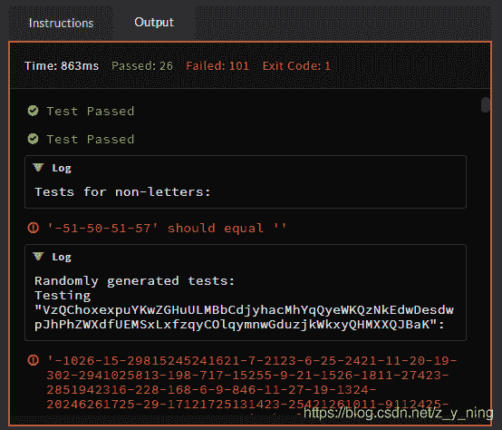

<!--yml
category: codewars
date: 2022-08-13 11:45:55
-->

# codewars5 Replace With Alphabet Position_z_y_ning的博客-CSDN博客

> 来源：[https://blog.csdn.net/z_y_ning/article/details/102552639?ops_request_misc=&request_id=&biz_id=102&utm_term=codewars&utm_medium=distribute.pc_search_result.none-task-blog-2~all~sobaiduweb~default-0-102552639.nonecase](https://blog.csdn.net/z_y_ning/article/details/102552639?ops_request_misc=&request_id=&biz_id=102&utm_term=codewars&utm_medium=distribute.pc_search_result.none-task-blog-2~all~sobaiduweb~default-0-102552639.nonecase)

**Instructions**
Welcome.

In this kata you are required to, given a string, replace every letter with its position in the alphabet.

If anything in the text isn’t a letter, ignore it and don’t return it.

“a” = 1, “b” = 2, etc.
**Example**
alphabet_position(`"The sunset sets at twelve o' clock."`)
Should return “`20 8 5 19 21 14 19 5 20 19 5 20 19 1 20 20 23 5 12 22 5 15 3 12 15 3 11`” (as a string)
**Solution:**

```
def position_number(word):   
    word_position=''
    for l in word: 
        if ord(l)>=97 or ord(l)<=122:     
            word_position+=(str(ord(l)-96))
        elif ord(l)>=65 or ord(l)<=90:    
            word_position+=(str(ord(l)-64))
    return word_position
def alphabet_position(text):
    words_position=''
    for word in text.split():
        words_position+=(str(position_number(word)))
    return words_position 
```

输出错误


借鉴

```
def alphabet_position(text):
    letters = []
    for s in text:
        c = ord(s)
        if c >= 65 and c <= 90:
            c -= 64
        elif c >= 97 and c <= 122:
            c -= 96
        else:
            continue
        letters.append(str(c))
    return ' '.join(letters) 
```

更正

```
def alphabet_position(text):
	word_position=[]
	for l in text: 
    	if ord(l)>=97 and ord(l)<=122:     
        	word_position.append(str(ord(l)-96))
    	elif ord(l)>=65 and ord(l)<=90:    
        	word_position.append(str(ord(l)-64))
    	else:
        	continue
	return ' '.join(word_position) 
```

需要注意的问题

1.  逻辑连接次and、or使用时多确定一次，选择是否正确；
2.  根据输出格式要求选择创建列表还是字符串，注意空白字符输出情况；
3.  程序中的 l in text，l 表示text中的字符，不是text中的某个单词。

**Best practice:**

```
def alphabet_position(text):
	return ' '.join(str(ord(c) - 96) for c in text.lower() if c.isalpha()) 
```