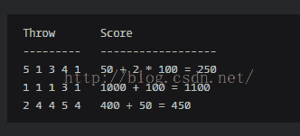

<!--yml
category: codewars
date: 2022-08-13 11:48:35
-->

# codewars打怪日记 Greed is Good JavaScript中数组用法和 哈希表的使用_Cinderella_hou的博客-CSDN博客

> 来源：[https://blog.csdn.net/cinderella_hou/article/details/51784474?ops_request_misc=&request_id=&biz_id=102&utm_term=codewars&utm_medium=distribute.pc_search_result.none-task-blog-2~all~sobaiduweb~default-9-51784474.nonecase](https://blog.csdn.net/cinderella_hou/article/details/51784474?ops_request_misc=&request_id=&biz_id=102&utm_term=codewars&utm_medium=distribute.pc_search_result.none-task-blog-2~all~sobaiduweb~default-9-51784474.nonecase)

codewars是一个在线编程网站，其奖励机制像打怪升级。你不能查看高于你级别的问题的答案。除非自己通过提交测试。通过提交之后可以看到各种解法排行榜 。通过对比自己解法和排行榜对比，可以找到差距，提高能力。

     描述 ： greed dice 是一个骰子游戏，使用5个骰子，5个点数根据 一定的规则 算出分数，你要做的就是根据输入的数组点数，输出最后的分数 。

规则如下 ： 3个 1  = 1000分，3个6  = 600分，3个5=500分，3个4 = 400分，3个3 = 300分，3个2 = 200分，1个1 = 100分，1个5 = 50分。



题目应该很简单，根据输入的点数，统计每个点数的个数，然后根据规则计算得分。

我的代码：

```
<span style="font-size:18px;">function score( dice ) {
  // Fill me in!
  var score = 0 ;
  var diceR = [ 0,0,0,0,0,0] ;
  var length = dice.length ;
  for (var i =0 ; i < dice.length ; ++ i){
              diceR[dice[i] ] += 1;
          }
  for(var index = 1;index <= diceR.length ;++　index ){
    var item = diceR[index] ;
     if ( item > 0) {
       switch (index){
                  case 1 :  score +=  1000* Math.floor(item /3) +　100* (item %3);continue;
                  case 2 :  
                  case 3 : 
                  case 6 :  
                  case 4 :  score +=  index*100 * Math.floor(item /3) ;continue;
                  case 5 :  score +=  index*100 * Math.floor(item /3) + 50* (item %3); continue;  
                  default : score += 0 ;continue ;                
             }  
     }
  }
   return score ;
}</span>
```

diceR 数组是根据下标对应个数。在官网test通过，**submit有一个测试案例通不过，但是不知道输入，到现在也没想到原因，纠结中，求看到有兴趣的私信呀**

看一下排行榜第一的代码 ：

```
<span style="font-size:18px;"> function score( dice ) {
     var diceR = [0,0,0,0,0,0] ;
     var tdr = [1000,200,300,400,500,600] ;
     var sdr = [100,0,0,0,50,0] ;
     dice.forEach(function(item){
       diceR[item -1] ++ ;
     })
  return   diceR.reduce(function(prev,cur,index){
         return prev + ( cur >= 3 ? tdr[index] : 0)+ sdr[index] * (cur%3) ;
    },0)
}</span>
```

分析 ：  精妙之处 1 ，对原数组出现个数的统计，我使用了for循环，这里使用forEach函数，数组的forEach函数，不返回值，只对每一项运行特定的函数，本质上与用for循环迭代数组一样，用自身函数，效率更高。 2  计算最终结果时，我又用了for循环，并且因为要判断6中情况，所以我还嵌套了一个switch语句，简直不能忍，这里把的分数放入数组，类似于哈希表的都是用，计算个数对应的得分。 3 归并函数的使用，reduce函数就是逐个迭代数组所有项，然后构建一个最终返回值。用在这里简练精巧。

 JavaScript提供了很多原生的方法，多练习才能更熟练的运用。