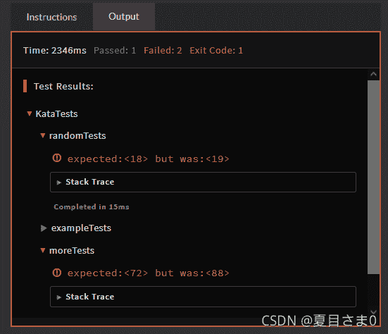

<!--yml
category: codewars
date: 2022-08-13 11:32:23
-->

# codewars打脸沾沾自喜的小聪明(Don‘t give me five---java)_AntPro的博客-CSDN博客

> 来源：[https://blog.csdn.net/qq_45858986/article/details/121192556?ops_request_misc=&request_id=&biz_id=102&utm_term=codewars&utm_medium=distribute.pc_search_result.none-task-blog-2~all~sobaiduweb~default-2-121192556.142^v40^control,185^v2^control](https://blog.csdn.net/qq_45858986/article/details/121192556?ops_request_misc=&request_id=&biz_id=102&utm_term=codewars&utm_medium=distribute.pc_search_result.none-task-blog-2~all~sobaiduweb~default-2-121192556.142^v40^control,185^v2^control)

**---------------------------------------------------------------------------------**

# 打歪了嘴的小小明/(ㄒoㄒ)/~~

**-----------------------------------------------------------------------------------**

事情是介样滴，在codewars上skip出一个目测自以为简单的题，如下：

[codewars](https://www.codewars.com)

**Don’t give me five!**（7kyu）
In this kata you get the start number and the end number of a region and should return the count of all numbers except numbers with a 5 in it. The start and the end number are both inclusive!
在这个kata中，您得到一个区域的起始编号和结束编号，并且应该返回所有编号的计数，除了带5的编号。起始编号和结束编号都包含在内！

**Examples:**

```
1,9 -> 1,2,3,4,6,7,8,9 -> Result 8
4,17 -> 4,6,7,8,9,10,11,12,13,14,16,17 -> Result 12 
```

**Solution:**

```
public class Kata
{
  public static int dontGiveMeFive(int start, int end)
  {
	return 0;
  }
} 
```

**Sample Tests:**

```
import org.junit.Test;
import static org.junit.Assert.assertEquals;
import org.junit.runners.JUnit4;

public class KataTests {
    @Test
    public void exampleTests() {
      assertEquals(8, Kata.dontGiveMeFive(1,9));
      assertEquals(12, Kata.dontGiveMeFive(4,17));
    }
} 
```

喜滋滋的去掉5和15，自得的一测，嚯，过了


然后粘到Solution，这样，👇


年青人，耍这样的小聪明，不好，好自为之，好好反思

有很多时候自己在编译器里通过了就扔一边不管了，实际上自己的代码就是一坨翔，还沾沾自喜，换个数字就露馅了

给自己扇一巴掌，没有下次~

**大佬的：**

```
public class Kata
{
  public static int dontGiveMeFive(int start, int end)
  {
    int count=0;
    for(int i=start;i<=end;i++)
    {
    	if (!("" + i).contains("5")) count++;
    }
	return count;
  }
} 
```

**CONTAINS 函数**

CONTAINS 是字符串处理函数，它能够处理所有字符串数据类型（BIT、BLOB 和 CHARACTER），并返回布尔值以指示一个字符串是否包含在另一个字符串中。

```
public class Kata
{
  public static int dontGiveMeFive(int start, int end)
  {
	int count=0;
    for(int i=start;i<=end;i++)
    {
    	if (String.valueOf(i).indexOf('5') == -1) count++;
    }
	return count;
  }
} 
```

**valueOf() 方法**用于返回给定参数的原生 Number 对象值，参数可以是原生数据类型, String等。

该方法是静态方法。该方法可以接收两个参数一个是字符串，一个是基数。

**indexOf() 方法有以下四种形式：**

public int indexOf(int ch): 返回指定字符在字符串中第一次出现处的索引，如果此字符串中没有这样的字符，则返回 -1。

public int indexOf(int ch, int fromIndex): 返回从 fromIndex 位置开始查找指定字符在字符串中第一次出现处的索引，如果此字符串中没有这样的字符，则返回 -1。

**int indexOf(String str)**: 返回指定字符在字符串中第一次出现处的索引，如果此字符串中没有这样的字符，则返回 -1。

int indexOf(String str, int fromIndex): 返回从 fromIndex 位置开始查找指定字符在字符串中第一次出现处的索引，如果此字符串中没有这样的字符，则返回 -1。

**-----------------------------------------------------------------------------------**
[Java 教程](https://www.runoob.com/java/java-tutorial.html)