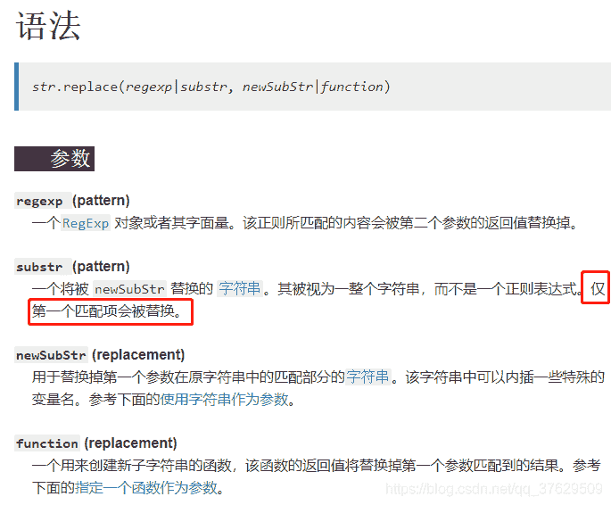

<!--yml
category: codewars
date: 2022-08-13 11:42:33
-->

# codewars第二篇（8kyu）Remove String Spaces_弥玥的博客-CSDN博客

> 来源：[https://blog.csdn.net/qq_37629509/article/details/103613079?ops_request_misc=%257B%2522request%255Fid%2522%253A%2522166036059216781685328322%2522%252C%2522scm%2522%253A%252220140713.130102334.pc%255Fall.%2522%257D&request_id=166036059216781685328322&biz_id=0&utm_medium=distribute.pc_search_result.none-task-blog-2~all~first_rank_ecpm_v1~rank_v31_ecpm-17-103613079-null-null.142^v40^control,185^v2^control&utm_term=codewars](https://blog.csdn.net/qq_37629509/article/details/103613079?ops_request_misc=%257B%2522request%255Fid%2522%253A%2522166036059216781685328322%2522%252C%2522scm%2522%253A%252220140713.130102334.pc%255Fall.%2522%257D&request_id=166036059216781685328322&biz_id=0&utm_medium=distribute.pc_search_result.none-task-blog-2~all~first_rank_ecpm_v1~rank_v31_ecpm-17-103613079-null-null.142^v40^control,185^v2^control&utm_term=codewars)

**题目：**
Simple, remove the spaces from the string, then return the resultant string.
**个人感觉不错的解答：**

```
function noSpace(x){
  return x.replace(/\s/g, '');
} 
```

```
function noSpace(x){return x.split(' ').join('')} 
```

```
const noSpace = x => x.replace(/ /g, ""); 
```

**自己的解答：**

```
function noSpace(x) {
    return x.replace(/[ ]/g, '');
} 
```

**涉及到的知识点：**
[string.replace MDN](https://developer.mozilla.org/zh-CN/docs/Web/JavaScript/Reference/Global_Objects/String/replace)
[RegExp](https://developer.mozilla.org/zh-CN/docs/Web/JavaScript/Reference/Global_Objects/RegExp)
replace() 方法返回一个由替换值（replacement）替换一些或所有匹配的模式（pattern）后的新字符串。模式可以是一个字符串或者一个正则表达式，替换值可以是一个字符串或者一个每次匹配都要调用的回调函数。

***原字符串不会改变***。

***在进行全局的搜索替换时，正则表达式需包含 g 标志。***