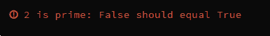

<!--yml
category: codewars
date: 2022-08-13 11:48:50
-->

# codewars练习(3)Is Prime_u010082526的博客-CSDN博客

> 来源：[https://blog.csdn.net/u010082526/article/details/85005246?ops_request_misc=&request_id=&biz_id=102&utm_term=codewars&utm_medium=distribute.pc_search_result.none-task-blog-2~all~sobaiduweb~default-1-85005246.nonecase](https://blog.csdn.net/u010082526/article/details/85005246?ops_request_misc=&request_id=&biz_id=102&utm_term=codewars&utm_medium=distribute.pc_search_result.none-task-blog-2~all~sobaiduweb~default-1-85005246.nonecase)

【1】

def is_prime(num):
    k=0
    if num>1:
        for i in range(num):
            if num%(i+1)==0:
                k+=1
            else:
                continue
    if k>2:
        print("true")
    else:
        print("false")

if __name__ == '__main__':    
    is_prime(12)

【2】改动下for循环：

def is_prime(num):
    k=0
    if num>1:
        for i in range(1,num):
            if num%i==0:
                k+=1
            else:
                continue
    if k>1:
        print("true")
    else:
        print("false")
提交测试后，报错

上面写反了。。。

【3】修改如下：

def is_prime(num):
    k=0
    if num>1:
        for i in range(1,num):
            if num%i==0:
                k+=1
            else:
                continue
    if k==1:
        print("true")
    else:
        print("false")

if __name__ == '__main__':    
    is_prime(4)

【4】codewards测试通过

def is_prime(num):
  k=0
  if num>1:
    for i in range(1,num):
      if num%i==0:
        k+=1
      else:
        continue
  if k==1:
    return True
  else:
    return False

别人的

【1】

def is_prime(num): return num > 1 and not any(num % n == 0 for n in range(2,num))

【2】跟我思路一样，代码比我少，哈哈

def is_prime(num):

if num < 2:

   return False

for i in range(2, num):

   if num % i == 0:

     return False

return True