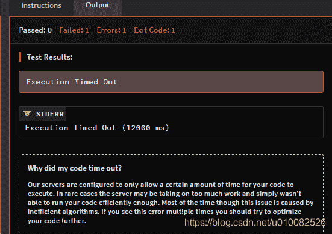

<!--yml
category: codewars
date: 2022-08-13 11:42:02
-->

# codewars练习(5)backwardsPrime--提交失败-Execution Timed Out (12000 ms)_u010082526的博客-CSDN博客

> 来源：[https://blog.csdn.net/u010082526/article/details/85047320?ops_request_misc=%257B%2522request%255Fid%2522%253A%2522166036059216781685328322%2522%252C%2522scm%2522%253A%252220140713.130102334.pc%255Fall.%2522%257D&request_id=166036059216781685328322&biz_id=0&utm_medium=distribute.pc_search_result.none-task-blog-2~all~first_rank_ecpm_v1~rank_v31_ecpm-1-85047320-null-null.142^v40^control,185^v2^control&utm_term=codewars](https://blog.csdn.net/u010082526/article/details/85047320?ops_request_misc=%257B%2522request%255Fid%2522%253A%2522166036059216781685328322%2522%252C%2522scm%2522%253A%252220140713.130102334.pc%255Fall.%2522%257D&request_id=166036059216781685328322&biz_id=0&utm_medium=distribute.pc_search_result.none-task-blog-2~all~first_rank_ecpm_v1~rank_v31_ecpm-1-85047320-null-null.142^v40^control,185^v2^control&utm_term=codewars)

【1】

    li=list(string(a))

NameError: name 'string' is not defined

[https://www.cnblogs.com/nzbbody/p/3581048.html](https://www.cnblogs.com/nzbbody/p/3581048.html)

str(18)

list(s )                将序列 s 转换为一个列表    

[http://www.cnblogs.com/wuxiangli/p/6046800.html](http://www.cnblogs.com/wuxiangli/p/6046800.html)

【2】字符串反转reverse函数

[http://www.cnblogs.com/wuxiangli/p/6046800.html](http://www.cnblogs.com/wuxiangli/p/6046800.html)

Backwards Read Primes are primes that when read backwards in base 10 (from right to left) are a different prime. (This rules out primes which are palindromes.)

向后读素数是指在基数10（从右到左）向后读时是不同素数的素数。（这排除了作为回文的素数。）

Examples: 13 17 31 37 71 73 are Backwards Read Primes

13 is such because it's prime and read from right to left writes 31 which is prime too. Same for the others.

# Example

backwardsPrime(2, 100) => [13, 17, 31, 37, 71, 73, 79, 97] backwardsPrime(9900, 10000) => [9923, 9931, 9941, 9967] backwardsPrime(501, 599) => []

Find all Backwards Read Primes between two positive given numbers (both inclusive), the second one always being greater than or equal to the first one. The resulting array or the resulting string will be ordered following the natural order of the prime 

找出两个正的给定数字（都包含）之间的所有向后读素数，第二个总是大于或等于第一个。结果数组或结果字符串的顺序将遵循素数的自然顺序

实现代码如下：

def backwardsPrime(start, stop):
    a=[]
    for val in range(start, stop):
        if is_prime(val) and is_prime(f1(val)):
            a.append(val)
    return a

def f1(a):   
    li=list(str(a))
    li.reverse()
    a2=''.join(li)
    return int(a2)

def is_prime(num):
    k=0
    if num>1:
        for i in range(1,num):
            if num%i==0:
                k+=1
            else:
                continue
        if k==1:
            return True
    else:
        return False

测试通过，但是提交代码报错

为什么我的代码超时？
我们的服务器被配置为只允许您的代码执行一定的时间。在极少数情况下，服务器可能承担了太多的工作，并且不能够有效地运行代码。虽然这个问题大部分时间是由低效的算法引起的。如果您多次看到这个错误，那么应该尝试进一步优化代码。

Solutions have been withheld

Since you have not yet solved this kata we have hidden the solutions from you. If you choose to view the solutions you will forfeit your eligibility to earn honor/rank progress for this kata.

UNLOCK SOLUTIONS (FORFEIT ELIGIBILITY)

解决方案被搁置

既然你还没有解决这个卡塔，我们已经对你隐藏了解决方案。如果您选择查看解决方案，您将丧失您的资格，以赢得荣誉/排名的进展为这个kata。

解锁解决方案（遗失资格）

range和xrange的区别

[https://blog.csdn.net/jayandchuxu/article/details/54897887](https://blog.csdn.net/jayandchuxu/article/details/54897887)

python3没有了xrange

[https://blog.csdn.net/mvs2008/article/details/73693012](https://blog.csdn.net/mvs2008/article/details/73693012)

别人的代码:

def prime(a):

if a == 2: return True

if a < 2 or a % 2 == 0: return False

return not any(a % x == 0 for x in range(3, int(a**0.5) + 1, 2))

def backwardsPrime(start, nd):

return [x for x in range(start, nd + 1) if (str(x) != str(x)[::-1]) and prime(x) and prime(int(str(x)[::-1])) ]