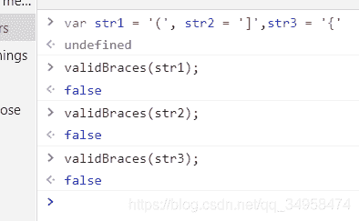
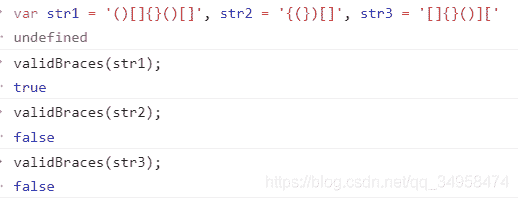
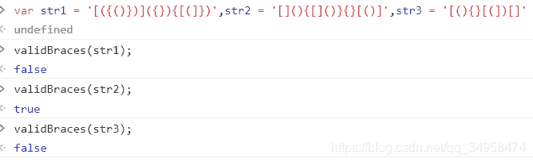

<!--yml
category: codewars
date: 2022-08-13 11:41:38
-->

# codewars练习题_dick_binge的博客-CSDN博客

> 来源：[https://blog.csdn.net/qq_34958474/article/details/107059409?ops_request_misc=%257B%2522request%255Fid%2522%253A%2522166036059116782388023961%2522%252C%2522scm%2522%253A%252220140713.130102334.pc%255Fall.%2522%257D&request_id=166036059116782388023961&biz_id=0&utm_medium=distribute.pc_search_result.none-task-blog-2~all~first_rank_ecpm_v1~rank_v31_ecpm-18-107059409-null-null.142^v40^control,185^v2^control&utm_term=codewars](https://blog.csdn.net/qq_34958474/article/details/107059409?ops_request_misc=%257B%2522request%255Fid%2522%253A%2522166036059116782388023961%2522%252C%2522scm%2522%253A%252220140713.130102334.pc%255Fall.%2522%257D&request_id=166036059116782388023961&biz_id=0&utm_medium=distribute.pc_search_result.none-task-blog-2~all~first_rank_ecpm_v1~rank_v31_ecpm-18-107059409-null-null.142^v40^control,185^v2^control&utm_term=codewars)

## 括号匹配

```
function validBraces(str){

   if(str.length < 2 || str.length % 2!=0){

    if(!str.length){
      return true;
    } else {
      return false;
    }
  }

  let count = 0;
  let length = str.length;
  while(count < length / 2){
    str = str.replace(/[(][)]/g,'').replace(/\{}/g,'').replace(/\[]/g,''); 
    count++;
  }
  if(str.length === 0){
    return true;
  } else{
    const obj = {
      '(': ')',
      '[': ']',
      '{': '}',
    };

    const strArry = str.split('');
    let num = 0;
    for (let i = 0 ;i<strArry.length - 1 ;i++){
      const keys = Object.keys(obj);
      if (i < strArry.length / 2) {
        if (obj[strArry[i]] === strArry[strArry.length - 1]){
          num ++ ;
        }
      } else {
        break;
      }
    }
    if (num === strArry.length / 2) {
      return true;
    } else {
      return false;
    }
  }
} 
```

输出结果如下：

```
var str1 = '(', str2 = ']',str3 = '{'; 
```



```
var str1 = '()[]{}()[]', str2 = '{(})[]', str3 = '[]{}()]['; 
```



```
var str1 = '[({()})]({}){[(]})',str2 = '[](){[]()}{}[()]',str3 = '[(){}[(])[]'; 
```



## 检查字符串是否具有相同数量的“x”和“o”。该方法必须返回布尔值并且不区分大小写。字符串可以包含任何字符。

```
function XO(str) {

    const reg = (str, char) => {
      const r = new RegExp(char, 'gi');
      const length = str.match(r) ? str.match(r).length : 0;
      return length;
    }
    str = str.toLowerCase();
    return reg(str, 'o') === reg(str, 'x');
} 
```