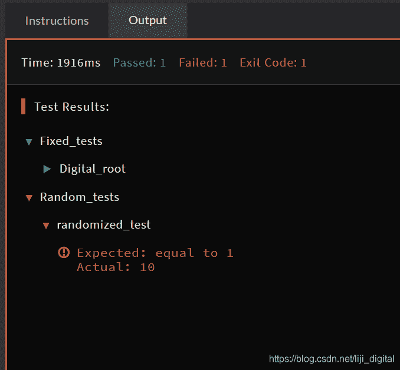

<!--yml
category: codewars
date: 2022-08-13 11:37:34
-->

# codewars调试的一个小技巧_金色熊族的博客-CSDN博客

> 来源：[https://blog.csdn.net/liji_digital/article/details/100637916?ops_request_misc=%257B%2522request%255Fid%2522%253A%2522166036058816781685396932%2522%252C%2522scm%2522%253A%252220140713.130102334.pc%255Fall.%2522%257D&request_id=166036058816781685396932&biz_id=0&utm_medium=distribute.pc_search_result.none-task-blog-2~all~first_rank_ecpm_v1~rank_v31_ecpm-4-100637916-null-null.142^v40^control,185^v2^control&utm_term=codewars](https://blog.csdn.net/liji_digital/article/details/100637916?ops_request_misc=%257B%2522request%255Fid%2522%253A%2522166036058816781685396932%2522%252C%2522scm%2522%253A%252220140713.130102334.pc%255Fall.%2522%257D&request_id=166036058816781685396932&biz_id=0&utm_medium=distribute.pc_search_result.none-task-blog-2~all~first_rank_ecpm_v1~rank_v31_ecpm-4-100637916-null-null.142^v40^control,185^v2^control&utm_term=codewars)

在codewars调试时，有时自己分析不出bug出现在哪里，但是output 只是告诉你正确结果是多少，以及你的代码输出了多少，并不告诉你输入值是多少。这给调试带来麻烦。一个简单的办法是直接在你的代码里写printf()，打印出输入变量即可。

