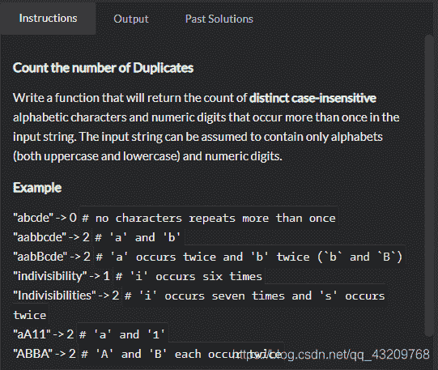

<!--yml
category: codewars
date: 2022-08-13 11:48:11
-->

# codewars题目Counting Duplicates_bug的生产者的博客-CSDN博客

> 来源：[https://blog.csdn.net/qq_43209768/article/details/102963092?ops_request_misc=&request_id=&biz_id=102&utm_term=codewars&utm_medium=distribute.pc_search_result.none-task-blog-2~all~sobaiduweb~default-4-102963092.nonecase](https://blog.csdn.net/qq_43209768/article/details/102963092?ops_request_misc=&request_id=&biz_id=102&utm_term=codewars&utm_medium=distribute.pc_search_result.none-task-blog-2~all~sobaiduweb~default-4-102963092.nonecase)


题目是统计字符串中有多少个重复的字符串，我的想法是找到每个字符在字符串中的索引，如果索引出现的次数大于1，则说明这个字符重复了，我的解答如下

```
 var count = 0
            var arr = text.toLowerCase().split('');
            var arr2 = []
            arr.map((val, index) => {
                if (arr2.indexOf(val) == -1) {
                    arr2.push(val)
                }
            })
            arr2.map((val, index) => {
                if (findIndex(arr, val) > 1) {
                    count++
                }
            })
            return count
        }

        function findIndex(arr, text) {
            var count = 0
            arr.map((val, index) => {
                if (val == text) {
                    count++
                }
            })
            return count
        }
        console.log(duplicateCount("Indivisibilities")); 
```

看到的一个比较喜欢的答案
indexOf() 方法可返回某个指定的字符串值在字符串中首次出现的位置。

```
 function duplicateCount(text) {
            return text.toLowerCase().split('').filter(function(val, i, arr) {
                return arr.indexOf(val) !== i && arr.lastIndexOf(val) === i;
            }).length;
        } 
```

这个答案还没消化，先放在这里

```
function duplicateCount(text){
  var lower = text.toLowerCase();
  var count = 0;
  var used = [];

  lower.split('').forEach(function(letter) {
    if (!used.includes(letter) && (lower.split(letter).length - 1) > 1) {
      count++;
      used.push(letter);
    }
  });

  return count;
} 
```