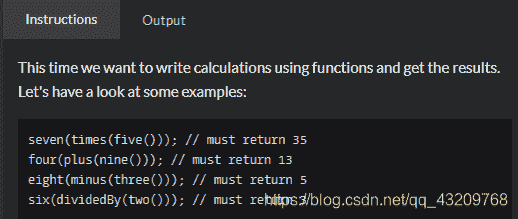
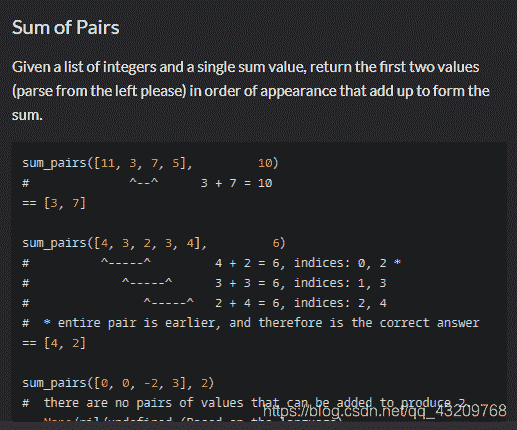
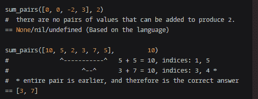
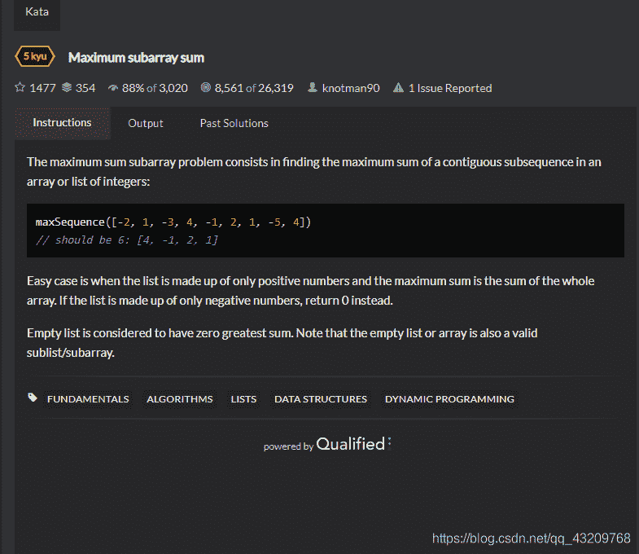
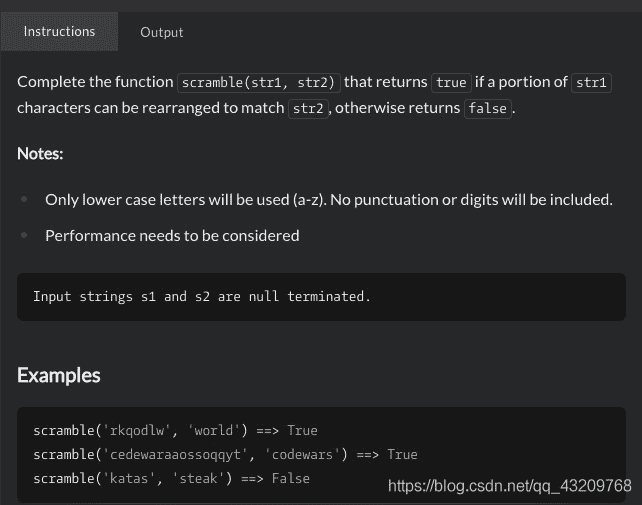

<!--yml
category: codewars
date: 2022-08-13 11:35:52
-->

# codewars题目_bug的生产者的博客-CSDN博客

> 来源：[https://blog.csdn.net/qq_43209768/article/details/103844390?ops_request_misc=%257B%2522request%255Fid%2522%253A%2522166036058616781685360739%2522%252C%2522scm%2522%253A%252220140713.130102334.pc%255Fall.%2522%257D&request_id=166036058616781685360739&biz_id=0&utm_medium=distribute.pc_search_result.none-task-blog-2~all~first_rank_ecpm_v1~rank_v31_ecpm-17-103844390-null-null.142^v40^control,185^v2^control&utm_term=codewars](https://blog.csdn.net/qq_43209768/article/details/103844390?ops_request_misc=%257B%2522request%255Fid%2522%253A%2522166036058616781685360739%2522%252C%2522scm%2522%253A%252220140713.130102334.pc%255Fall.%2522%257D&request_id=166036058616781685360739&biz_id=0&utm_medium=distribute.pc_search_result.none-task-blog-2~all~first_rank_ecpm_v1~rank_v31_ecpm-17-103844390-null-null.142^v40^control,185^v2^control&utm_term=codewars)

# 1.Calculating with Functions


我的解决方案（粗糙的一批）

```
 function common(n, val) {
            var a, b;
            for (var key in n) {
                a = key;
                b = n[key]
            }
            switch (a) {
                case '*':
                    return val * b;
                    break;
                case '-':
                    return val - b;
                    break;
                case '+':
                    return val + b;
                    break;
                case '/':
                    return Math.floor(val / b);
                    break;
                default:
                    return val
            }
        }

        function zero(n) {
            return common(n, 0)

        }

        function one(n) {
            return common(n, 1)

        }

        function two(n) {
            return common(n, 2)

        }

        function three(n) {
            return common(n, 3)

        }

        function four(n) {
            return common(n, 4)

        }

        function five(n) {
            return common(n, 5)

        }

        function six(n) {
            return common(n, 6)

        }

        function seven(n) {
            return common(n, 7)

        }

        function eight(n) {
            return common(n, 8)

        }

        function nine(n) {
            return common(n, 9)
        }

        function times(n) {
            return {
                '*': n
            }
        }

        function plus(n) {
            return {
                '+': n
            }
        }

        function minus(n) {
            return {
                '-': n
            }
        }

        function dividedBy(n) {
            return {
                '/': n
            }
        } 
```

别人的写法

```
 function zero(func) {
            return func ? func(0) : 0;
        };

        function one(func) {
            return func ? func(1) : 1;
        };

        function two(func) {
            return func ? func(2) : 2;
        };

        function three(func) {
            return func ? func(3) : 3;
        };

        function four(func) {
            return func ? func(4) : 4;
        };

        function five(func) {
            return func ? func(5) : 5;
        };

        function six(func) {
            return func ? func(6) : 6;
        };

        function seven(func) {
            return func ? func(7) : 7;
        };

        function eight(func) {
            return func ? func(8) : 8;
        };

        function nine(func) {
            return func ? func(9) : 9;
        };

        function plus(b) {
            return function(a) {
                return a + b;
            };
        };

        function minus(b) {
            return function(a) {
                return a - b;
            };
        };

        function times(b) {
            return function(a) {
                return a * b;
            };
        };

        function dividedBy(b) {
            return function(a) {
                return a / b;
            };
        };
        console.log(eight(plus(nine()))) 
```

# 2.Sum of Pairs

[Sum of Pairs](https://www.codewars.com/kata/sum-of-pairs/train/javascript)

我的解答：这一题好难啊，现在的解法虽然可以解决问题，但是执行超时了，懵逼，明天再看

```
 var sum_pairs = function(ints, s) {
            var arri = []
            var arrb = []
            for (var i = 0, l = ints.length, r = []; i < l; i++) {
                for (var j = i + 1; j < l; j++) {
                    if (ints[i] + ints[j] == s) {
                        if (r[0] == null) {
                            r[0] = i;
                            r[1] = j;
                            arri.push(i);
                            arrb.push(j);
                        } else if (j - i === r[1] - r[0]) {
                            arri.push(i);
                            arrb.push(j);
                        } else if (j - i < r[1] - r[0]) {
                            r[0] = i;
                            r[1] = j;
                        }
                    }
                }
            }
            if (arri.length > 1) {
                var anser1 = ints[arri[0]]
                var anser2 = ints[arrb[0]]
                return [anser1, anser2]
            } else if (r[1]) {
                return [ints[r[0]], ints[r[1]]]
            } else {
                return undefined

            }
        } 
```

# 3.Maximum subarray sum

[Maximum subarray sum](https://www.codewars.com/kata/54521e9ec8e60bc4de000d6c/solutions/javascript)
求连续子序列的最大和
简单的情况是当列表只由正数组成，而最大和是整个数组的和。如果列表仅由负数组成，则返回0。
空列表被视为最大和为零。请注意，空列表或数组也是有效的子列表/子数组。

思路：双重循环获得数组的全部子序列，然后求最大值
我的答案

```
 var maxSequence = function (arr) {

      if (arr.length > 0) {
        var arr1 = []
        var sumArr = []
        for (var j = 0; j < arr.length; j++) {
          for (var i = j; i < arr.length; i++) {
            arr1.push(arr.slice(j, i + 1))
          }
        }
        arr1.map((valArr) => {
          sumArr.push(sum(valArr))
        })
        return Math.max.apply(Math, sumArr.map(item => { return item }))>0?Math.max.apply(Math, sumArr.map(item => { return item })):0
      }else{
        return 0
      }

    }

    function sum(arr) {
      return arr.reduce(function (prev, curr, idx, arr) {
        return prev + curr;
      });
    } 
```

codewars上答案

```
 var maxSequence = function (arr) {
      var min = 0, ans = 0, i, sum = 0;
      for (i = 0; i < arr.length; ++i) {
        sum += arr[i];                     
        min = Math.min(sum, min);          
        ans = Math.max(ans, sum - min);    
        console.log(sum,min,ans);      
      }
      return ans;
    } 
```

# 4.Rot13

[Rot13](https://www.codewars.com/kata/530e15517bc88ac656000716/javascript)
套用ROT13到一段文字上仅仅只需要检查字元字母顺序并取代它在13位之后的对应字母，有需要超过时则重新绕回26英文字母开头即可。A换成N、B换成O、依此类推到M换成Z，然后序列反转：N换成A、O换成B、最后Z换成M。只有这些出现在英文字母里头的字元受影响；数字、符号、空白字元以及所有其他字元都不变。因为只有在英文字母表里头只有26个，并且26=2×13

我的解答

```
 var arr = ['A','B','C' ,'D' ,'E' ,'F' ,'G','H', 'I', 'J', 'K', 'L', 'M', 'N','O', 'P', 'Q', 'R', 'S', 'T', 'U', 'V', 'W', 'X', 'Y', 'Z']
      function rot13(message){

        let result = ''
        message.split('').map((val)=>{
          if(arr.indexOf(val.toLocaleUpperCase())!=-1){
            var index = arr.indexOf(val.toLocaleUpperCase())+13
          if(index>25){
            if(judgeUpper(val)){
              result+=arr[index-26].toLocaleUpperCase()
            }else{
              console.log(val);
              result+=arr[index-26].toLocaleLowerCase()
            }
          }else{
            if(judgeUpper(val)){
              result+=arr[index].toLocaleUpperCase()
            }else{
              console.log(index);
              result+=arr[index].toLocaleLowerCase()
            }
          }
          }else{
            result+=val
          }
        })
        return result
      }
      function judgeUpper(val){
        if(/[A-Z]/.test(val)){
          return true
        }
      }
      console.log(rot13('test')); 
```

利用`charCodeAt()`和`fromCharCode()`

```
 var codeA = "A".charCodeAt(0),
        codeZ = "Z".charCodeAt(0),
        codea = "a".charCodeAt(0),
        codez = "z".charCodeAt(0);
      function rot13(message) {
        return message.split("").map(function (char) {
            var code = char.charCodeAt(0);
            if (codeA <= code && code <= codeZ) {
              return String.fromCharCode(((code - codeA + 13) % 26) + codeA);
            } else if (codea <= code && code <= codez) {
              console.log(code,codeA);

              return String.fromCharCode(((code - codea + 13) % 26) + codea);
            }
            return char;
          })
          .join("");
      }
      console.log(rot13('ROT13')) 
```

# 5.Calculating with Functions

[Scramblies](https://www.codewars.com/kata/55c04b4cc56a697bb0000048/train/javascript)
第二个字母的全部字符是否可以在第一个字母中找到

我的超时的答案

```
 function scramble(str1, str2) {

				let num = 0
				str2.split('').map((val) => {
					const a = str1.split('').indexOf(val)
					if (a > -1) {
						str1 = str1.replace(val, '')
						console.log(a, str1)
						num++
					}
				})
				if (num == str2.length) {
					return true
				} else {
					return false
				}
			} 
```

第二位同样超时的答案

```
 function scramble(str1, str2) {
				const str1Arr = str1.split('')
				return Array.prototype.every.call(str2, (l) => {
					var i = str1Arr.indexOf(l)
					if (i !== -1) {
						str1Arr.splice(i, 1)
					}
					return i !== -1
				})
			} 
```

贴上来主要是看js哪些操作会改变原数组

```
var arr = []
arr.splice() 
arr.reverse()
arr.fill()
arr.copyWithin()
arr.sort()
arr.push()
arr.pop()
arr.unshift()
arr.shift() 
```

```
var arr = []
arr.slice()
arr.map()
arr.forEach()
arr.every()
arr.some()
arr.filter()
arr.reduce()
arr.entries()
arr.find()
arr.concat('1',['2','3']) 
```

**[forEach有争议](https://blog.csdn.net/xiao_yu_liu/article/details/84844291)**
orEach 在对 item 进行修改的时候，如果 item 是原始类型的值，item 对应的 的内存地址实际并没有变化
如果 item 是 引用类型的值，item 对应多的内存地址也没有变化，但是对应的值，已经重写了