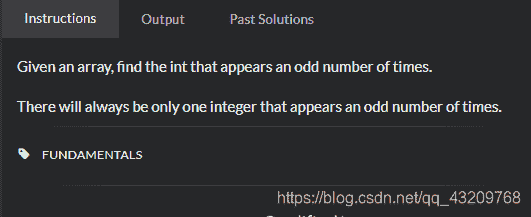
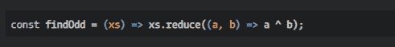

<!--yml
category: codewars
date: 2022-08-13 11:43:33
-->

# codewars题目解答---Find the odd int_bug的生产者的博客-CSDN博客

> 来源：[https://blog.csdn.net/qq_43209768/article/details/102884237?ops_request_misc=&request_id=&biz_id=102&utm_term=codewars&utm_medium=distribute.pc_search_result.none-task-blog-2~all~sobaiduweb~default-1-102884237.nonecase](https://blog.csdn.net/qq_43209768/article/details/102884237?ops_request_misc=&request_id=&biz_id=102&utm_term=codewars&utm_medium=distribute.pc_search_result.none-task-blog-2~all~sobaiduweb~default-1-102884237.nonecase)

好久没写题目了，搞得许多都不记得了，谴责一下自己

我的解答：这个题目是找到一个数组中出现奇数次的那个数，我想的是找到每一个数字在数组中的下标，统计出现奇数次的下标的那个数

```
 function findOdd(A) {
        var arr2=[]
        var anser=''
        A.map((val,i)=>{
            arr2.push([findIndex(A,val),val])
        })
        arr2.map((val)=>{
            if(val[0].length%2!=0){
                anser=val[1]
            }
        })
        return anser
      }
      function findIndex(A,n){
        let arr=[]
        A.map((val,index)=>{
            if(val===n){
                arr.push(index)
            }
        })
        return arr
      }
      console.log(findOdd([20,1,-1,2,-2,3,3,5,5,1,2,4,20,4,-1,-2,5])); 
```

看了一下其他的解答，我写的代码真的好多

我看不懂这个答案，啊哈哈哈
[`a^b`啥意思](https://blog.csdn.net/Garrettzxd/article/details/82390653)

这个答案也很不错,至少我能看得懂啊哈哈哈

```
 function findOdd(A) {
  var obj = {};
  A.forEach(function(el){
    obj[el] ? obj[el]++ : obj[el] = 1;
  });
  for(prop in obj) {
    if(obj[prop] % 2 !== 0) return Number(prop);
  }
}
findOdd([20,1,-1,2,-2,3,3,5,5,1,2,4,20,4,-1,-2,5]) 
```