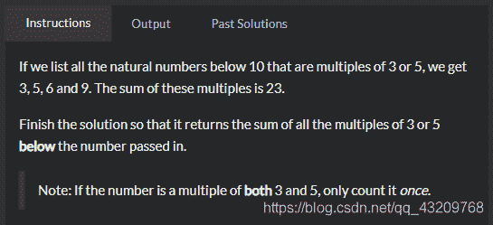

<!--yml
category: codewars
date: 2022-08-13 11:42:12
-->

# codewars题目解答Multiples of 3 or 5_bug的生产者的博客-CSDN博客

> 来源：[https://blog.csdn.net/qq_43209768/article/details/102885272?ops_request_misc=%257B%2522request%255Fid%2522%253A%2522166036059216781685328322%2522%252C%2522scm%2522%253A%252220140713.130102334.pc%255Fall.%2522%257D&request_id=166036059216781685328322&biz_id=0&utm_medium=distribute.pc_search_result.none-task-blog-2~all~first_rank_ecpm_v1~rank_v31_ecpm-7-102885272-null-null.142^v40^control,185^v2^control&utm_term=codewars](https://blog.csdn.net/qq_43209768/article/details/102885272?ops_request_misc=%257B%2522request%255Fid%2522%253A%2522166036059216781685328322%2522%252C%2522scm%2522%253A%252220140713.130102334.pc%255Fall.%2522%257D&request_id=166036059216781685328322&biz_id=0&utm_medium=distribute.pc_search_result.none-task-blog-2~all~first_rank_ecpm_v1~rank_v31_ecpm-7-102885272-null-null.142^v40^control,185^v2^control&utm_term=codewars)


我的解答

```
 function solution(number){
        var arr =[]
        var arr2 =[]
        for(var i=1;i<number;i++){
            arr.push(i)
        }
        arr.map((val,index)=>{
            if(val%3==0||val%5==0){
                arr2.push(val)
            }
        })
        var anser =arr2.reduce((total,val)=>{
            return total+val
        },0)
        return anser
    }
    console.log(solution(10)) 
```

别人简洁的代码

```
function solution(number){
  var sum = 0;

  for(var i = 1;i< number; i++){
    if(i % 3 == 0 || i % 5 == 0){
      sum += i
    }
  }
  return sum;
} 
```