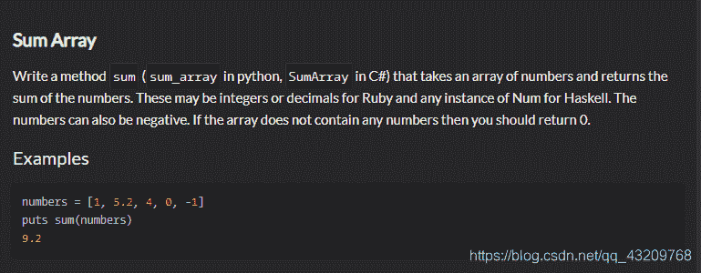

<!--yml
category: codewars
date: 2022-08-13 11:44:53
-->

# codewars题目解答Sum Arrays_bug的生产者的博客-CSDN博客

> 来源：[https://blog.csdn.net/qq_43209768/article/details/89356037?ops_request_misc=&request_id=&biz_id=102&utm_term=codewars&utm_medium=distribute.pc_search_result.none-task-blog-2~all~sobaiduweb~default-5-89356037.nonecase](https://blog.csdn.net/qq_43209768/article/details/89356037?ops_request_misc=&request_id=&biz_id=102&utm_term=codewars&utm_medium=distribute.pc_search_result.none-task-blog-2~all~sobaiduweb~default-5-89356037.nonecase)

1.题目描述：

2.我解答：

```
// Sum Numbers
function sum (numbers) {
    "use strict";
    var sum = 0;
    for (var i = 0; i < numbers.length; i++) {
      sum += numbers[i];
    }

    return sum;
}; 
```

3.别人的解答

```
// Sum Numbers
sum = function (numbers) {
  "use strict";
  return numbers.reduce(function(t, n){
    return t + n;
  }, 0);
}; 
```

解释：reduce函数 借鉴Beijiyang999的文章https://blog.csdn.net/Beijiyang999/article/details/80186242

1.  reduce函数是归并的方法，其接受两个参数。
2.  第一个参数是每一项上调用的函数，该函数接受四个参数（前一个值：Prev,当前值：Cur,当前值的索引：Index,数组对象：Array）
3.  第二个可选参数作为归并基础的初始值，这个方法返回一个最终的值.
4.  `arr.reduce(function(prev,cur,index,arr){},initialValue)`
5.  其具体的实施过程如下：
    不断对数组的前两项取出，对其执行目标函数，计算得到的返回值，将返回值作为数组的第一个元素继续进行取出操作，直到数组中的每一项都访问了一次，返回最终的结果
    如对数组[1,2,3]进行reduce操作

```
[1,2,3] 取出1,2，填回3
[3,3]取出3,3，填回6
[6]最终结果为6 
```