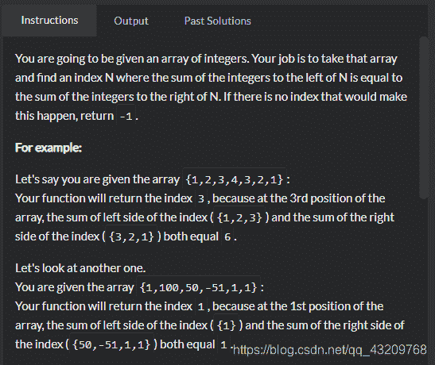

<!--yml
category: codewars
date: 2022-08-13 11:48:55
-->

# codewars题目：Equal Sides Of An Array_bug的生产者的博客-CSDN博客

> 来源：[https://blog.csdn.net/qq_43209768/article/details/102924957?ops_request_misc=&request_id=&biz_id=102&utm_term=codewars&utm_medium=distribute.pc_search_result.none-task-blog-2~all~sobaiduweb~default-6-102924957.nonecase](https://blog.csdn.net/qq_43209768/article/details/102924957?ops_request_misc=&request_id=&biz_id=102&utm_term=codewars&utm_medium=distribute.pc_search_result.none-task-blog-2~all~sobaiduweb~default-6-102924957.nonecase)


题目是找到数组中的一个数，这个数的左边所有数的和等于右边所有数的和，我一开始的想法是先找到数组中的每一个数在数组中的下标，然后根据下标来判断获得这个数左边的数组和右边的数组，但实践起来比较困难，后来百度了一篇文章，获得思路 [文章地址](https://blog.csdn.net/lovearforever/article/details/83272083)
我的解答

```
 var sliceArray = function(arr, start, end) {
            return arr.slice(start, end)
        }
        var sumArray = function(arr) {
            if (arr.length == 0) {
                return 0
            }
            return arr.reduce((prev, cuur) => {
                return prev + cuur
            })
        }

        function findEvenIndex(arr) {

            var anser = ''
            arr.map((val, index) => {
                var leftArr = sliceArray(arr, 0, index)
                var rightArr = sliceArray(arr, index + 1, arr.length)
                var leftSum = sumArray(leftArr)
                var rightSum = sumArray(rightArr)
                if (leftSum == rightSum) {
                    anser = index
                }
            })
            if (anser !== '') {
                return anser
            } else {
                return -1
            }
        }
        console.log(findEvenIndex([20, 10, 30, 10, 10, 15, 35])); 
```

看到别人差不多思路但很简洁的写法

```
function findEvenIndex(arr)
{
  for(var i=1; i<arr.length-1; i++) {
    if(arr.slice(0, i).reduce((a, b) =>  a+b) === arr.slice(i+1).reduce((a, b) =>  a+b)) {
      return i;
    }
  }
  return -1;
} 
```