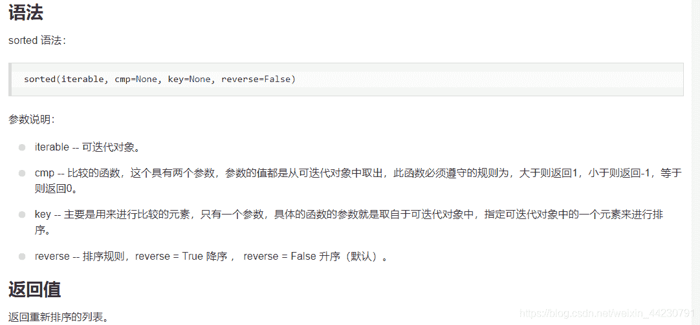

<!--yml
category: codewars
date: 2022-08-13 11:43:49
-->

# 【CodeWars】刷题之 noobCode 01: SUPERSIZE ME.... or rather, this integer!_虚名御寇的博客-CSDN博客

> 来源：[https://blog.csdn.net/weixin_44230791/article/details/104406470?ops_request_misc=&request_id=&biz_id=102&utm_term=codewars&utm_medium=distribute.pc_search_result.none-task-blog-2~all~sobaiduweb~default-2-104406470.nonecase](https://blog.csdn.net/weixin_44230791/article/details/104406470?ops_request_misc=&request_id=&biz_id=102&utm_term=codewars&utm_medium=distribute.pc_search_result.none-task-blog-2~all~sobaiduweb~default-2-104406470.nonecase)

按照惯例先来看一哈题目

```
Write a function that rearranges an integer into its largest possible value.
super_size(123456) 
super_size(105)    
super_size(12) 
```

按照题目要求及举例可以较为容易地理解到本题是要把给定参数按照每个数位上数字由大到小的顺序重排列并重新得到一个 int

本题的核心考点肯定是排序方法，我在这里直接运用了使用频率较高的冒泡排序

```
for i in range(len(n)):
        for j in range(0,len(n)-i-1):
            if n[j]<n[j+1]:
                n[j],n[j+1]=n[j+1],n[j] 
```

利用python中的两层嵌套循环可以较为容易地将其写出

接下来需要考虑的就是如何将给定的 int 型的参数转化为列表，让我们可以分别比较每个数位上的数字

在这里就需要提前将一个整数转化为元素均为整数的列表

```
 n=[int(x) for x in str(n)] 
```

不由地想到在昨天的文章中提到过的map函数好像可以达到相同的效果

完整函数代码

```
def super_size(n):
    n=[int(x) for x in str(n)]
    for i in range(len(n)):
        for j in range(0,len(n)-i-1):
            if n[j]<n[j+1]:
                n[j],n[j+1]=n[j+1],n[j]
    n=[str(x) for x in n]
    result=""
    for x in n:
        result=result+x
    return int(result) 
```

最后再来膜拜一下大神的代码

```
def super_size(n):
    return int(''.join(sorted(str(n), reverse = True))) 
```

需要特别注意的就是 sorted 函数

具体的使用方法参考[另一位高手写的详解](https://www.jb51.net/article/147635.htm)