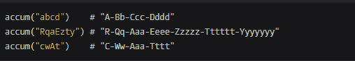

<!--yml
category: codewars
date: 2022-08-13 11:43:39
-->

# 【codewars】Mumbling_sysu_lluozh的博客-CSDN博客

> 来源：[https://blog.csdn.net/lluozh2015/article/details/78725240?ops_request_misc=&request_id=&biz_id=102&utm_term=codewars&utm_medium=distribute.pc_search_result.none-task-blog-2~all~sobaiduweb~default-5-78725240.nonecase](https://blog.csdn.net/lluozh2015/article/details/78725240?ops_request_misc=&request_id=&biz_id=102&utm_term=codewars&utm_medium=distribute.pc_search_result.none-task-blog-2~all~sobaiduweb~default-5-78725240.nonecase)

## **instruction**

This time no story, no theory. The examples below show you how to write function

Examples:


## **my solution**

```
def accum(s):
    # your code
    n = 0
    reStr=""
    for str in s:
        if n!=0:
            reStr = reStr + "-"
        reStr = reStr + str.upper()
        for i in range(n):
            reStr = reStr + str.lower()
        n = n+1
    return reStr 
```

## **best solution from others**

```
def accum(s):
    return '-'.join((a * i).title() for i, a in enumerate(s, 1)) 
```

## **join方法**

用于将序列中的元素以指定的字符连接生成一个新的字符串

str.join(sequence)
sequence – 要连接的元素序列

```
 c = "abc"
    d = "-".join(c + "efg")
    print(d)

>> a-b-c-e-f-g 
```

```
 c = ["abc","efg"]
    d = "-".join(c)
    print(d)

>> abc-efg 
```

```
 c = ["abc","efg"]
    d = "-".join(c + "efg")
    print(d)

>>    d = "-".join(c + "efg")
TypeError: can only concatenate list (not "str") to list 
```

## **enumerate方法**

将一个可遍历的数据对象(如列表、元组或字符串)组合为一个索引序列，同时列出数据和数据下标，一般用在 for 循环当中

enumerate(sequence, [start=0])
sequence – 一个序列、迭代器或其他支持迭代对象
start – 下标起始位置

```
 s = "ABC"
    for i, a in enumerate(s, 1):
        print("i :",i," a:",a)

>> 
i : 1  a: A
i : 2  a: B
i : 3  a: C 
```

```
 s = ["ABC","DEF"]
    for i, a in enumerate(s, 1):
        print("i :",i," a:",a)

>> 
i : 1  a: ABC
i : 2  a: DEF 
```

## **title方法**

返回"标题化"的字符串,就是说所有单词都是以大写开始，其余字母均为小写
str.title()

```
 strs = "abcdef".title()
    print(strs)

>>Abcdef 
```

## **代码行**

‘-’.join((a * i).title() for i, a in enumerate(s, 1))

```
print([str(i) for i in range(5)])

>> ['0', '1', '2', '3', '4'] 
```

```
 xyz = "-".join([str(i) for i in range(5)])
    print(xyz)

>> 0-1-2-3-4 
```

```
 s = "abcde"
    k = [(a * i).title() for i, a in enumerate(s, 1)]
    print(k)

>> ['A', 'Bb', 'Ccc', 'Dddd', 'Eeeee'] 
```

```
 s = "abcde"
    k = "-".join([(a * i).title() for i, a in enumerate(s, 1)])
    print(k)

>> A-Bb-Ccc-Dddd-Eeeee 
```