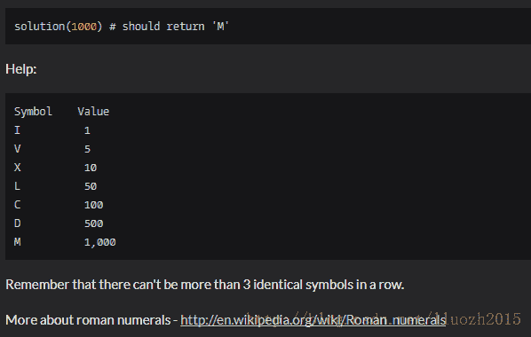

<!--yml
category: codewars
date: 2022-08-13 11:48:22
-->

# 【codewars】Roman Numerals Encoder_sysu_lluozh的博客-CSDN博客

> 来源：[https://blog.csdn.net/lluozh2015/article/details/79079394?ops_request_misc=&request_id=&biz_id=102&utm_term=codewars&utm_medium=distribute.pc_search_result.none-task-blog-2~all~sobaiduweb~default-0-79079394.nonecase](https://blog.csdn.net/lluozh2015/article/details/79079394?ops_request_misc=&request_id=&biz_id=102&utm_term=codewars&utm_medium=distribute.pc_search_result.none-task-blog-2~all~sobaiduweb~default-0-79079394.nonecase)

## **instruction**

Create a function taking a positive integer as its parameter and returning a string containing the Roman Numeral representation of that integer.

Modern Roman numerals are written by expressing each digit separately starting with the left most digit and skipping any digit with a value of zero. In Roman numerals 1990 is rendered: 1000=M, 900=CM, 90=XC; resulting in MCMXC. 2008 is written as 2000=MM, 8=VIII; or MMVIII. 1666 uses each Roman symbol in descending order: MDCLXVI.

**Example:**



## **my solution**

```
def solution(n):

    symbolArr = [["I","V"],["X","L"],["C","D"],["M"]]
    strN = str(n).zfill(4)
    symbol = "M"*int(strN[0])
    for i in range(2,-1,-1):
        valueArr = ["", symbolArr[i][0], symbolArr[i][0] + symbolArr[i][0],symbolArr[i][0] + symbolArr[i][0] + symbolArr[i][0], symbolArr[i][0] + symbolArr[i][1],symbolArr[i][1],symbolArr[i][1] + symbolArr[i][0], symbolArr[i][1] + symbolArr[i][0] + symbolArr[i][0],symbolArr[i][1] + symbolArr[i][0] + symbolArr[i][0] + symbolArr[i][0],symbolArr[i][0] + symbolArr[i + 1][0]]
        symbol = symbol + valueArr[int(strN[(3-i)])]
    return symbol
```

## **best solution from others**

```
def solution(n):
    roman_numerals = {1000: 'M', 900: 'CM', 500: 'D', 400: 'CD', 100: 'C', 90: 'XC', 50: 'L', 40: 'XL', 10: 'X',9: 'IX', 5: 'V', 4: 'IV', 1: 'I'}
    roman_string = ''
    for key in sorted(roman_numerals.keys(),reverse=True):
        while n >= key:
            roman_string += roman_numerals[key]
            n -= key
    return roman_string
```

## **技巧点**

针对原表能够重新构造
Symbol Value
I 1
V 5
X 10
L 50
C 100
D 500
M 1,000

roman_numerals = {1000: ‘M’, 900: ‘CM’, 500: ‘D’, 400: ‘CD’, 100: ‘C’, 90: ‘XC’, 50: ‘L’, 40: ‘XL’, 10: ‘X’,9: ‘IX’, 5: ‘V’, 4: ‘IV’, 1: ‘I’}