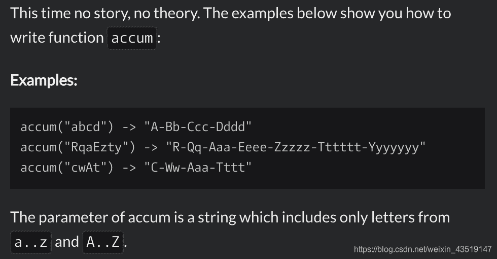
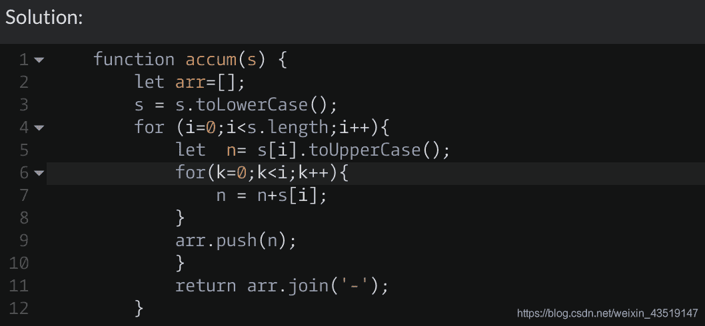

<!--yml
category: codewars
date: 2022-08-13 11:45:22
-->

# 【刷题】codewars-Mumbling_污师先生的博客-CSDN博客

> 来源：[https://blog.csdn.net/weixin_43519147/article/details/91355145?ops_request_misc=&request_id=&biz_id=102&utm_term=codewars&utm_medium=distribute.pc_search_result.none-task-blog-2~all~sobaiduweb~default-4-91355145.nonecase](https://blog.csdn.net/weixin_43519147/article/details/91355145?ops_request_misc=&request_id=&biz_id=102&utm_term=codewars&utm_medium=distribute.pc_search_result.none-task-blog-2~all~sobaiduweb~default-4-91355145.nonecase)

问题描述：
代码：

问题反思：
循环应用，循环套循环，数组的分割和合并。