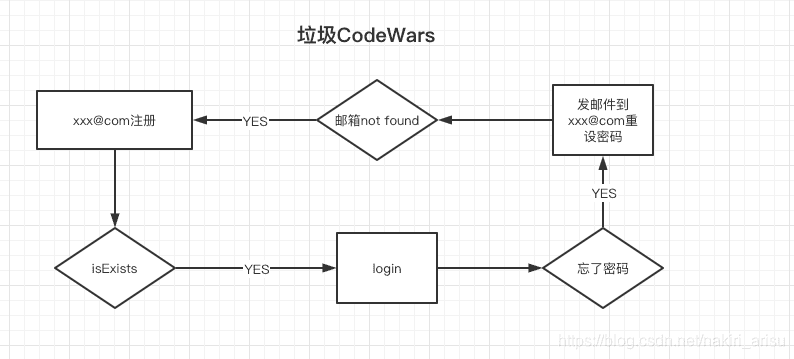
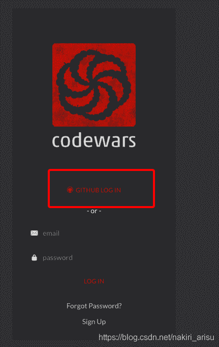
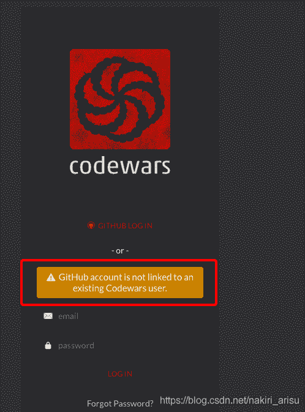
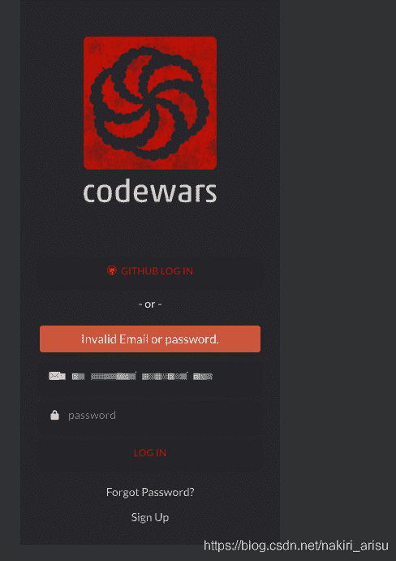
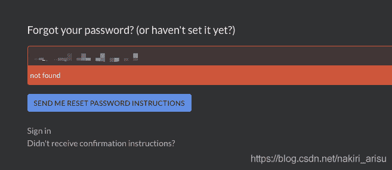

<!--yml
category: codewars
date: 2022-08-13 11:35:24
-->

# 【吐槽】CodeWars遇到的不快_转身雪人的博客-CSDN博客_codewars支付不了

> 来源：[https://blog.csdn.net/nakiri_arisu/article/details/105968384?ops_request_misc=&request_id=&biz_id=102&utm_term=codewars&utm_medium=distribute.pc_search_result.none-task-blog-2~all~sobaiduweb~default-3-105968384.142^v40^control,185^v2^control](https://blog.csdn.net/nakiri_arisu/article/details/105968384?ops_request_misc=&request_id=&biz_id=102&utm_term=codewars&utm_medium=distribute.pc_search_result.none-task-blog-2~all~sobaiduweb~default-3-105968384.142^v40^control,185^v2^control)

好久没写博客了，水一篇博客先。

最近了解到CodeWars这个网站，想注册玩玩。



login页面里有github一键登录功能，懒星人的我自然首先选择这个方式去登录。

显示我已经linked到codewars了。。 好吧，那我就直接登录一下。。


⬇️⬇️⬇️⬇️⬇️⬇️⬇️⬇️⬇️⬇️⬇️⬇️⬇️⬇️⬇️⬇️⬇️⬇️
结果我按照github来登录，显示我密码不对

好吧，那我就找回密码吧。。。

## 结果

邮箱又告诉我不存在？

???
难道是github关联到时候有问题？

保险起见我再拿这个不存在的邮箱去注册。。。


FUCK codewars， Eat my shit！！！

要知道注册的时候还要写道题目。。。写完题目才能填写注册信息。。
真的浪费时间啊

```
 public static Double multiplyDouble(Double d1, Double d2) {
        Integer result;
        String doubleStr1 = String.valueOf(d1);
        String doubleStr2 = String.valueOf(d2);
        Integer x1 = d1.intValue();
        Integer x2 = d2.intValue();
        Integer tens1 = 0;
        Integer tens2 = 0;
        Integer tensAll = 0;
        if(d1 - x1 != 0) {
            String [] doubleStr1Arr = doubleStr1.split("\\.");  
            tens1 = doubleStr1Arr[1].length();
        }
        if(d2 - x2 != 0) {
            String [] doubleStr2Arr = doubleStr2.split("\\.");
            tens2 = doubleStr2Arr[1].length();
        }
        tensAll = tens1 + tens2;

        d1 = d1 * Math.pow(10, tens1);
        d2 = d2 * Math.pow(10, tens2) * d1;
        result = d2.intValue();
        if(tensAll > 0) {
            return new Double(result / Math.pow(10, tensAll));
        }
        return new Double(result);
    } 
```