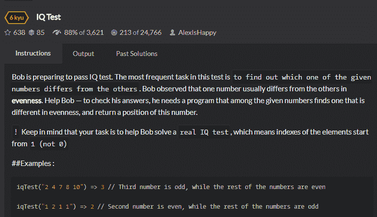
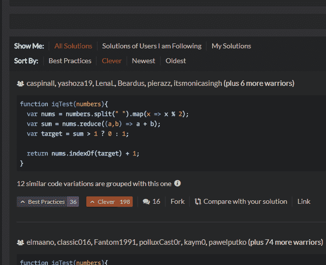

<!--yml
category: codewars
date: 2022-08-13 11:42:45
-->

# 入坑codewars_weixin_34406061的博客-CSDN博客

> 来源：[https://blog.csdn.net/weixin_34406061/article/details/88766981?ops_request_misc=%257B%2522request%255Fid%2522%253A%2522166036059216781685328322%2522%252C%2522scm%2522%253A%252220140713.130102334.pc%255Fall.%2522%257D&request_id=166036059216781685328322&biz_id=0&utm_medium=distribute.pc_search_result.none-task-blog-2~all~first_rank_ecpm_v1~rank_v31_ecpm-23-88766981-null-null.142^v40^control,185^v2^control&utm_term=codewars](https://blog.csdn.net/weixin_34406061/article/details/88766981?ops_request_misc=%257B%2522request%255Fid%2522%253A%2522166036059216781685328322%2522%252C%2522scm%2522%253A%252220140713.130102334.pc%255Fall.%2522%257D&request_id=166036059216781685328322&biz_id=0&utm_medium=distribute.pc_search_result.none-task-blog-2~all~first_rank_ecpm_v1~rank_v31_ecpm-23-88766981-null-null.142^v40^control,185^v2^control&utm_term=codewars)

前几天做LeetCode上的大数乘法，代码没错，可就是提交不成功，显示`SyntaxError: Unexpected token var`
我把所有代码都注释掉，只留下`return 1`，依然报同样的错误。。。感觉LeetCode对JSer不是特别友好
刚刚在node社区看到有人推荐codewars，立马去体验一番。注册要写个代码测试一下身份，这个细节有意思（虽然代码很简单）。
codewars，黑色的主题风格，很符合coder。而且可用语言非常广，连TypeScript都有！！
然后codewars给我推荐了一题=>[codewars-iqTest](https://www.codewars.com/kata/iq-test/train/javascript)

这题虽然很简单，但是很有意思，对我的启发挺大的，让我发现了自己的一些不足。
题目：意思就是要找出数串（不是数组，这是一个坑）中跟其他数不相同的一个数（奇偶方面）



我一开始的写法是：以第一个数的奇偶性为标准，后面的数跟这个标准一样，那就返回之前记录的一个跟这个标准不同的数的下标（如果有的话）。如果跟这个标准不同，那就记录下标。这样遍历完之后就如果还没有return，那结果就只能是第一个数或者最后一个数。判断一下seen就知道是头还是尾了。时间复杂度O（n）

```
function iqTest(numbers){
  let number = numbers.split(' ')
  let tag = number[0]%2
  let resIndex = ''
  let seen = false
  for(let i = 1, len = number.length; i < len; i++) {
    if(number[i]%2 === tag) {
      if(resIndex !== '') return resIndex+1
      seen = true
    }else {
      resIndex = i
    }
  }
  return seen? resIndex + 1: 1
}
```

虽然成功AC，但我明显感觉代码写得不是很优雅。在评论区看到有人用两个数组分别装奇数偶数，我恍然大悟，瞬间感觉自己宛如zz...我怎么一开始没想到orz
这一题完全暴露了我的不足，让我深思。遇到编程题，也许我更多地是在微观上进行思考，关注执行流程的每个细节，代码怎么执行。这个是没错的，但缺乏了宏观的视角，会变得片面。正所谓`不识庐山真面目，只缘身在此山中`，这一题如果宏观上把奇偶剥离，那什么问题都解决了，简直不要太简单！！

```
function iqTest(numbers){
  let number = numbers.split(' ')
  let odd = [],even = []
  number.forEach((item,index) => {
    item % 2 == 0? even.push(index + 1): odd.push(index + 1)
  })
  return odd.length === 1? odd[0]: even[0]
}
```

短短几行代码，也是一次遍历，时间复杂度O（n），这才是优雅地写代码！（看到社区高票答案有用filter扫两次，我觉得用forEach一次就够了）
此外，AC之后还能看大佬们的代码，按clever排序，看到了一下代码：


看到这样的代码，我真的有点兴奋，想法太妙了！虽然包含indexOf，一共遍历了三遍。但是不重要，关键是这个思想要学习，可以应用到其他地方。
首先他用map将每个元素模2，这就像同化一样，因为只有奇数和偶数，所以先把奇数和偶数都分别同化成一个样，0或1。求和，大于1就返回偶数的位置，否则返回奇数的位置。
不过我觉得reduce累加的步骤没有必要，只要把前三个数加起来就知道不同的数的奇偶性，或者可以在第一次遍历就记录0或1的数量，省一次遍历。

喜欢codewars，这里人个个都是人才，说话又好听