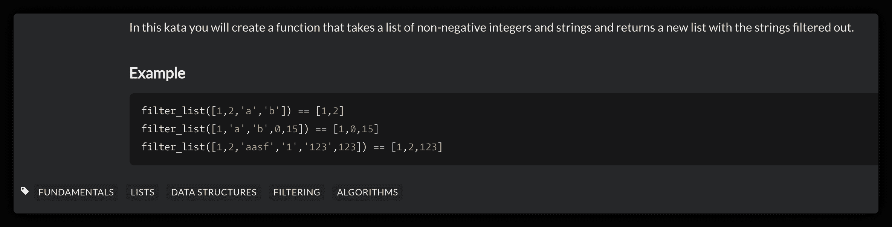
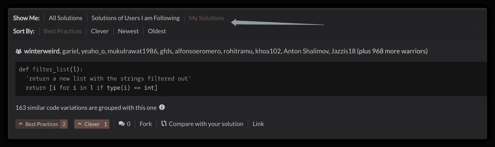

<!--yml
category: codewars
date: 2022-08-13 11:40:04
-->

# 入坑codewars的第一题--列表过滤器（List Filtering）_iu—良犬的博客-CSDN博客_codewars第一关

> 来源：[https://blog.csdn.net/weixin_56314697/article/details/117694954?ops_request_misc=&request_id=&biz_id=102&utm_term=codewars&utm_medium=distribute.pc_search_result.none-task-blog-2~all~sobaiduweb~default-6-117694954.142^v40^control,185^v2^control](https://blog.csdn.net/weixin_56314697/article/details/117694954?ops_request_misc=&request_id=&biz_id=102&utm_term=codewars&utm_medium=distribute.pc_search_result.none-task-blog-2~all~sobaiduweb~default-6-117694954.142^v40^control,185^v2^control)

**入坑codewars的第一题–列表过滤器（List Filtering）**

身为八段塑料的小白，竟勇敢的挑战codewars上的题目


****话不多说，请看我生涯中破解的第一道题目：****

链接: [link](https://www.codewars.com/kata/53dbd5315a3c69eed20002dd).
In this kata you will create a function that takes a list of non-negative integers and strings and returns a new list with the strings filtered out.

翻译一下子就是：
在这个kata中，您将创建一个函数，它接受一个非负整数和字符串的列表，并返回一个新的列表，其中包含过滤掉的字符串


在经过我长达半个小时的冥思苦想与多次反复尝试失败后，终于------成功了！

```
def filter_list(l):
    b = []
    for i in l:
        if type(i) == int:
            b.append(i)
    return b 
```


不过，我还不太满意，于是我想到了通过列表推导式来进行精简代码，于是我就用了两行：

```
def filter_list(l):
    return [i for i in l if type(i) == int] 
```

嘿嘿，真不错


果然，不出意外，我的两行代码是最佳解法。