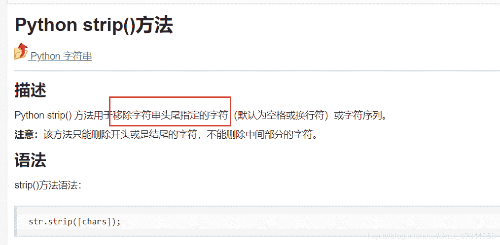
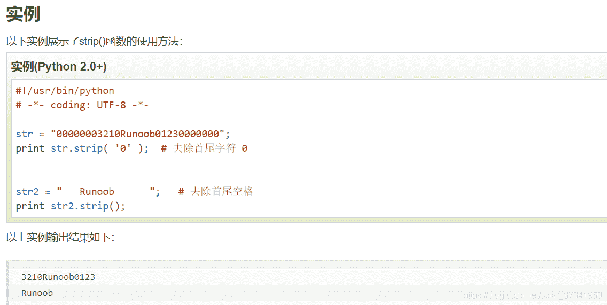

<!--yml
category: codewars
date: 2022-08-13 11:40:56
-->

# 入坑codewars第13天- Dashatize it_渣渣琪的博客-CSDN博客

> 来源：[https://blog.csdn.net/sinat_37341950/article/details/84978909?ops_request_misc=&request_id=&biz_id=102&utm_term=codewars&utm_medium=distribute.pc_search_result.none-task-blog-2~all~sobaiduweb~default-0-84978909.142^v40^control,185^v2^control](https://blog.csdn.net/sinat_37341950/article/details/84978909?ops_request_misc=&request_id=&biz_id=102&utm_term=codewars&utm_medium=distribute.pc_search_result.none-task-blog-2~all~sobaiduweb~default-0-84978909.142^v40^control,185^v2^control)

第一题：

Given a number, return a string with dash`'-'`marks before and after each odd integer, but do not begin or end the string with a dash mark.

Ex:

```
dashatize(274) -> '2-7-4'
dashatize(6815) -> '68-1-5'
```

题意：

```
题意很简单，就是在每一个奇数前后输出一个‘-’：
但是有特殊情况，第一个前面和最后一个数字的后面不能有‘-’，还有就是数与数之间只能有一个‘-’，当num的数值只有一位时，直接返回数值的字符串。
这道题我写了很久，漏了很多情况，后面代码一大串，看了大神的精简代码发现自己太菜鸡了。。。 
```

代码：

```
import re
def dashatize(num):
    if num==None:return 'None'
    #if num<10:return num
    str1=re.findall(r"\d+",str(num))
    str1="".join(str1)
    if int(str1)<10: return str1
    #print(str1)
    list1=[]
    if str1[0]=='-':list1=[]
    else:
        if int(str1[0])%2!=0:
            list1.append(str1[0]+"-")
        else:
            list1.append(str1[0])
    for i in range(1,len(str1)-1):
        if int(str1[i])%2!=0:
            if int(str1[i-1])%2!=0:
                str2=str1[i]+"-"
                list1.append(str2)
            else:
                str2="-"+str1[i]+"-"
                list1.append(str2)
        else:
            list1.append(str1[i])
    if int(str1[len(str1)-1])%2!=0 and int(str1[len(str1)-2])%2==0:
        list1.append("-"+str1[len(str1)-1])
    else:
        list1.append(str1[len(str1)-1])
    return "".join(list1)
```

我运用到的知识有：正则表达式、字符串和列表的相互转化

参考文章：

[https://blog.csdn.net/roytao2/article/details/53433373](https://blog.csdn.net/roytao2/article/details/53433373)

[https://blog.csdn.net/liao392781/article/details/80495411](https://blog.csdn.net/liao392781/article/details/80495411) 

大神的精简代码:

```
import re
def dashatize(num):
    try:
        return ''.join(['-'+i+'-' if int(i)%2 else i for i in str(abs(num))]).replace('--','-').strip('-')
    except:
        return 'None'
```

我这猪脑子，我之前写过的题里就用到过了strip函数，我给忘了。。。而且输入的是正负数，我给当成了字符串处理。受教了

而且列表推导式我运用的不熟练。

 

