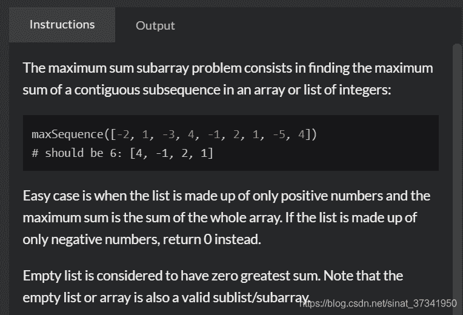
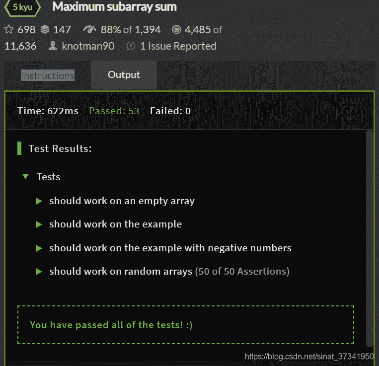
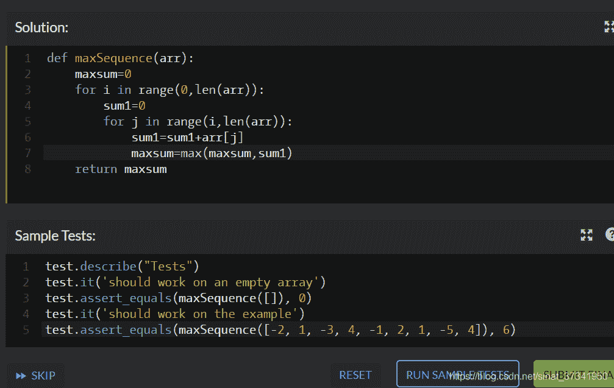
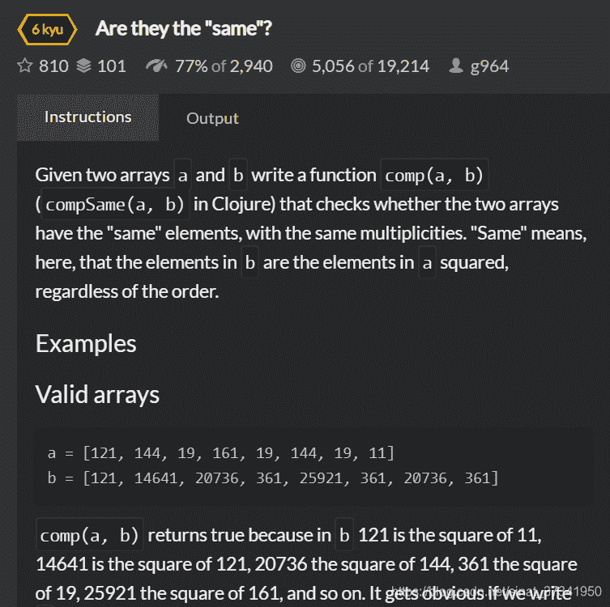
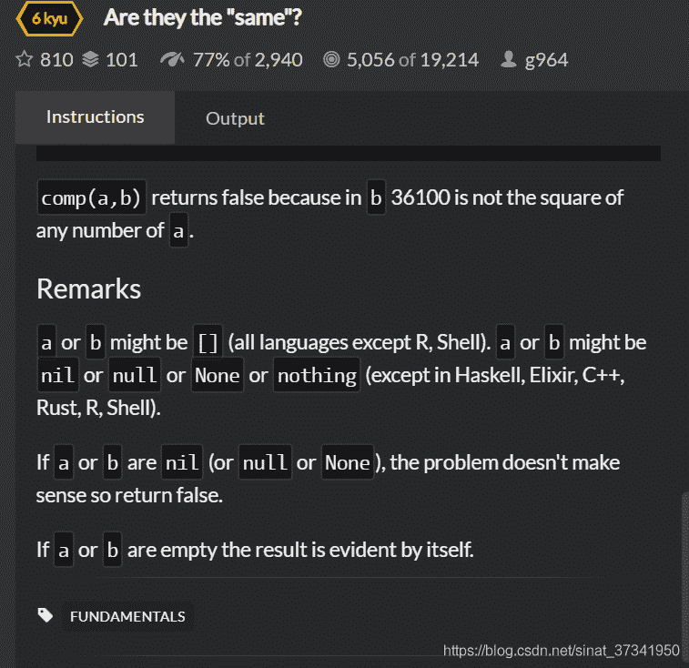

<!--yml
category: codewars
date: 2022-08-13 11:45:11
-->

# 入坑codewars第七天-Maximum subarray sum、Are they the “same”？_渣渣琪的博客-CSDN博客

> 来源：[https://blog.csdn.net/sinat_37341950/article/details/84581768?ops_request_misc=&request_id=&biz_id=102&utm_term=codewars&utm_medium=distribute.pc_search_result.none-task-blog-2~all~sobaiduweb~default-7-84581768.nonecase](https://blog.csdn.net/sinat_37341950/article/details/84581768?ops_request_misc=&request_id=&biz_id=102&utm_term=codewars&utm_medium=distribute.pc_search_result.none-task-blog-2~all~sobaiduweb~default-7-84581768.nonecase)

题目：

题意：求连续子序列的和的最大值



思路：笨方法一个一个求：首先求第一个数分别加后面的数取一个最大值

然后下一个数分别加后面的数取最大值

以此类推……

代码如下：

```
def maxSequence(arr):
    maxsum=0
    for i in range(0,len(arr)):
        sum1=0
        for j in range(i,len(arr)):
            sum1=sum1+arr[j]
            maxsum=max(maxsum,sum1)
    return maxsum
```



第二题：



题意就是：给出两个列表a,b; b的数字开根号的结果都能在a中找到；

特殊情况就是a、b都是空的就没意义返回false

代码如下：

思路是首先当array1、array2不为空时，把array1中的数平方后排序和array2的数排序比较是否相等，若相等则返回True

反之返回false

另外若其中之一为空则返回False

```
def comp(array1, array2):
    if array1 and array2:
        return sorted([i**2 for i in array1])==sorted(array2)
    return array1==array2==[]
```