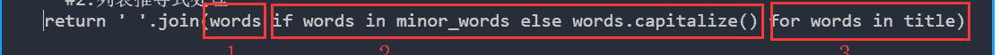

<!--yml
category: codewars
date: 2022-08-13 11:43:19
-->

# 入坑codewars第九天-Title Case_渣渣琪的博客-CSDN博客

> 来源：[https://blog.csdn.net/sinat_37341950/article/details/84865165?ops_request_misc=&request_id=&biz_id=102&utm_term=codewars&utm_medium=distribute.pc_search_result.none-task-blog-2~all~sobaiduweb~default-2-84865165.nonecase](https://blog.csdn.net/sinat_37341950/article/details/84865165?ops_request_misc=&request_id=&biz_id=102&utm_term=codewars&utm_medium=distribute.pc_search_result.none-task-blog-2~all~sobaiduweb~default-2-84865165.nonecase)

题目：

Title Case

A string is considered to be in title case if each word in the string is either (a) capitalised (that is, only the first letter of the word is in upper case) or (b) considered to be an exception and put entirely into lower case unless it is the first word, which is always capitalised.

Write a function that will convert a string into title case, given an optional list of exceptions (minor words). The list of minor words will be given as a string with each word separated by a space. Your function should ignore the case of the minor words string -- it should behave in the same way even if the case of the minor word string is changed.

###Arguments (Haskell)

*   **First argument**: space-delimited list of minor words that must always be lowercase except for the first word in the string.
*   **Second argument**: the original string to be converted.

###Arguments (Other languages)

*   **First argument (required)**: the original string to be converted.
*   **Second argument (optional)**: space-delimited list of minor words that must always be lowercase except for the first word in the string. The JavaScript/CoffeeScript tests will pass `undefined`when this argument is unused.
*   ###Example

    ```
    title_case('a clash of KINGS', 'a an the of') # should return: 'A Clash of Kings'
    title_case('THE WIND IN THE WILLOWS', 'The In') # should return: 'The Wind in the Willows'
    title_case('the quick brown fox') # should return: 'The Quick Brown Fox' 
    ```

    遗憾今天这题想得太复杂了没完全通过，但是题意明白，后来看了最优解发现代码精简，别人巧妙使用了列表推导式。

*   题意：

*   ```
    题目意思：
    题意很简单，就是输入两个字符串，比如：x:'a clash of KINGS', y:'a an the of'；
    x中的单词要是有y中的则不需要首字母大写；
    但是有一种情况就是刚好y中的某个单词在x中是第一个单词，则要大写；
    其他情况都是首字母大写。
    ```

    代码如下：

*   ```
    def title_case(title, minor_words=''):#这里是设置minor_words默认值为空字符串
        #1.先将两个字符串转成列表,并处理，minor中都是小写，title中是先首字母大写然后再分割
        title = title.capitalize().split()#注意处理顺序，先将首字母大写，然后再分割
        minor_words = minor_words.lower().split()
        #2.列表推导式处理
        return ' '.join(words if words in minor_words else words.capitalize() for words in title) 
    ```

    在这里我想说列表推导式很厉害。这里列表推导式我是分三段理解。

*   

*   第一段是固定格式，第二段是加了条件，第三段也是固定格式；

*   （1）选择words单词连接

*   （2）如果words在minor_words中则选择minor_words中的此词；否则将words做首字母大写处理

*   （3）words都来自title相当于第一层循环

*   ---------------------------------------------------------------

*   每一个句子的首字母都要大写这个问题在代码第一步就处理了； title = title.capitalize().split()，第一步就把第一个字母大写了，考虑了这种情况：(‘ab’，‘ab’)——>'Ab'