<!--yml
category: codewars
date: 2022-08-13 11:43:58
-->

# 入坑codewars第五天-Dubstep、Regex validate PIN code_渣渣琪的博客-CSDN博客

> 来源：[https://blog.csdn.net/sinat_37341950/article/details/84537443?ops_request_misc=&request_id=&biz_id=102&utm_term=codewars&utm_medium=distribute.pc_search_result.none-task-blog-2~all~sobaiduweb~default-9-84537443.nonecase](https://blog.csdn.net/sinat_37341950/article/details/84537443?ops_request_misc=&request_id=&biz_id=102&utm_term=codewars&utm_medium=distribute.pc_search_result.none-task-blog-2~all~sobaiduweb~default-9-84537443.nonecase)

第一题：

题目：

```
Polycarpus works as a DJ in the best Berland nightclub, and he often uses dubstep music in his performance. Recently, he has decided to take a couple of old songs and make dubstep remixes from them.

Let's assume that a song consists of some number of words. To make the dubstep remix of this song, Polycarpus inserts a certain number of words "WUB" before the first word of the song (the number may be zero), after the last word (the number may be zero), and between words (at least one between any pair of neighbouring words), and then the boy glues together all the words, including "WUB", in one string and plays the song at the club.

For example, a song with words "I AM X" can transform into a dubstep remix as "WUBWUBIWUBAMWUBWUBX" and cannot transform into "WUBWUBIAMWUBX".

Recently, Jonny has heard Polycarpus's new dubstep track, but since he isn't into modern music, he decided to find out what was the initial song that Polycarpus remixed. Help Jonny restore the original song.
```

input：

```
Input
The input consists of a single non-empty string, consisting only of uppercase English letters, the string's length doesn't exceed 200 characters
```

output：

```
Output
Return the words of the initial song that Polycarpus used to make a dubsteb remix. Separate the words with a space.
```

```
Examples
song_decoder("WUBWEWUBAREWUBWUBTHEWUBCHAMPIONSWUBMYWUBFRIENDWUB")
  # =>  WE ARE THE CHAMPIONS MY FRIEND
```

题目意思就是：将所有的WUB替换成空格，然后将头尾的空格去掉

此时可以用正则表达式：

r'WUB+'就代表至少一个或者多个WUB

利用正则表达式的re.sub()函数

再利用strip()函数去掉字符串头尾的空格“ ”

代码如下：

```
import re
def song_decoder(song):
    song = re.sub(r'(WUB)+'," ",song)#利用正则表达式把WUB替换成空格，"(WUB)+"表示至少一个WUB或者多个WUB
    song = song.strip(" ")#替换掉开头结尾的“ ”
    return song
```

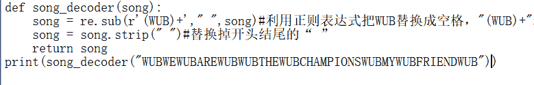

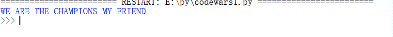

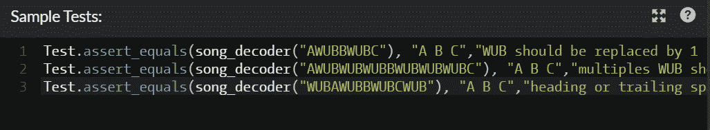

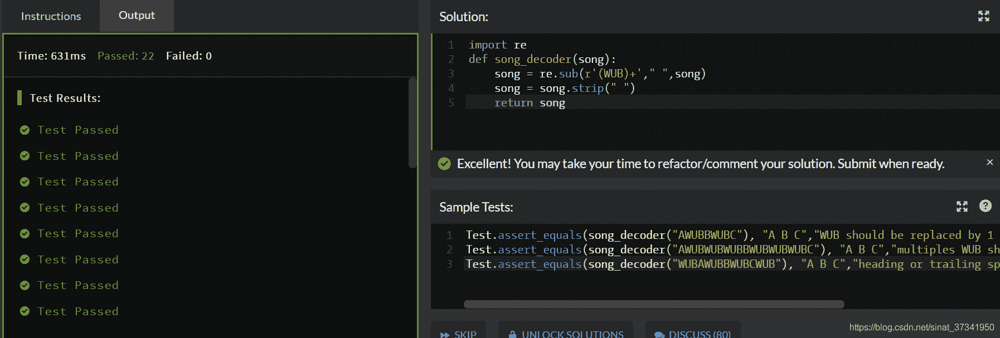

补充：

排名第一的最简单的代码：

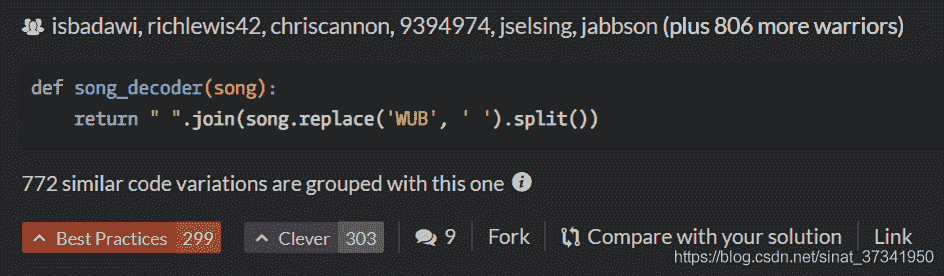

相当厉害，思路：**字符串**和**列表**互相转换

（1）将字符串中的WUB都替换成空格

（2）.split()就是将分割后的字符串变成列表

（3）.join()再把列表转成字符串，以空格相连

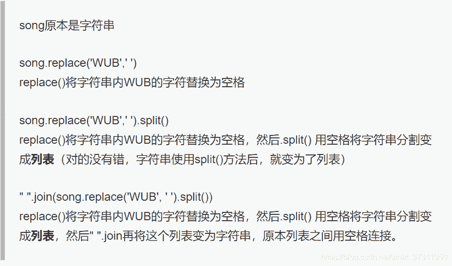

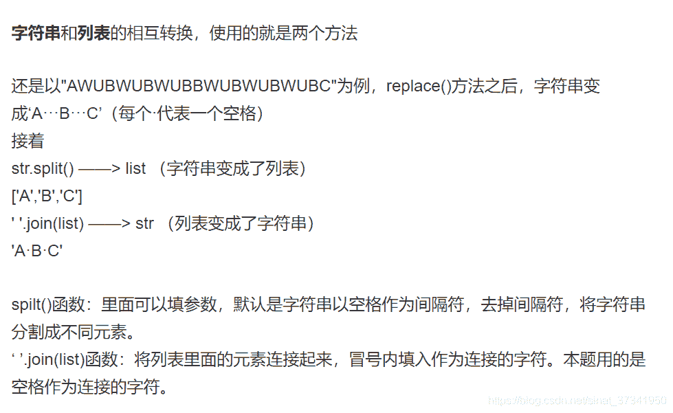

# 总结

1.正则表达式
本题想考察的应该是正则表达式，找出字符串中要替换字符的规律，用正则表达式进行操作。关键是要字符的规律是什么？正则表达式可以应用在非常多的场合，判断是不是中国的手机号，判断是不是邮箱等等。用数字、字母和符号就能向计算机将规律表达出来。

2.字符串和列表的相互转换
str ————> list 用split()
list ————> str 用 ‘ ’.join
多多应用，熟练对象的互相转换。

第二题：

                   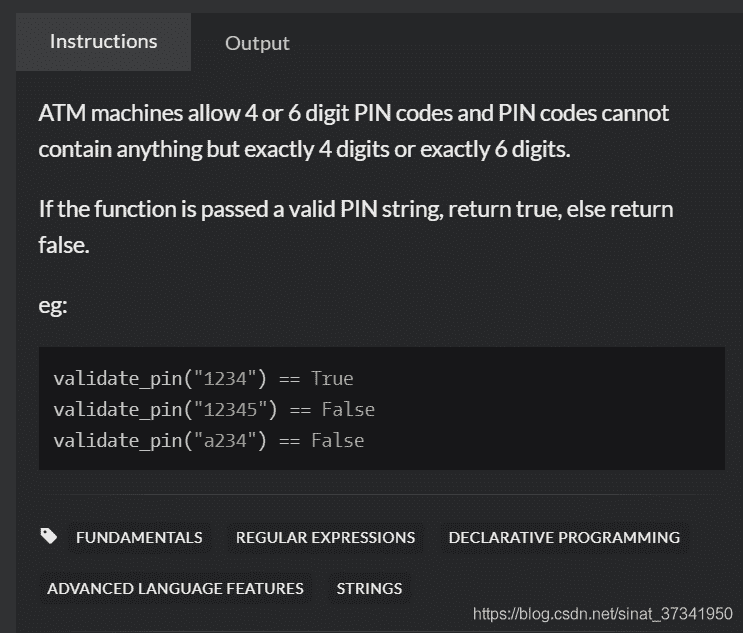

题目意思就是：只能四个数或者六个数，且不能有非数字

我的思路就是：

（1）先统计数字个数

（2）如果数字个数是4且字符串长度是4；或者数字个数是6且字符串长度是6；这两种情况返回True，其他情况返回False

```
def validate_pin(pin):
    digits=0
    for c in pin:
        if c.isdigit():
            digits=digits+1
            print(digits)
    if digits==4 and len(pin)==4:
        return True
    elif digits==6 and len(pin)==6:
        return True
    else:
        return False
```

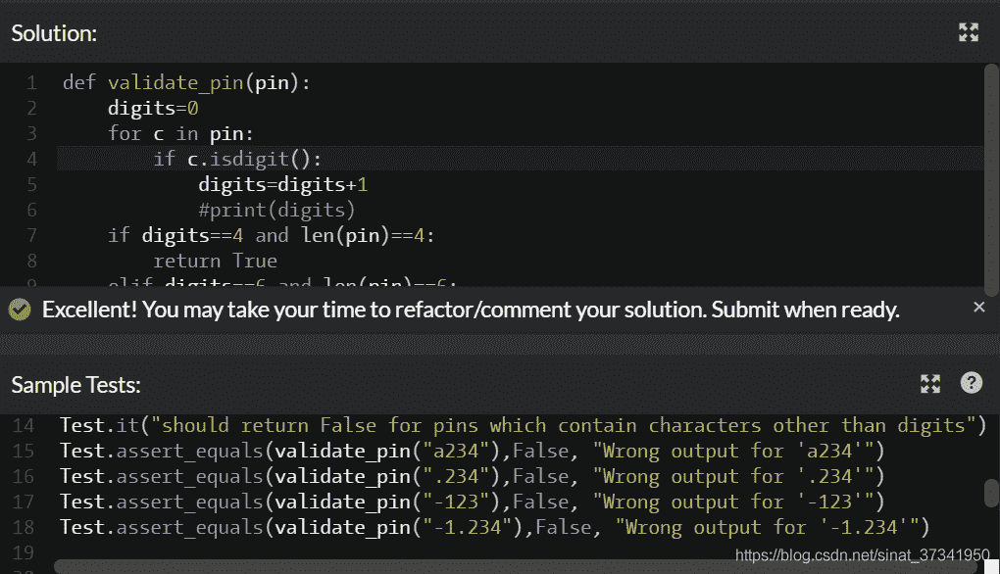


这里运用了python的函数：

输入一行字符，分别统计出其中英文字母、空格、数字和其它字符的个数。

方法isalpha()判断是否英文字母；

方法isspace()判断是否空格；

方法isdigit()判断是否为数字。

还是很方便的。

但是下面我参考一下其他人写的精简代码：

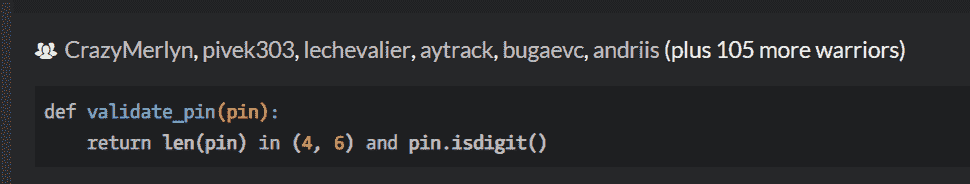

查了一下：isdigit()就能判断字符串是否是数字，因此思路就是可以直接判断长度是否是是4或6，且是否都是数字

                        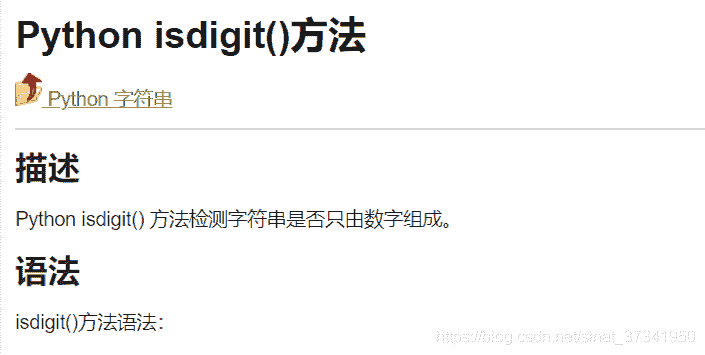