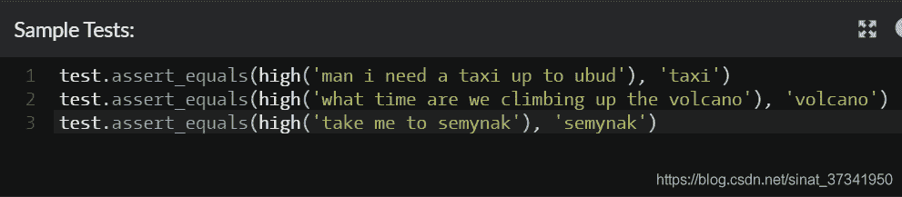
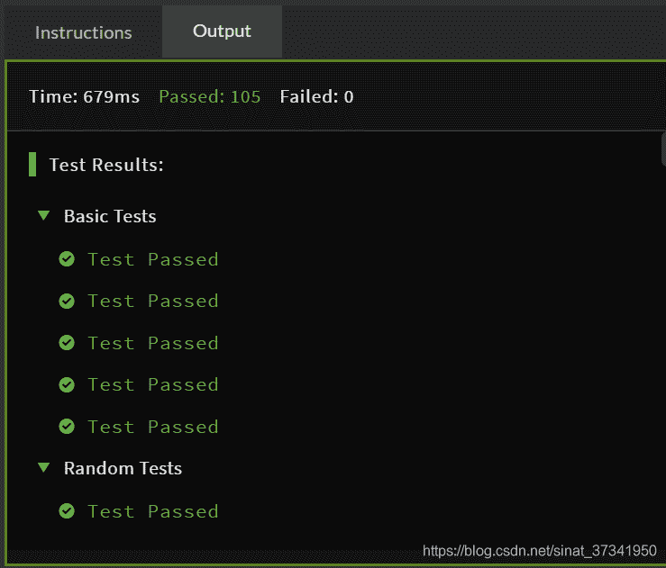
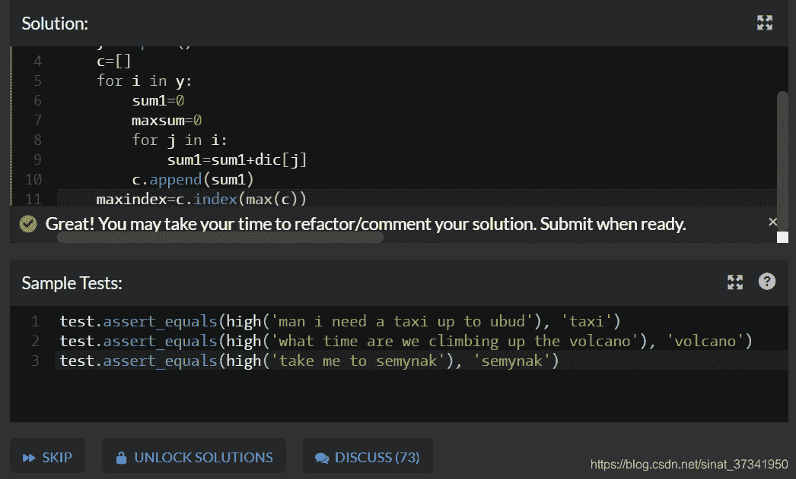
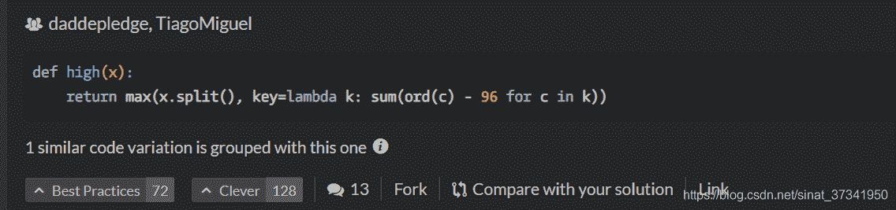
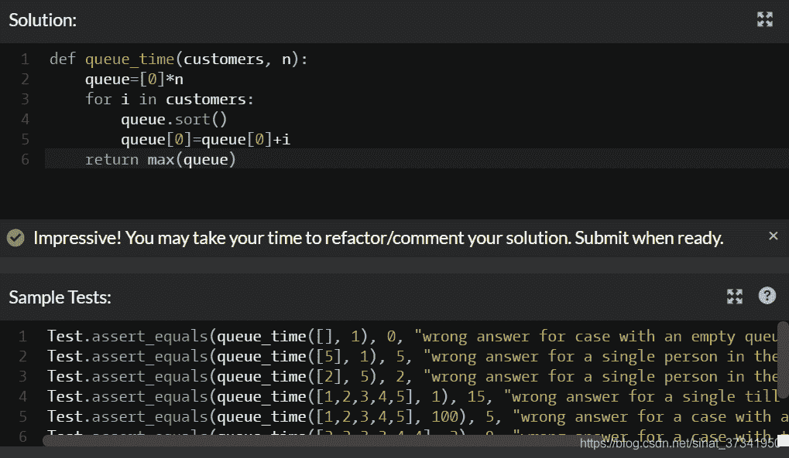

<!--yml
category: codewars
date: 2022-08-13 11:44:04
-->

# 入坑codewars第六天-Highest Scoring Word、The Supermarket Queue_渣渣琪的博客-CSDN博客

> 来源：[https://blog.csdn.net/sinat_37341950/article/details/84571400?ops_request_misc=&request_id=&biz_id=102&utm_term=codewars&utm_medium=distribute.pc_search_result.none-task-blog-2~all~sobaiduweb~default-2-84571400.nonecase](https://blog.csdn.net/sinat_37341950/article/details/84571400?ops_request_misc=&request_id=&biz_id=102&utm_term=codewars&utm_medium=distribute.pc_search_result.none-task-blog-2~all~sobaiduweb~default-2-84571400.nonecase)

题目：

Given a string of words, you need to find the highest scoring word.

Each letter of a word scores points according to it's position in the alphabet: `a = 1, b = 2, c = 3` etc.

You need to return the highest scoring word as a string.

If two words score the same, return the word that appears earliest in the original string.

All letters will be lowercase and all inputs will be valid.

题意：

就是给出一句字符串，计算出得分最大的那个单词；比如abc，得分就是1+2+3=6分；a代表1分，b2分，c3分以此类推……



我的解题思路是：

（1）首先先建立一个字典：

dic={'a':1,'b':2,'c':3,'d':4,'e':5,'f':6,'g':7,'h':8,'i':9,'j':10,'k':11,'l':12,'m':13,'n':14,'o':15,'p':16,'q':17,'r':18,'s':19,'t':20,'u':21,'v':22,'w':23,'x':24,'y':25,'z':26}

（2）然后将字符串转化成列表，运用了split()函数

（3）遍历列表的每一个元素

（4）针对每一个元素，遍历元素中的字符，计算该元素的得分

（5）将得分放在一个新的列表中

（6）求最大值对应的得分函数的下标

（7）找到下标对应的列表元素将其转成字符串输出，运用了"".join()函数

代码如下：

```
dic = {'a':1,'b':2,'c':3,'d':4,'e':5,'f':6,'g':7,'h':8,'i':9,'j':10,'k':11,'l':12,'m':13,'n':14,'o':15,'p':16,'q':17,'r':18,'s':19,'t':20,'u':21,'v':22,'w':23,'x':24,'y':25,'z':26}
def high(x):
    y=x.split()
    c=[]
    for i in y:
        sum1=0
        maxsum=0
        for j in i:
            sum1=sum1+dic[j]
        c.append(sum1)
    maxindex=c.index(max(c))
    return "".join(y[maxindex])
```

                    

看了别人最优答案，学到了一个新的东西就是lambda表示匿名函数



下面来解释一下：

python用关键字lambda表示匿名函数。
例1.对于函数f(x)=x*x,以下两种表达方式等价;

```
def f(x):
	return x*x

>>>f(5)
>>>25
```

等价于下面的： 

```
f=lambda x:x*x
>>>f(5)
>>>25
```

冒号前的x表示函数的参数。
例2.将列表按照元素绝对值大小进行排序

```
list1=[2,5,6,-4,8-5,3,-7]

def get_abs(x):
    return abs(x)

sorted(list1,key=get_abs)
#等价于下面的：
list1=[2,5,6,-4,8-5,3,-7]
sorted(list1,key=lambda x:abs(x))
```

从上面这个例子可以看出：sorted（传入一个列表，按照什么规则排序（这里是绝对值））
例3.找到句子中字母ASCII码之和最大的单词

同理：

```
x='i want a banana'

 max(x.split(),key=lambda k:sum(ord(c)-96 for c in k))

输出：'want'
```

max（传入要找最大得分的列表，按照什么规则找最大值格式是key=lambda k：……）

第二题：

There is a queue for the self-checkout tills at the supermarket. Your task is write a function to calculate the total time required for all the customers to check out!

* * *

The function has two input variables:

*   customers: an array (list in python) of positive integers representing the queue. Each integer represents a customer, and its value is the amount of time they require to check out.
*   n: a positive integer, the number of checkout tills.

The function should return an integer, the total time required.

* * *

EDIT: A lot of people have been confused in the comments. To try to prevent any more confusion:

*   There is only ONE queue, and
*   The order of the queue NEVER changes, and
*   Assume that the front person in the queue (i.e. the first element in the array/list) proceeds to a till as soon as it becomes free.
*   The diagram on the wiki page I linked to at the bottom of the description may be useful.

```
输出样例：
queue_time([5,3,4], 1)
# should return 12
# because when n=1, the total time is just the sum of the times

queue_time([10,2,3,3], 2)
# should return 10
# because here n=2 and the 2nd, 3rd, and 4th people in the 
# queue finish before the 1st person has finished.

queue_time([2,3,10], 2)
# should return 12
```

题意：

说白了就是有个队列cutomer，有n个结账的收银台处，计算排队总时间；就是顾客找最空闲的结账窗口排队

比如[5,3,4]，n=1，明显只有一个结账处，就是5+3+4=12个总时间

再比如：[10,2,3,3],n=2，明显10个总时间

代码如下：

```
def queue_time(customers, n):
    queue = [0]*n
    for i in customers:
        queue.sort()
        queue[0]+=i
    return max(queue)
```

