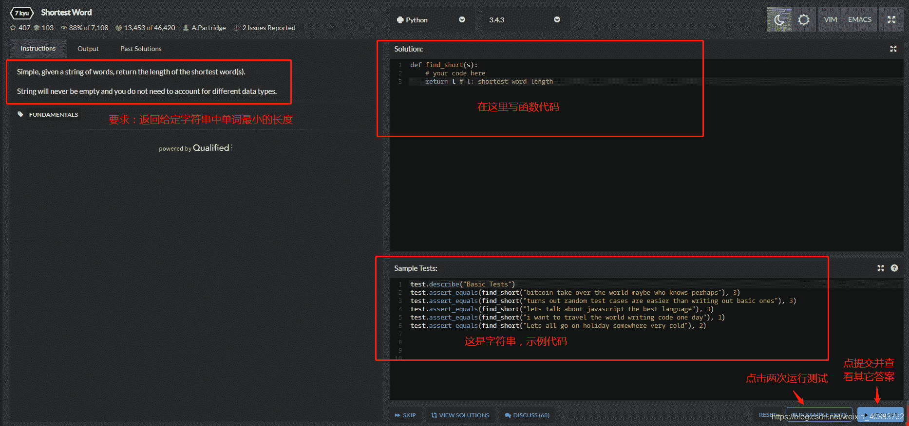

<!--yml
category: codewars
date: 2022-08-13 11:39:17
-->

# 国外代码刷题网站---Python刷题记录【https://www.codewars.com】_资深IT小白的博客-CSDN博客_codewars中文网站

> 来源：[https://blog.csdn.net/weixin_40383792/article/details/88850064?ops_request_misc=%257B%2522request%255Fid%2522%253A%2522166036058916781685355945%2522%252C%2522scm%2522%253A%252220140713.130102334.pc%255Fall.%2522%257D&request_id=166036058916781685355945&biz_id=0&utm_medium=distribute.pc_search_result.none-task-blog-2~all~first_rank_ecpm_v1~rank_v31_ecpm-21-88850064-null-null.142^v40^control,185^v2^control&utm_term=codewars](https://blog.csdn.net/weixin_40383792/article/details/88850064?ops_request_misc=%257B%2522request%255Fid%2522%253A%2522166036058916781685355945%2522%252C%2522scm%2522%253A%252220140713.130102334.pc%255Fall.%2522%257D&request_id=166036058916781685355945&biz_id=0&utm_medium=distribute.pc_search_result.none-task-blog-2~all~first_rank_ecpm_v1~rank_v31_ecpm-21-88850064-null-null.142^v40^control,185^v2^control&utm_term=codewars)

今天无意间听到好多人说刷题，瞬间我听懵逼了，刷题啥意思？在哪儿刷题？打怪升级？

经过搜索，原来是国外的一个专门供程序员在线写代码的网站。（[https://www.codewars.com](https://www.codewars.com)）

里面可以选择各种编程语言练习代码，初次进入的级别是八级，经过不断的做题挑战、通关测试，可以提升自己的等级，等级越高，数字越小。大家可自行去注册登录练习，网上教程很多，我就直接贴上练习题和多种大神的解法，真的是人外有人。。。

如图所示：根据下方示例中的字符串，完善函数代码，返回字符串中单词的最小长度。

方法一：

```
def find_short(s):
    return min(map(len, s.split(' '))) 
```

方法二：

```
def find_short(s):
    return len(min(s.split(' '), key=len)) 
```

方法三：

```
def find_short(s):
    return min(len(x) for x in s.split()) 
```

方法四：

```
def find_short(s):
    l = 100;
    for item in a.split():
        if len(item) < l:
            l = len(item)
    return l 
```

方法五：

```
find_short = lambda s: min(len(e) for e in s.split()) 
```

方法六：

```
find_short = lambda s: len(min(s.split(), key=len)) 
```

还有好多，基本上都跟上面的类似了，这个网站真的不错，大家可以去试试，一题多解，真牛逼。。。